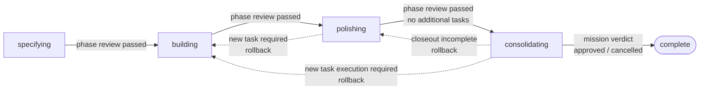
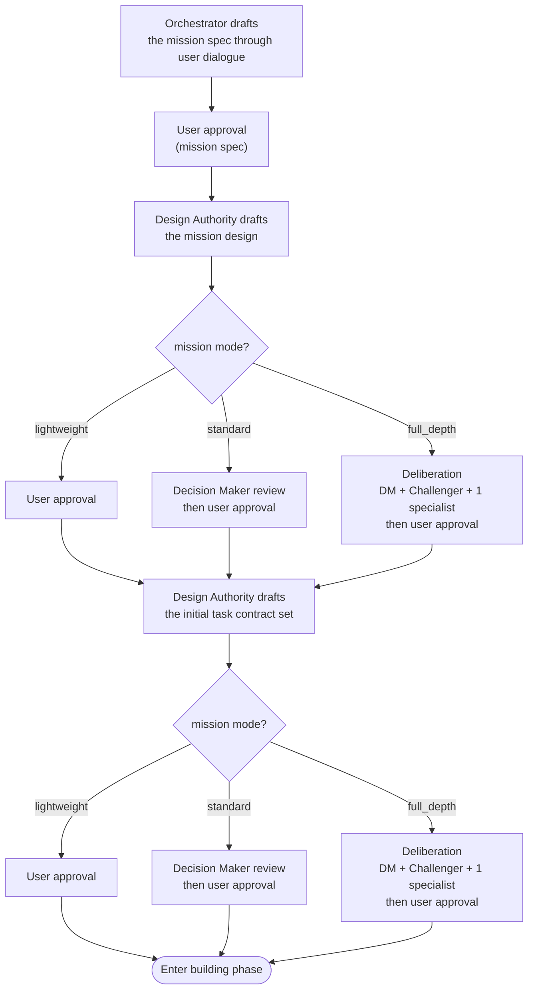
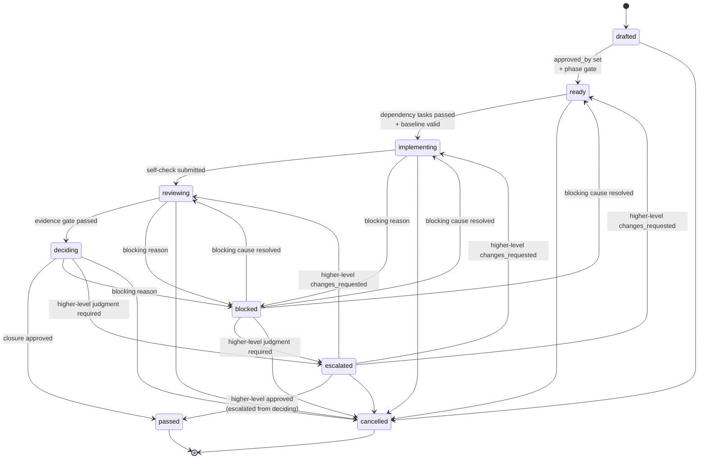
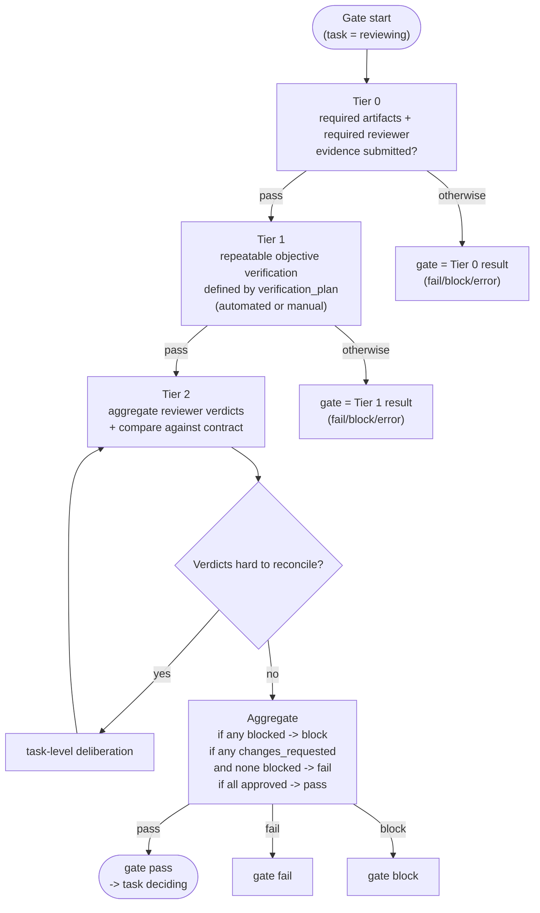
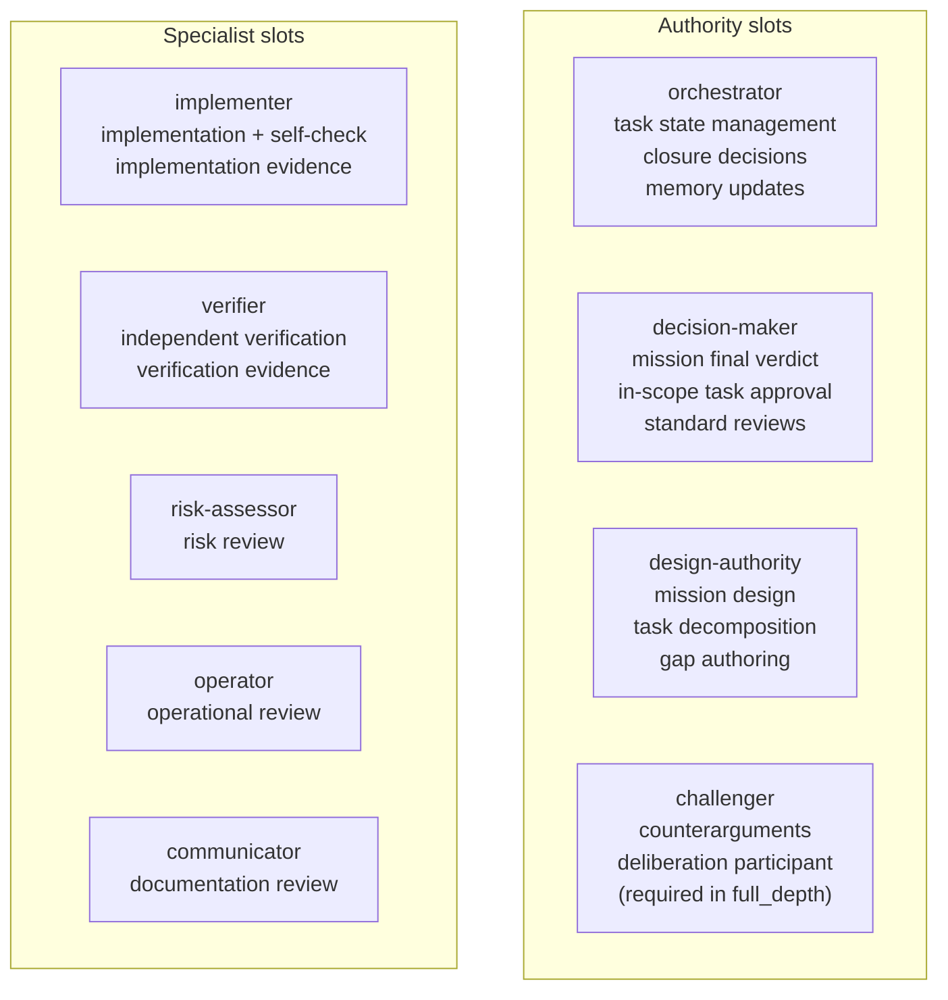
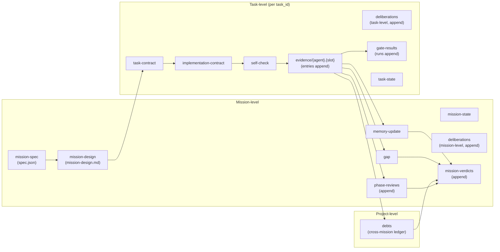

# Geas Protocol Diagrams

This document presents the core flows defined by the Geas protocol (`docs/protocol/`, 9 docs) and the JSON schemas (`docs/schemas/`, 14 schemas) as Mermaid diagrams. Each diagram names its source document at the top.

## Table of Contents

1. [Mission Phase Flow](#1-mission-phase-flow)
2. [Specifying Approval Flow](#2-specifying-approval-flow)
3. [Task Lifecycle](#3-task-lifecycle)
4. [Evidence Gate](#4-evidence-gate)
5. [Agent Slots and Responsibilities](#5-agent-slots-and-responsibilities)
6. [Artifact Relationships](#6-artifact-relationships)

---

## 1. Mission Phase Flow

> Reference: [protocol/02_MISSIONS_PHASES_AND_FINAL_VERDICT.md](protocol/02_MISSIONS_PHASES_AND_FINAL_VERDICT.md)

A mission moves through four phases in sequence and ends in `complete`. Each phase ends with a phase gate, and the next phase opens only when the phase review is `passed`. Limited rollback is allowed only from polishing and consolidating; returning to specifying is not allowed.

A mission verdict is one of `approved`, `changes_requested`, `escalated`, or `cancelled`. When the verdict is `changes_requested` or `escalated`, additional work is performed and a new verdict is appended to the array. `cancelled` is terminal. If the mission is abandoned before spec approval, it goes straight to `complete` without entering consolidating.

---

## 2. Specifying Approval Flow

> Reference: [protocol/02_MISSIONS_PHASES_AND_FINAL_VERDICT.md](protocol/02_MISSIONS_PHASES_AND_FINAL_VERDICT.md) (`Operating mode requirements` + `specifying` phase)

The mission spec is always approved by the user alone. The mission design and the initial set of task contracts follow different approval paths depending on the operating mode.

The `approved_by` field on a task contract records the final approver (`user` or `decision-maker`; the initial task set uses `user`). In-scope tasks added during building or polishing may move to `ready` with Decision Maker approval alone. Work outside the mission scope is not handled within the current mission. If the user wants to expand scope, they must either escalate the current mission or open a follow-up mission.

---

## 3. Task Lifecycle

> Reference: [protocol/03_TASK_LIFECYCLE_AND_EVIDENCE.md](protocol/03_TASK_LIFECYCLE_AND_EVIDENCE.md)

A task has six primary states (`drafted` -> `ready` -> `implementing` -> `reviewing` -> `deciding` -> `passed`) and three held or terminal states (`blocked`, `escalated`, `cancelled`). `blocked` and `escalated` are temporary; once resolved, the task returns to the appropriate point in the lifecycle or terminates.

A closure verdict is one of `approved`, `changes_requested`, `escalated`, or `cancelled`. `changes_requested` is a rewind, and the Orchestrator records both the restore target and the rationale. When a task ends as `cancelled` and is replaced by another contract, the new task contract points back through its `supersedes` field.

---

## 4. Evidence Gate

> Reference: [protocol/03_TASK_LIFECYCLE_AND_EVIDENCE.md](protocol/03_TASK_LIFECYCLE_AND_EVIDENCE.md) (`Evidence Gate` section)

The Evidence Gate runs in order from Tier 0 to Tier 1 to Tier 2. At any tier, `fail`, `block`, or `error` immediately becomes the verdict for the whole gate. Tier 2 aggregates reviewer verdicts.

The gate verdict is appended as an immutable object in the `runs` array of `gate-results.json`. Retries accumulate as new runs; earlier runs are never overwritten.

---

## 5. Agent Slots and Responsibilities

> Reference: [protocol/01_AGENTS_AND_AUTHORITY.md](protocol/01_AGENTS_AND_AUTHORITY.md)

A slot is a protocol role, not an implementation identity. Implementations map slots to concrete agent types, but the protocol is always read in terms of slot names. One concrete agent may cover multiple slots, but the role switch must be explicit.

Default ownership by evidence kind:

| kind | Primary producer |
|---|---|
| `implementation` | `implementer` |
| `review` | `risk-assessor`, `operator`, `communicator`, `challenger` |
| `verification` | `verifier` |
| `closure` | `orchestrator` |

---

## 6. Artifact Relationships

> Reference: [protocol/08_RUNTIME_ARTIFACTS_AND_SCHEMAS.md](protocol/08_RUNTIME_ARTIFACTS_AND_SCHEMAS.md)

Mission-level and task-level artifacts accumulate as a hierarchy. Append-only logs (`phase-reviews`, `mission-verdicts`, `gate-results`, `deliberations`, `evidence`) never overwrite prior entries; they append new array items.

During consolidating, the Orchestrator reads `debt_candidates`, `memory_suggestions`, and `gap_signals` from task evidence, updates the project-level `debts.json` (registering new items and updating the status of debts touched in the mission), and writes the mission-level `memory-update.json`. The Design Authority writes the mission-level `gap.json`. The Decision Maker reads all of them before issuing the mission verdict.
