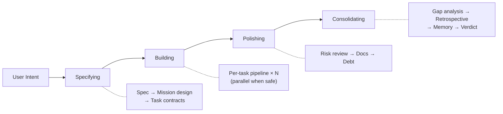

**[English](README.md)** | **한국어**

<p align="center">
  
</p>

<h1 align="center">Geas</h1>
<h3 align="center">AI 에이전트가 "완료" 대신 증거를 남기게 하고, 그걸 검증하세요.</h3>
<p align="center">계약으로 작업하고, 증거로 검증하고, 기억을 남겨 성장하는 멀티 에이전트 운영 프로토콜</p>

<p align="center">
  <a href="LICENSE"></a>
  <a href="https://github.com/choam2426/geas/releases"></a>
</p>

Geas는 AI 에이전트들이 하나의 전문적인 팀으로 동작하게 만드는 프로토콜입니다. 완료는 증거로 입증하고, 승인은 권한자가 내리고, 교훈은 세션이 바뀌어도 남습니다.

- **Task Contract** — 작업 전에 범위, 수용 기준, 리뷰어, 검증 계획을 계약으로 정합니다.
- **Traceable Artifacts** — 계약, 리뷰, 검증, 판정까지 모든 과정이 구조화된 산출물로 남습니다.
- **Evidence Gate** — 3단계 검증으로 완료를 입증합니다. 에이전트의 말이 아닌 산출물로 판단합니다.
- **Memory System** — 회고와 교훈이 shared memory와 에이전트별 메모리에 쌓여 다음 세션에 이어집니다.

---

## Quick Start

Claude Code 또는 Codex 플러그인으로 설치합니다.

```bash
/plugin marketplace add choam2426/geas
/plugin install geas@choam2426-geas
```

Codex에서는 이 저장소를 Codex 플러그인으로 설치해 `.codex-plugin/plugin.json`이 루트 `skills/`를 읽도록 합니다.

| 명령어 | 하는 일 |
|---|---|
| `/geas:mission` | 미션 시작 또는 이어하기. 요구사항 수집부터 최종 전달까지 한 번에. |
| `/geas:navigating-geas` | 스킬 목록, CLI 표면, 미션 디스패처가 멀티 에이전트 작업을 어떻게 조율하는지 설명. |

`/geas:mission` 하나면 됩니다. 만들고 싶은 걸 설명하면 Geas가 요구사항을 정리하고, task contract를 만들고, 에이전트를 배정하고, evidence를 검증하고, 미션을 마무리합니다. 간단한 작업이면 파이프라인을 건너뛰고 바로 처리합니다.

---

## How it works

### Four Phases

모든 미션은 규모에 관계없이 같은 네 단계를 거칩니다. 작은 변경이면 가볍게, 큰 작업이면 깊게 — 흐름 자체는 동일합니다. 각 단계가 얼마나 엄격하게 적용될지는 operating mode(`lightweight` / `standard` / `full_depth`)가 결정합니다.



| 단계 | 하는 일 |
|---|---|
| **Specifying** | 미션 스펙을 정의하고, mission design을 확정하고, 초기 task contract들을 승인합니다. |
| **Building** | 각 task를 계약부터 종료까지 이어지는 실행 파이프라인에 태웁니다. |
| **Polishing** | 기술 부채, 문서화, 품질 이슈 등 실행 과정에서 드러난 문제를 정리합니다. |
| **Consolidating** | 설계와 실제 결과를 대조하고, 교훈을 메모리로 승격하고, 미션 판정을 내립니다. |

### Per-task Pipeline

승인된 task는 모두 같은 순서를 따릅니다. Evidence gate가 타협 불가 체크포인트입니다. 리뷰어 evidence와 verifier evidence를 직접 읽어서 task가 종료로 진행 가능한지 판정합니다.

```text
Contract 승인 → Implementation contract → 구현 → Self-check
→ 리뷰어 evidence + Verification → Evidence gate
→ Closure evidence → Retrospective
```

Task 상태는 `drafted → ready → implementing → reviewing → deciding → passed` 흐름으로 이동하며, `blocked` / `escalated` / `cancelled`가 측면 종결 상태입니다.

---

## When Geas is a good fit

- 여러 단계를 거치는 구현, 리팩터링, 마이그레이션
- 잘못되면 비용이 커서 검증이 중요한 작업
- 구현, QA, 보안, 운영, 문서화가 얽힌 병렬 작업
- 추적과 기억이 필요한 장기 프로젝트
- 역할 분리가 중요한 연구/분석 작업

절차가 늘어나는 만큼 **단계도 많고 토큰도 더 듭니다**. 실수 비용이 조율 비용보다 클 때 쓰세요. 간단한 작업이면 Geas가 알아서 파이프라인을 건너뜁니다.

---

## Features

   

### Socratic Intake

한 번에 하나씩 질문하며 미션 스펙을 완성합니다. 애매한 채로 넘어가지 않습니다. 범위, 수용 기준, 리스크, operating mode를 작업 시작 전에 확정합니다. 승인된 미션 스펙은 immutable입니다.

### Task contract

모든 작업에 범위, 수용 기준, 리뷰어, verification plan, 위험도, 라우팅 정책을 담은 계약을 먼저 만듭니다. `implementing` 상태에서 implementer가 작업과 함께 implementation contract를 작성하며, required reviewer는 implementer의 self-check가 append된 이후에 evidence를 제출합니다.

### Evidence Gate

3단계 검증:
- **Tier 0 (Preflight)** — 필수 산출물과 필수 리뷰어 리뷰가 제출됐는지 확인
- **Tier 1 (Objective)** — 계약의 verification plan을 실행. 자동화든 고정된 수동 절차든 동일하게 반복 가능
- **Tier 2 (Judgment)** — 계약과 리뷰어 판정을 함께 읽고 수용 기준과 알려진 리스크를 점검

Gate 판정: `pass`, `fail`, `block`, `error`. Gate는 객관적 검증만 담당하고, 제품 판단은 mission verdict에서 별도로 이루어집니다.

### Parallel Scheduling

독립적인 task는 surface 기반 충돌 감지와 함께 동시에 실행됩니다. 의존 관계가 있으면 자동으로 순서를 맞춥니다. 오케스트레이터만 `.geas/`에 쓸 수 있고, 구현자는 해당 surface가 비었을 때만 디스패치됩니다.

### Challenger Review

고위험 task에 *"이게 왜 아직 틀릴 수 있지?"*를 묻는 적대적 리뷰어가 배정됩니다. 반드시 하나 이상의 실질적 우려를 제기해야 하며, 블로킹 우려가 있으면 deliberation을 통해 ship, iterate, escalate를 결정합니다.

### Deliberation

주요 의사결정을 위한 구조화된 다자 판단 절차입니다. Full-depth 미션의 mission design 승인과, challenger의 블로킹 우려 해소에 사용됩니다. 참여자가 독립적으로 evidence를 제출한 뒤 decision maker가 판정을 내립니다.

### Session Recovery

모든 CLI 쓰기에서 runtime state가 `.geas/`에 즉시 저장됩니다. Resume은 디스크에서 활성 미션, phase, task 집합을 재구성합니다. 세션이 잠깐 멈췄든, 컨텍스트가 압축됐든, 다른 기기에서 다시 열었든 동일하게 이어집니다.

### Memory System

`shared.md`로 에이전트 간 지식을 공유하고, 에이전트별 memory note로 역할 특화 교훈을 쌓습니다. 매 task 후 회고에서 후보를 추출하고, consolidating 단계에서 검증된 교훈을 메모리로 승격합니다. 세션이 바뀌어도 팀이 학습합니다.

### Gap Analysis

미션이 끝나면 설계와 실제 전달을 대조합니다. 각 gap은 이번 미션 안에서 `resolve`할지, 부채로 남길지, 다음 미션으로 넘길지 disposition이 지정됩니다. 이 결과가 프로젝트 단위 debt ledger에 반영되고 다음 미션 계획으로 이어집니다.

### Real-time Dashboard

`.geas/` 상태를 감시하는 Tauri 데스크톱 앱입니다. 모든 패널에 path sticker가 붙은 터미널풍 "console" 스타일, 파일 watcher 기반 — polling 없이 에이전트 세션에 영향을 주지 않습니다. 아래 [대시보드](#대시보드) 섹션을 참고하세요.


---

## Dashboard

`.geas/` 디렉토리를 실시간으로 읽는 Tauri 데스크톱 앱입니다. 파일 변경을 감지해서 동작하므로 에이전트 세션에 영향을 주지 않습니다. 터미널풍 "console" 스타일을 입혔습니다 — JetBrains Mono (ID · path · timestamp), Inter (산문), 어두운 neutral 배경에 phosphor-green accent. 모든 패널에 해당 뷰가 읽는 `.geas/` 파일 경로를 표시하는 `PathBadge`가 붙어 있습니다.


### Layout

- **Top bar** — 로고 + breadcrumb(project › mission › sub-tab) + 현재 phase pill.
- **Sidebar** — 프로젝트 리스트(각 row에 path + phase). 클릭으로 전환.
- **Main area** — 4개 top-level view 중 하나 (아래).
- **Status bar** — `.geas/` watch 상태 + 마지막 이벤트 시각 + 실제 카운트(tasks, debt).

### Views

**Dashboard (미션 리스트)** — 프로젝트 진입 화면. Active 미션은 ASCII progress bar가 있는 큰 카드로, 과거 미션은 history 섹션에 인라인(resolved는 기본 접힘). 카드 클릭으로 미션 상세 진입.

**미션 상세** — 미션별 shell + 5개 서브탭:
- `overview` — lifecycle 그룹별 task 목록, 최근 이벤트, 도입된 debt, final verdict, phase reviews, gap 요약
  
- `spec` — `mission-spec.json`을 구조화하여 렌더 (승인 후 frozen)
  
- `design` — `mission-design.md`를 Markdown으로 렌더 + phase-review verdict로 구성한 sticky decision-log 사이드바
  
- `kanban` — task가 9단계 lifecycle 컬럼(drafted → ready → implementing → reviewing → deciding → passed, 측면 blocked / escalated / cancelled)을 따라 이동
- `timeline` — `events.jsonl` 전체 시간순 뷰, 페이지네이션

**Debt** — 프로젝트 전역 debt ledger. status 탭(open / resolved / dropped / all) + severity chip으로 필터. row 클릭으로 상세.

**Memory** — shared memory(`shared.md`), 에이전트별 note(`agents/{type}.md`), 최근 미션의 memory changelog(`memory-update.json`).


### 태스크 상세 모달

task(overview 패널, kanban 보드, 이벤트 row 어디서든)를 클릭하면 모달이 열립니다 — contract + acceptance criteria, implementation contract, self-check(verify-fix 루프에서는 latest-of-N), tier별 gate 결과, evidence timeline(entry별 drill-down), deliberations, deps 스택 네비게이션(의존 task 클릭 시 현재 task를 push, ESC로 pop).

### Install

[Releases](https://github.com/choam2426/geas/releases)에서 플랫폼에 맞는 설치 파일을 받으세요. 앱을 열고 `.geas/`가 있는 프로젝트 디렉토리를 추가하면 즉시 상태를 읽기 시작합니다.

---

## Team Model

**Slot 기반 역할 구조**를 씁니다. Authority 에이전트가 프로세스를 관장하고, Specialist 에이전트가 실무를 맡습니다.

| 그룹 | 에이전트 |
|---|---|
| **Authority** (항상 활성) | Decision Maker, Design Authority, Challenger |
| **Software** | Software Engineer, QA Engineer, Security Engineer, Platform Engineer, Technical Writer |
| **Research** | Literature Analyst, Research Analyst, Methodology Reviewer, Research Integrity Reviewer, Research Engineer, Research Writer |

도메인 프로필은 기본 에이전트 선호도를 정할 뿐, 오케스트레이터는 task마다 가장 적합한 에이전트를 자유롭게 고릅니다. 소프트웨어 미션 안에서 문헌 조사가 필요하면 리서치 에이전트를 쓰고, 그 반대도 됩니다.

---

## Documentation

| 문서 | 내용 |
|---|---|
| [Architecture](docs/architecture/DESIGN.md) | 시스템 설계, 4계층 아키텍처, 설계 근거 |
| [Protocol](docs/protocol/) | 9개 운영 프로토콜 문서 |
| [Schemas](docs/schemas/) | 14개 JSON Schema (draft 2020-12) |
| [Agents](docs/reference/AGENTS.md) | 14개 에이전트와 slot 기반 권한 모델 |
| [Skills](docs/reference/SKILLS.md) | 17개 스킬 — 2개 user-invocable, 15개 sub-skill |
| [Hooks](docs/reference/HOOKS.md) | SessionStart, SubagentStart, PreToolUse 라이프사이클 훅 |

---

## License

[Apache License 2.0](LICENSE)

---

**프로토콜을 정의하고. 미션을 맡기고. 결과를 검증하고. 팀이 성장하는 걸 지켜보세요.**
