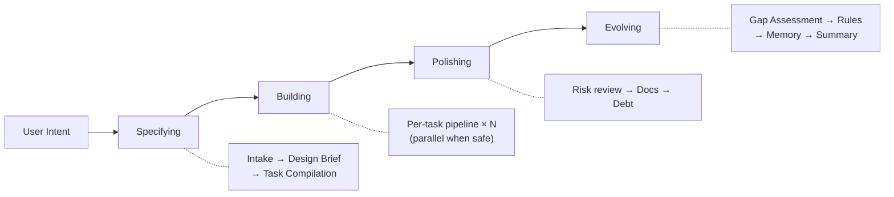

**[English](README.md)** | **한국어**

# Geas
### AI 에이전트가 "끝났다"고 하면, 증거를 요구하세요.
**멀티 에이전트 거버넌스 프로토콜 + Claude Code 플러그인**

[](LICENSE)
[](https://github.com/choam2426/geas/releases)

AI 에이전트를 여럿 돌리는 건 어렵지 않습니다. 어려운 건 그 에이전트들이 **팀으로 작동하게 만드는 것**입니다. Geas는 에이전트 위에 거버넌스 계층을 올려서, "다 했어요"라는 말 대신 **증거**를, 대충 넘어가는 리뷰 대신 **명시적 승인**을, 세션이 끝나면 리셋되는 기억 대신 **누적되는 학습**을 만듭니다.

현재 **Claude Code 플러그인** + **Tauri 데스크톱 대시보드**로 동작합니다. **소프트웨어**와 **연구** 에이전트 프로필을 기본 제공하며, 계약 엔진 자체는 도메인에 묶이지 않아서 다른 분야의 프로필도 같은 구조 위에 올릴 수 있습니다.

> 에이전트를 더 많이 쓰는 게 아니라, 에이전트가 어떻게 협력하고, 검증받고, 성장하는지를 제어하는 시스템입니다.

**14 에이전트 · 13 스킬 · 9 라이프사이클 훅 · 16 JSON 스키마**

---

## 왜 필요한가

| 그냥 에이전트를 돌리면 | Geas를 쓰면 |
|---|---|
| "끝났습니다" 하고 넘어간다 | **Evidence Gate**가 산출물, 테스트, 수용 기준을 직접 확인한다 |
| 설계 결정이 컨텍스트 압축과 함께 사라진다 | **Closure Packet**에 뭘 했고, 왜 그랬고, 누가 승인했는지 남는다 |
| 병렬 작업이 나중에 충돌한다 | **Task contract와 lock check**가 충돌을 미리 잡는다 |
| 다 같이 리뷰하지만 아무도 책임지지 않는다 | **Authority 에이전트**가 승인과 최종 판정을 명시적으로 내린다 |
| 다음 세션에서 같은 실수를 반복한다 | **회고, rules.md, 에이전트 메모리**가 교훈을 이어간다 |

---

## 주요 기능

- **소크라틱 인테이크** — 한 번에 하나씩 질문하며 미션 스펙을 만들어갑니다. 애매한 채로 넘어가지 않습니다.
- **Task contract** — 코드를 쓰기 전에 scope, 수용 기준, reviewer, 평가 명령을 담은 계약을 먼저 만듭니다.
- **14단계 실행 파이프라인** — 구현 → 셀프체크 → 전문가 리뷰 → evidence gate → challenger 리뷰 → 최종 판정. 모든 단계가 추적 가능한 산출물을 남깁니다.
- **Evidence Gate** — 3단계 검증(평가 명령, 수용 기준, 루브릭 채점). "믿되 확인"이 아니라 "믿지 말고 확인"입니다.
- **병렬 스케줄링** — 독립적인 task는 lock 기반 충돌 감지와 함께 동시 실행됩니다. 의존 관계가 있으면 자동으로 순서를 맞춥니다.
- **Challenger 리뷰** — 고위험 task에 *"이게 왜 아직 틀릴 수 있지?"*를 묻는 적대적 리뷰어가 배정됩니다. 반드시 하나 이상의 실질적 우려를 제기해야 합니다.
- **세션 복구** — 체크포인트 기반 복구로 세션 중단, 컨텍스트 압축, 비정상 상태를 처리합니다. 끊긴 곳에서 바로 이어할 수 있습니다.
- **메모리 시스템** — `rules.md`로 에이전트 간 지식을 공유하고, 에이전트별 memory note로 역할 특화 교훈을 쌓습니다. 세션이 바뀌어도 팀이 학습합니다.
- **실시간 대시보드** — `.geas/` 상태를 감시하는 Tauri 데스크톱 앱. 칸반 보드, 타임라인, 부채 추적, 토스트 알림을 제공합니다.

---

## 시작하기

### 설치

```bash
/plugin marketplace add choam2426/geas
/plugin install geas@choam2426-geas
```

### 명령어

| 명령어 | 하는 일 |
|---|---|
| `/geas:mission` | 미션 시작 또는 이어하기. 요구사항 수집부터 최종 전달까지 한 번에. |
| `/geas:help` | 전체 명령어 목록, 4단계 워크플로우, 팀 모델 설명. |

`/geas:mission` 하나면 됩니다. 만들고 싶은 걸 설명하면 Geas가 요구사항을 정리하고, task contract를 만들고, 에이전트를 배정하고, evidence를 검증하고, 미션을 마무리합니다. 파일 하나 고치는 정도의 간단한 작업이면 파이프라인을 건너뛰고 바로 처리합니다.

`/geas:intake`, `/geas:evidence-gate`, `/geas:scheduling` 같은 나머지 명령어는 오케스트레이터가 내부적으로 씁니다. `/geas:help`로 전체 목록을 확인할 수 있습니다.

### 대시보드 (선택)

아래 [대시보드](#대시보드) 섹션을 참고하세요.

---

## 미션 진행 과정

### 네 단계

모든 미션은 규모에 관계없이 같은 네 단계를 거칩니다. 작은 변경이면 가볍게, 큰 작업이면 깊게 — 흐름 자체는 동일합니다.



| 단계 | 하는 일 |
|---|---|
| **Specifying** | 미션을 정의하고, design brief를 확정하고, task contract를 컴파일합니다. |
| **Building** | 각 task를 계약 → 구현 → 검증 → 판정까지 이어지는 파이프라인에 태웁니다. |
| **Polishing** | 보안 리뷰, 문서화, 기술 부채 등 실행 과정에서 드러난 이슈를 정리합니다. |
| **Evolving** | 교훈을 뽑아내고, rules를 업데이트하고, 에이전트 메모리를 갱신합니다. |

### Task별 파이프라인

```text
Contract → Implementation → Self-check → Specialist review
→ Evidence Gate → Closure Packet → Challenger review
→ Final Verdict → Retrospective → Memory extraction
```

---

## 대시보드

`.geas/` 디렉토리를 실시간으로 읽는 Tauri 데스크톱 앱입니다. 파일 변경을 감지해서 동작하므로 에이전트 세션에 영향을 주지 않습니다.


### 뷰

**프로젝트 개요** — 현재 미션, 활성 에이전트, phase, task 진행률, 마지막 활동 시간을 한눈에 볼 수 있습니다. 사이드바에서 여러 프로젝트를 전환할 수 있습니다.

**칸반 보드** — task가 7단계 상태 컬럼(drafted → ready → implementing → reviewed → integrated → verified → passed)을 따라 이동합니다. 카드를 클릭하면 contract, evidence, record를 확인할 수 있습니다.


**미션 상세** — design brief, task 목록, gap assessment, debt register, mission summary까지 프로토콜이 만든 모든 산출물을 한 화면에서 확인합니다.

**메모리 브라우저** — `rules.md`와 에이전트별 memory note를 열람합니다. 팀이 어떤 교훈을 쌓았는지 볼 수 있습니다.

**타임라인** — 이벤트 로그를 시간순으로 시각화합니다. 상태 전이, gate 결과, 에이전트 스폰 내역이 전부 나옵니다.

**기술 부채 패널** — severity, kind별로 부채 항목을 보여줍니다. open / resolved / deferred로 필터링할 수 있습니다.

### 알림

task 완료, gate 통과·실패, phase 전환 같은 이벤트가 발생하면 토스트 알림이 뜹니다. 대시보드 창을 안 보고 있어도 놓치지 않습니다.


### 설치

[Releases](https://github.com/choam2426/geas/releases)에서 플랫폼에 맞는 설치 파일을 받으세요. 앱을 열고 `.geas/`가 있는 프로젝트 디렉토리를 추가하면 즉시 상태를 읽기 시작합니다.

---

## 팀 모델

**Slot 기반 역할 구조**를 씁니다. Authority 에이전트가 프로세스를 관장하고, Specialist 에이전트가 실무를 맡습니다.

| 그룹 | 에이전트 |
|---|---|
| **Authority** (항상 활성) | Product Authority, Design Authority, Challenger |
| **Software** | Software Engineer, QA Engineer, Security Engineer, Platform Engineer, Technical Writer |
| **Research** | Literature Analyst, Research Analyst, Methodology Reviewer, Research Integrity Reviewer, Research Engineer, Research Writer |

도메인 프로필은 기본 에이전트 선호도를 정할 뿐, 오케스트레이터는 task마다 가장 적합한 에이전트를 자유롭게 고릅니다. 소프트웨어 미션 안에서 문헌 조사가 필요하면 리서치 에이전트를 쓰고, 그 반대도 됩니다.

---

## Geas가 강제하는 것

- **구현 전에 계약** — 모든 task에 scope, 수용 기준, reviewer, 평가 명령, risk, escalation policy를 담은 계약을 먼저 만듭니다.
- **종료 전에 독립 검증** — 에이전트가 "됐다"고 해도 프로토콜이 직접 확인하기 전에는 끝나지 않습니다.
- **위험한 작업에는 Challenger** — *"이게 왜 아직 틀릴 수 있지?"*를 묻는 에이전트가 따로 있습니다.
- **세션을 넘는 기억** — 회고, rules, 에이전트 메모리가 세션마다 리셋되는 대신 쌓입니다.
- **Slot 기반 라우팅** — 계약 엔진은 추상 역할(slot)로 동작하고, 도메인 프로필이 런타임에 실제 에이전트로 매핑합니다.

---

## 이런 작업에 적합합니다

- 여러 단계를 거치는 구현, 리팩터링, 마이그레이션
- 잘못되면 비용이 커서 검증이 중요한 작업
- 구현·QA·보안·운영·문서화가 얽힌 병렬 작업
- 추적과 기억이 필요한 장기 프로젝트
- 역할 분리가 중요한 연구·분석 작업

절차가 늘어나는 만큼 **단계도 많고 토큰도 더 듭니다**. 실수 비용이 조율 비용보다 클 때 쓰세요. 간단한 작업이면 Geas가 알아서 파이프라인을 건너뜁니다.

---

## 문서

| 문서 | 내용 |
|---|---|
| [Architecture](docs/architecture/DESIGN.md) | 시스템 설계, 4계층 아키텍처, 설계 근거 |
| [Protocol](docs/protocol/) | 12개 운영 프로토콜 |
| [Schemas](docs/protocol/schemas/) | 16개 JSON Schema (draft 2020-12) |
| [Agents](docs/reference/AGENTS.md) | 14개 에이전트와 slot 기반 권한 모델 |
| [Skills](docs/reference/SKILLS.md) | 13개 스킬 (12 core + 1 utility) |
| [Hooks](docs/reference/HOOKS.md) | 9개 라이프사이클 훅 |

---

## 라이선스

[Apache License 2.0](LICENSE)

---

**프로토콜을 정의하고. 미션을 맡기고. 결과를 검증하고. 팀이 성장하는 걸 지켜보세요.**
