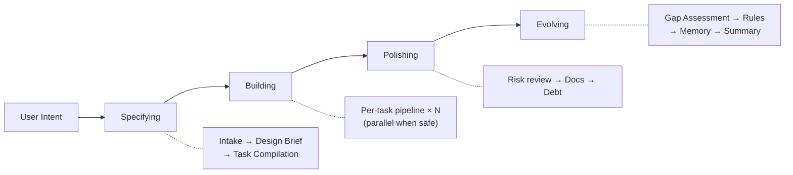

**[English](README.md)** | **한국어**

<p align="center">
  
</p>

<h1 align="center">Geas</h1>
<h3 align="center">AI 에이전트가 "완료" 대신 증거를 남기게 하고, 그걸 검증하세요.</h3>
<p align="center">계약으로 작업하고, 증거로 검증하고, 기억을 남겨 성장하는 멀티 에이전트 운영 프로토콜</p>

<p align="center">
  <a href="LICENSE"></a>
  <a href="https://github.com/choam2426/geas/releases"></a>
</p>

Geas는 AI 에이전트들이 하나의 전문적인 팀으로 동작하게 만드는 프로토콜입니다. 완료는 증거로 입증하고, 승인은 권한자가 내리고, 교훈은 세션이 바뀌어도 남습니다.

- **Task Contract** — 작업 전에 범위, 수용 기준, 리뷰어, 검증 방법을 계약으로 정합니다.
- **Traceable Artifacts** — 계약, 리뷰, 검증, 판정까지 모든 과정이 구조화된 산출물로 남습니다.
- **Evidence Gate** — 3단계 검증으로 완료를 입증합니다. 에이전트의 말이 아닌 산출물로 판단합니다.
- **Memory System** — 회고와 교훈이 rules.md와 에이전트 메모리에 쌓여 다음 세션에 이어집니다.

---

## Quick Start

Claude Code 플러그인으로 설치합니다.

```bash
/plugin marketplace add choam2426/geas
/plugin install geas@choam2426-geas
```

| 명령어 | 하는 일 |
|---|---|
| `/geas:mission` | 미션 시작 또는 이어하기. 요구사항 수집부터 최종 전달까지 한 번에. |
| `/geas:help` | 전체 명령어 목록, 4단계 워크플로우, 팀 모델 설명. |

`/geas:mission` 하나면 됩니다. 만들고 싶은 걸 설명하면 Geas가 요구사항을 정리하고, task contract를 만들고, 에이전트를 배정하고, evidence를 검증하고, 미션을 마무리합니다. 간단한 작업이면 파이프라인을 건너뛰고 바로 처리합니다.

---

## How it works

### Four Phases

모든 미션은 규모에 관계없이 같은 네 단계를 거칩니다. 작은 변경이면 가볍게, 큰 작업이면 깊게 — 흐름 자체는 동일합니다.



| 단계 | 하는 일 |
|---|---|
| **Specifying** | 미션을 정의하고, design brief를 확정하고, task contract를 컴파일합니다. |
| **Building** | 각 task를 계약부터 판정까지 이어지는 실행 파이프라인에 태웁니다. |
| **Polishing** | 기술 부채, 문서화, 품질 이슈 등 실행 과정에서 드러난 문제를 정리합니다. |
| **Evolving** | 교훈을 추출하고, rules를 업데이트하고, 에이전트 메모리를 갱신하고, 미션을 정리합니다. |

### Per-task Pipeline

각 task는 최대 15단계를 거칩니다. `*` 표시는 조건부 단계입니다.

```text
Design* → Design Guide* → Implementation Contract → Implementation
→ Self-check → Specialist Review + Testing → Evidence Gate
→ Integration → Closure Packet → Challenger Review*
→ Final Verdict → Retrospective → Memory Extraction → Resolve
```

---

## When Geas is a good fit

- 여러 단계를 거치는 구현, 리팩터링, 마이그레이션
- 잘못되면 비용이 커서 검증이 중요한 작업
- 구현, QA, 보안, 운영, 문서화가 얽힌 병렬 작업
- 추적과 기억이 필요한 장기 프로젝트
- 역할 분리가 중요한 연구/분석 작업

절차가 늘어나는 만큼 **단계도 많고 토큰도 더 듭니다**. 실수 비용이 조율 비용보다 클 때 쓰세요. 간단한 작업이면 Geas가 알아서 파이프라인을 건너뜁니다.

---

## Features

   

### Socratic Intake

한 번에 하나씩 질문하며 미션 스펙을 완성합니다. 애매한 채로 넘어가지 않습니다. 범위, 수용 기준, 리스크, 도메인 프로필을 작업 시작 전에 확정합니다.

### Task contract

모든 작업에 범위, 수용 기준, 리뷰어, 검증 커맨드, 위험도, 에스컬레이션 정책을 담은 계약을 먼저 만듭니다. 작업자와 리뷰어는 코드를 쓰기 전에 구현 계약까지 합의합니다.

### Evidence Gate

3단계 검증:
- **Tier 0 (Precheck)** — 필수 산출물 존재 여부, task 상태, 베이스라인 유효성 확인
- **Tier 1 (Mechanical)** — 계약에 명시된 검증 커맨드를 실행하고 결과를 기록
- **Tier 2 (Contract + Rubric)** — 수용 기준 충족 여부, 범위 이탈 감지, 리스크 처리 확인, 루브릭 채점

Gate 판정: `pass`, `fail`, `block`, `error`. Gate는 객관적 검증만 담당하고, 제품 판단은 Final Verdict에서 별도로 이루어집니다.

### Parallel Scheduling

독립적인 task는 lock 기반 충돌 감지(경로, 인터페이스, 리소스 잠금)와 함께 동시에 실행됩니다. 의존 관계가 있으면 자동으로 순서를 맞춥니다. 통합은 단일 머지 레인으로 충돌을 방지합니다.

### Challenger Review

고위험 task에 *"이게 왜 아직 틀릴 수 있지?"*를 묻는 적대적 리뷰어가 배정됩니다. 반드시 하나 이상의 실질적 우려를 제기해야 하며, 블로킹 우려가 있으면 vote round를 통해 ship, iterate, escalate를 결정합니다.

### Vote Round

주요 의사결정을 위한 구조화된 병렬 투표입니다. 전체 깊이 design brief 결정이나 challenger의 블로킹 우려 해소에 사용됩니다. 참여자가 독립적으로 투표한 후 결과를 종합해 결정을 내립니다.

### Session Recovery

체크포인트 기반 복구로 다섯 가지 상황을 처리합니다: 컨텍스트 압축 후 복구, 세션 재개, 서브에이전트 중단, 비정상 상태, 수동 복구. 끊긴 곳에서 전체 컨텍스트와 함께 바로 이어갑니다.

### Memory System

`rules.md`로 에이전트 간 지식을 공유하고, 에이전트별 memory note로 역할 특화 교훈을 쌓습니다. 매 task 후 회고에서 후보를 추출하고, evolving 단계에서 검증된 교훈을 승격합니다. 세션이 바뀌어도 팀이 학습합니다.

### Gap Assessment

미션이 끝나면 계획한 범위와 실제 전달을 비교합니다. 항목별로 완전 전달, 부분 전달, 미전달로 분류하고 근거를 남깁니다. 이 결과가 기술 부채 등록과 다음 미션 계획에 반영됩니다.

### Real-time Dashboard

`.geas/` 상태를 감시하는 Tauri 데스크톱 앱입니다. 칸반 보드, 타임라인, 메모리 브라우저, 부채 추적, 토스트 알림을 제공합니다. 아래 [대시보드](#대시보드) 섹션을 참고하세요.


---

## Dashboard

`.geas/` 디렉토리를 실시간으로 읽는 Tauri 데스크톱 앱입니다. 파일 변경을 감지해서 동작하므로 에이전트 세션에 영향을 주지 않습니다.


### Views

**프로젝트 개요** — 현재 미션, 활성 에이전트, phase, task 진행률, 마지막 활동 시간을 한눈에 볼 수 있습니다. 사이드바에서 여러 프로젝트를 전환할 수 있습니다.

**칸반 보드** — task가 7단계 상태 컬럼(drafted → ready → implementing → reviewed → integrated → verified → passed)을 따라 이동합니다. 카드를 클릭하면 contract, evidence, record를 확인할 수 있습니다.


**미션 상세** — design brief, task 목록, gap assessment, debt register, mission summary까지 프로토콜이 만든 모든 산출물을 한 화면에서 확인합니다.

**메모리 브라우저** — `rules.md`와 에이전트별 memory note를 열람합니다. 팀이 어떤 교훈을 쌓았는지 볼 수 있습니다.

**타임라인** — 이벤트 로그를 시간순으로 시각화합니다. 상태 전이, gate 결과, 에이전트 스폰 내역이 전부 나옵니다.

**기술 부채 패널** — severity, kind별로 부채 항목을 보여줍니다. open / resolved / deferred로 필터링할 수 있습니다.

### Notifications

task 완료, gate 통과/실패, phase 전환 같은 이벤트가 발생하면 토스트 알림이 뜹니다. 대시보드 창을 안 보고 있어도 놓치지 않습니다.


### Install

[Releases](https://github.com/choam2426/geas/releases)에서 플랫폼에 맞는 설치 파일을 받으세요. 앱을 열고 `.geas/`가 있는 프로젝트 디렉토리를 추가하면 즉시 상태를 읽기 시작합니다.

---

## Team Model

**Slot 기반 역할 구조**를 씁니다. Authority 에이전트가 프로세스를 관장하고, Specialist 에이전트가 실무를 맡습니다.

| 그룹 | 에이전트 |
|---|---|
| **Authority** (항상 활성) | Product Authority, Design Authority, Challenger |
| **Software** | Software Engineer, QA Engineer, Security Engineer, Platform Engineer, Technical Writer |
| **Research** | Literature Analyst, Research Analyst, Methodology Reviewer, Research Integrity Reviewer, Research Engineer, Research Writer |

도메인 프로필은 기본 에이전트 선호도를 정할 뿐, 오케스트레이터는 task마다 가장 적합한 에이전트를 자유롭게 고릅니다. 소프트웨어 미션 안에서 문헌 조사가 필요하면 리서치 에이전트를 쓰고, 그 반대도 됩니다.

---

## Documentation

| 문서 | 내용 |
|---|---|
| [Architecture](docs/architecture/DESIGN.md) | 시스템 설계, 4계층 아키텍처, 설계 근거 |
| [Protocol](docs/protocol/) | 12개 운영 프로토콜 |
| [Schemas](docs/protocol/schemas/) | 16개 JSON Schema (draft 2020-12) |
| [Agents](docs/reference/AGENTS.md) | 14개 에이전트와 slot 기반 권한 모델 |
| [Skills](docs/reference/SKILLS.md) | 13개 스킬 (12 core + 1 utility) |
| [Hooks](docs/reference/HOOKS.md) | 10개 라이프사이클 훅 |

---

## License

[Apache License 2.0](LICENSE)

---

**프로토콜을 정의하고. 미션을 맡기고. 결과를 검증하고. 팀이 성장하는 걸 지켜보세요.**
