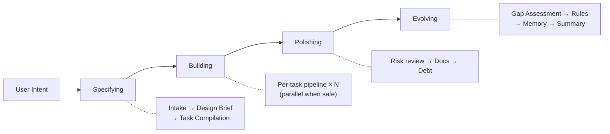

<div align="center">

**[English](README.md)** | **한국어**

# Geas

### 멀티 에이전트 AI 팀을 위한 거버넌스 프로토콜

[](LICENSE)
[](https://github.com/choam2426/geas/releases)

</div>

Geas는 AI 에이전트 팀이 통제된 조직처럼 동작하게 만든다 — 소프트웨어 개발이든, 연구든, 콘텐츠 제작이든 상관없다. 모든 결정은 정해진 절차를 따르고, 모든 행동은 추적 가능하며, 모든 산출물은 계약에 따라 검증되고, 팀은 세션을 거듭하며 성장한다.

---

## 왜 Geas가 필요한가

멀티 에이전트 작업은 빠르고 강력하다. 하지만 구조 없이 돌리면 늘 같은 식으로 무너진다:

- **증거 없는 "완료"** — 에이전트는 끝났다고 하지만, 수용 기준을 실제로 검증한 적이 없다
- **사라지는 결정** — 왜 이 접근을 택했는지, 리뷰에서 뭐가 논의됐는지 — 컴팩션 이후 전부 소실된다
- **병렬 충돌** — 에이전트 여럿이 같은 영역을 건드리고, 충돌은 한참 뒤에야 발견된다
- **불분명한 권한** — 토론은 하는데, 누가 결정권을 가지는지 정의되어 있지 않다
- **학습 제로** — 아무것도 남지 않으니, 세션이 바뀌면 같은 실수를 그대로 반복한다

에이전트를 하나에서 여럿으로 늘리면, 이런 문제는 더해지는 게 아니라 곱해진다.

---

## 동작 방식

### 네 단계

모든 mission은 네 단계를 거친다. 작은 변경이면 가볍게, 큰 작업이면 풀코스로 — 규모만 달라질 뿐 순서는 같다.



| 단계 | 수행 내용 |
|---|---|
| **Specifying** | WHAT과 WHY를 정의한다. Mission spec, design brief, task list를 산출한다. |
| **Building** | 각 task를 거버넌스 pipeline으로 실행한다: contract → implement → review → verify → verdict. |
| **Polishing** | Building 중 발견된 부채, 문서 누락, 품질 이슈를 처리한다. |
| **Evolving** | 교훈을 포착한다. 회고, memory 승격, 규칙 갱신, 다음 미션으로 이월. |

### Task Pipeline

각 task는 계약부터 종료까지 거버넌스 pipeline을 거친다:

```
Contract → Implementation → Self-check → Specialist review
→ Evidence Gate → Closure Packet → Challenger review
→ Final Verdict → Retrospective → Memory extraction
```

### 검증

프로토콜은 어떤 agent의 완료 주장도 신뢰하지 않는다. 독립적인 증거를 요구한다.

- **Evidence Gate** — Tier 0(산출물 사전 점검), Tier 1(반복 가능한 기계적 검증), Tier 2(수용 기준 + 루브릭 점수)
- **Challenger** — 고위험 작업에 대한 적대적 리뷰: "이게 틀릴 수 있는 이유는?"
- **Final Verdict** — Decision Maker가 전체 closure packet을 판정: pass, iterate, 또는 escalate

### Memory와 진화

완료된 모든 task는 시스템에 피드백된다:

- **회고** — 무엇이 잘 됐고, 무엇이 깨졌고, 무엇을 바꿔야 하는가
- **Memory** — 교훈은 증거를 통해 신뢰를 얻고, 규칙과 context packet을 통해 환류된다
- **부채 추적** — 타협한 결정을 가시화하고 책임을 부여한다. 잊히지 않는다

---

## 팀

프로토콜은 도메인 profile별로 조직된 **14개 agent 타입**을 정의한다. Authority agent가 프로세스를 통제하고, specialist agent가 도메인 작업을 수행한다.

| | Agents |
|---|---|
| **Authority** (항상 활성) | Product Authority, Design Authority, Challenger |
| **Software profile** | Software Engineer, QA Engineer, Security Engineer, Platform Engineer, Technical Writer |
| **Research profile** | Literature Analyst, Research Analyst, Methodology Reviewer, Research Integrity Reviewer, Research Engineer, Research Writer |

Mission에서 도메인 profile을 선언하면, Orchestrator(mission skill 자체)가 런타임에 추상 specialist slot을 구체 agent로 해석한다 — 동일한 거버넌스 pipeline이 어떤 도메인에서든 동작한다.

[전체 팀 레퍼런스 →](docs/reference/AGENTS.md)

---

## 실제 동작 예시

```
[Orchestrator]     Specifying: intake complete. 2 tasks compiled.
[Orchestrator]     Building: starting task-001 (JWT auth API).

[Design Auth]      Tech guide: bcrypt + JWT, refresh token rotation.
[Orchestrator]     Implementation contract approved.
[SW Engineer]      Implementation complete. 4 endpoints. Workspace merged.
[SW Engineer]      Self-check: confidence 4/5. Token expiry edge case untested.
[Design Auth]      Review: approved.                                <- parallel
[QA Engineer]      Testing: 6/6 acceptance criteria passed.         <- parallel
[Orchestrator]     Evidence Gate: PASS. Closure packet assembled.
[Challenger]       Challenge: no rate limiting [BLOCKING].
[Orchestrator]     Vote round: iterate. Re-implementing.
[SW Engineer]      Rate limiter added. Re-verification passed.
[Product Auth]     Final Verdict: PASS.
[Orchestrator]     Committed. Retro: auth APIs need rate limiting — rule proposed.

[Orchestrator]     Polishing: risk review, docs, debt.
[Orchestrator]     Evolving: gap assessment, rules update, memory promotion.
[Orchestrator]     Mission complete. 2/2 tasks passed.
```

---

## 빠른 시작

현재 구현체는 **Claude Code 플러그인**이다. [Claude Code CLI](https://claude.ai/code) 설치 후:

```bash
/plugin marketplace add choam2426/geas
/plugin install geas@choam2426-geas
/geas:mission
```

달성하고자 하는 것을 설명한다. Orchestrator가 Geas 프로토콜에 따라 작업을 진행한다.

---

## 문서

| 문서 | 설명 |
|---|---|
| [Architecture](docs/architecture/DESIGN.md) | 시스템 설계, 4계층 아키텍처, 데이터 흐름 |
| [Protocol](docs/protocol/) | 14개 운영 프로토콜 문서 |
| [Schemas](docs/protocol/schemas/) | 30개 JSON Schema 정의 (draft 2020-12) |
| [Agents](docs/reference/AGENTS.md) | 14개 agent 타입과 slot 기반 권한 모델 |
| [Skills](docs/reference/SKILLS.md) | 15개 skill (13 core + 2 utility) |
| [Hooks](docs/reference/HOOKS.md) | 16개 lifecycle hook |

---

## 라이선스

[Apache License 2.0](LICENSE)

---

<div align="center">

**프로토콜을 정의하라. 미션을 기술하라. 산출물을 검증하라. 팀의 성장을 지켜보라.**

</div>
