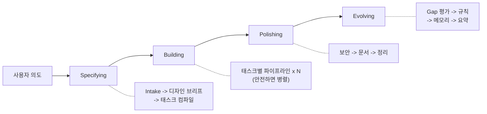

<div align="center">

**[English](README.md)** | **한국어**

# Geas

### 멀티 에이전트 팀 기반 작업에 질서를 부여하는 프로토콜

[](LICENSE)
[](https://github.com/choam2426/geas/releases)

</div>

> *"우리 과제 중 하나는 적절한 원칙을 유지하는 일이 될 것이다. 그래야 우리가 무엇을 하고 있는지 놓치지 않을 수 있다."*
> — 앨런 튜링

Geas는 에이전트 팀이 통제된 조직처럼 동작하도록 만드는 프로토콜입니다.

- **통제된 의사결정** — 14개 에이전트 타입이 authority, software, research 도메인에 걸쳐 배치되고, 설계 선택은 투표를 거칩니다. 의견이 갈리면 구조화된 절차와 에스컬레이션 경로로 풀고, 역할마다 낼 수 있는 결과물이 명시되어 있습니다.
- **추적 가능한 기록** — 태스크 계약, 상태 전이, 증거, 판결이 `.geas/`에 쌓입니다. 세션 체크포인트 덕분에 중단됐던 지점에서 그대로 재개할 수 있고, 이벤트 원장이 주요 행동을 전부 남깁니다.
- **계약 기반 검증** — 태스크마다 수용 기준과 루브릭이 붙습니다. 3단계 Evidence Gate가 사전 조건, 빌드/린트/테스트, 루브릭 점수를 차례로 확인합니다. 위험도가 높으면 Challenger가 따로 검증하고, 마지막에 제품 수준 Final Verdict로 닫습니다.
- **지속적 학습** — 태스크가 끝날 때마다 회고가 남고, 거기서 나온 교훈은 메모리 후보로 올라가 리뷰를 거쳐 승격됩니다. 규칙은 공유 `rules.md`에서 계속 갱신되고, 기술 부채는 debt register에 기록되어 다음 미션의 우선순위에 반영됩니다. 컨텍스트 패킷이 다음 작업에 관련 메모리를 넣어줍니다.

## 빠른 시작

현재 구현체는 **Claude Code 플러그인**입니다. [Claude Code CLI](https://claude.ai/code) 설치 후:

```bash
/plugin marketplace add choam2426/geas
/plugin install geas@choam2426-geas
/geas:mission
```

새로 만들거나 개선하고 싶은 걸 설명하세요. 오케스트레이터가 Geas 프로토콜에 따라 작업을 진행합니다.

## 설계 원칙

- **완료는 증거로 판정한다** — 3단계 검증과 제품 수준 최종 판정을 통과해야 태스크가 완료된다
- **맥락은 끊기지 않는다** — 중단이나 세션 교체 후에도 상태와 판단 이력이 그대로 남는다
- **지속할수록 성장한다** — 매 태스크의 회고가 규칙과 메모리로 축적되고, 기술 부채도 함께 기록된다

---

## 왜 Geas가 필요한가

멀티 에이전트 작업은 빠르고 강력하지만, 통제 없이 돌리면 늘 같은 식으로 무너집니다:

- **증거 없는 "완료"** — 에이전트는 끝났다고 하지만, 수용 기준을 실제로 검증한 적이 없습니다
- **사라지는 결정** — 아키텍처를 왜 이렇게 골랐는지, 리뷰에서 뭐가 논의됐는지 어디에도 없습니다
- **병렬 충돌** — 에이전트 여럿이 같은 파일을 건드리고, 충돌은 한참 뒤에야 발견됩니다
- **불분명한 권한** — 토론은 하는데, 누가 결정하는지 정해져 있지 않습니다
- **학습 제로** — 세션이 바뀌면 같은 실수를 그대로 반복합니다

에이전트를 하나에서 여럿으로 늘리면, 이런 문제는 더해지는 게 아니라 곱해집니다.

---

## 동작 방식



미션은 언제나 네 단계를 전부 밟습니다. 작은 요청이면 가볍게, 큰 작업이면 풀코스로 — 규모만 달라집니다.

태스크 하나는 **14단계 파이프라인**을 거칩니다. [-> 파이프라인 상세](docs/ko/architecture/DESIGN.md)

```
구현 계약 -> 구현 -> 셀프체크 -> 코드 리뷰 + 테스트
-> Evidence Gate -> Closure Packet -> Challenger Review
-> Final Verdict -> 회고 -> 메모리 추출
```

### 검증 흐름

태스크는 다음을 순서대로 통과해야 완료됩니다:

- **Evidence Gate** — Tier 0(사전 조건), Tier 1(build/lint/test), Tier 2(수용 기준 + 루브릭 점수)
- **Closure Packet** — Gate 통과 후 모든 증거를 하나의 패킷으로 조립
- **Challenger** — 위험도가 높은 태스크는 별도 검증을 거침
- **Final Verdict** — 모든 증거를 종합한 제품 수준 최종 판정

### 저장소에 남는 것

Geas는 운영 상태와 증거를 `.geas/`에 남깁니다:

```
.geas/
├── state/                        # 세션 체크포인트, 락, 상태 신호
├── missions/
│   └── {mission_id}/
│       ├── spec.json                 # 미션 스펙 (intake에서 동결)
│       ├── design-brief.json         # 디자인 브리프 (사용자 승인됨)
│       ├── tasks/
│       │   ├── task-001.json         # 태스크 계약
│       │   └── task-001/
│       │       ├── worker-self-check.json
│       │       ├── gate-result.json
│       │       ├── closure-packet.json
│       │       ├── challenge-review.json
│       │       ├── final-verdict.json
│       │       └── retrospective.json
│       ├── evidence/                 # 전문가 리뷰 증거
│       ├── evolution/                # 부채 등록부, gap 평가
│       └── phase-reviews/            # 단계 전이 리뷰
├── memory/                       # 학습 패턴 (candidate -> canonical)
├── ledger/                       # 추가 전용 이벤트 로그
└── rules.md                      # 공유 규칙 (시간이 갈수록 쌓임)
```

---

## 팀

프로토콜이 정의하는 에이전트 타입은 **14개**이며, 도메인 프로필별로 조직되어 역할마다 권한 범위와 결과물 책임이 정해져 있습니다.

**Authority** (항상 활성) — Product Authority, Design Authority, Challenger

**Software 도메인** — Software Engineer, QA Engineer, Security Engineer, Platform Engineer, Technical Writer

**Research 도메인** — Research Analyst, Research Engineer, Research Writer, Literature Analyst, Methodology Reviewer, Research Integrity Reviewer

미션에서 도메인 프로필(software, research, 또는 양쪽 모두)을 선언하면 해당 도메인의 에이전트가 활성화됩니다. Authority 에이전트는 항상 참여합니다.

[-> 전체 팀 레퍼런스](docs/ko/reference/AGENTS.md)

---

## 실제 동작 예시

```
[Orchestrator]     Specifying: intake 완료. 태스크 2개 컴파일됨.
[Orchestrator]     Building: task-001 (JWT 인증 API) 시작.

[Design Auth]      기술 가이드: bcrypt + JWT, refresh token rotation.
[Orchestrator]     구현 계약 승인됨.
[SW Engineer]      구현 완료. 4개 엔드포인트. worktree 병합.
[SW Engineer]      셀프체크: confidence 4/5. 토큰 만료 엣지케이스 미확인.
[Design Auth]      코드 리뷰: 승인.                              <- 병렬 실행
[QA Engineer]      테스트: 수용 기준 6/6 통과.                    <- 병렬 실행
[Orchestrator]     Evidence Gate: PASS. Closure packet 조립됨.
[Challenger]       챌린지: rate limiting 미적용 [BLOCKING].
[Orchestrator]     Vote round: iterate 결정. 재구현.
[SW Engineer]      rate limiter 추가. 재검증 통과.
[Product Auth]     Final Verdict: PASS.
[Orchestrator]     커밋 완료. 회고: 인증 API는 rate limiting 필수 규칙 제안.
[Orchestrator]     메모리 추출: 후보 3건.

[Orchestrator]     Polishing: 보안 리뷰, 문서, 정리.
[Orchestrator]     Evolving: gap 평가, 규칙 갱신, 메모리 승격.
[Orchestrator]     미션 완료. 2/2 태스크 통과.
```

---

## 문서

| 문서 | 설명 |
|------|------|
| [아키텍처](docs/ko/architecture/DESIGN.md) | 시스템 설계, 데이터 흐름, 원칙 |
| [프로토콜](docs/ko/protocol/) | 14개 운영 프로토콜 문서 |
| [스키마](docs/protocol/schemas/) | 30개 JSON Schema 정의 (draft 2020-12) |
| [Agents](docs/ko/reference/AGENTS.md) | 14개 에이전트 타입과 슬롯 기반 권한 모델 |
| [Skills](docs/ko/reference/SKILLS.md) | 15개 스킬 레퍼런스 (13 core + 2 utility) |
| [Hooks](docs/ko/reference/HOOKS.md) | 16개 라이프사이클 hook 레퍼런스 |

---

## 라이선스

[Apache License 2.0](LICENSE)

---

<div align="center">

**프로토콜을 정의하세요. 미션을 설명하세요. 결과를 검증하세요. 팀이 성장하는 걸 지켜보세요.**

</div>
