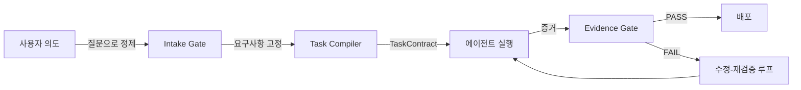

<div align="center">

**[English](README.md)** | **한국어**

# Geas

### Governance. Traceability. Verification. Evolution.

여러 AI 에이전트가 함께 일할 때 생기는 문제를 해결합니다 — 결정에는 체계가 있고, 과정은 추적되고, 결과물은 검증되고, 팀은 세션마다 성장합니다.

[](https://claude.ai/code)
[](LICENSE)
[](docs/AGENTS.md)
[](docs/SKILLS.md)
[](docs/HOOKS.md)

</div>

---

## 문제

AI 에이전트 여러 개를 동시에 돌리면 강력하지만, 한 가지 근본적인 문제가 있습니다. 에이전트가 늘어날수록 결정도 늘어나는데, 아무도 그걸 추적하지 않는다는 겁니다.

- **누가 무슨 결정을 했는지 모릅니다.** 에이전트 A가 기술 스택을 골랐고, B가 스키마를 설계하고, C가 구현했는데 — 왜 그런 선택을 했는지 기록이 없습니다.
- **결과물이 맞는지 확인할 수 없습니다.** 각 에이전트가 "완료"라고 하지만, 실제로 요구사항을 충족했는지 검증한 적이 없습니다.
- **문제가 생기면 되짚을 수가 없습니다.** 어떤 과정을 거쳐 이 결과가 나왔는지 추적할 방법이 없습니다.
- **팀이 학습하지 않습니다.** 다음 세션은 제로부터 시작합니다. 규칙도, 교훈도, 축적된 지식도 없습니다.

> 켈트 신화에서 **기아스(geas)**는 영웅에게 걸리는 절대적인 서약입니다. 반드시 지켜야 하고, 어기면 파멸합니다.
>
> 이 프로젝트도 마찬가지입니다. 모든 에이전트는 **계약**에 묶여서 일합니다 — 지켜야 할 기준, 넘으면 안 되는 경계, 남겨야 할 증거가 정해져 있고, 예외는 없습니다.

---

## 네 가지 원칙

> **Governance** — 결정을 암묵적으로 내리지 않습니다. 아키텍처 선택은 투표를 거치고, 의견이 갈리면 토론이 붙고, 결과는 결정 기록으로 남습니다. "모델이 그렇게 느꼈으니까"로 넘어가는 일은 없습니다.

> **Traceability** — 모든 과정이 기록으로 남습니다. 미션은 seed spec으로 고정되고, 작업은 계약으로 컴파일되고, 에이전트는 증거를 남기고, 상태 변화는 이벤트 로그에 쌓입니다. 뭐가 일어났고, 누가 했고, 왜 했는지 되짚을 수 있습니다.

> **Verification** — "완료"는 증거 게이트를 통과했다는 뜻입니다. "에이전트가 됐다고 함"이 아닙니다. 모든 작업은 3단계 게이트를 통과합니다:
>
> | 계층 | 질문 | 방법 |
> |------|------|------|
> | **기계적** | 코드가 동작하는가? | 빌드, 린트, 테스트 |
> | **의미론적** | 올바른 것을 만들었는가? | 요구사항 대조 |
> | **제품** | 미션에 부합하는가? | 제품 리뷰 판정 |

> **Evolution** — 팀은 세션마다 성장합니다. Scrum이 매 태스크 후 회고를 실행하고, 발견한 규칙은 `rules.md`에, 교훈은 프로젝트 메모리에 축적됩니다. 세션 1에서 배운 것이 세션 5의 작업 방식을 바꿉니다. 지식이 복리로 쌓입니다.

---

## 빠른 시작

**준비물**: [Claude Code CLI](https://claude.ai/code) 설치 및 인증

### 1. 플러그인 설치

```bash
/plugin marketplace add choam2426/geas
/plugin install geas@choam2426-geas
```

### 2. 미션을 설명합니다

```text
공유 링크로 초대할 수 있는 실시간 투표 앱을 만들어줘.
```

Compass(오케스트레이터)가 요구사항을 정리하고, 계약을 만들고, 전문 에이전트를 배치하고, 증거 게이트로 결과를 검증합니다.

### 3. 과정을 확인합니다

```
[Compass]  작업 시작. Pixel에게 할당.
[Palette]  모바일 퍼스트 레이아웃. 세로 카드 스택.
[사람]     파이차트 대신 막대그래프로 해줘.          <- 사람의 개입
[Forge]    동의. CSS-only 막대그래프.
[Pixel]    구현 완료. 5개 컴포넌트.
[Sentinel] QA: 5/5 기준 통과.
[Critic]   리스크: 오프라인 폴백 없음, 리사이즈 시 차트 리플로우.
[Compass]  Evidence Gate PASSED.
[Nova]     Ship.
[Scrum]    회고: CSS 애니메이션 규칙을 rules.md에 추가.
```

---

## 동작 방식



모든 기록은 `.geas/`에 남습니다 — 전체 과정을 되짚을 수 있는 근거입니다:

```
.geas/
├── spec/seed.json           # 고정된 요구사항
├── tasks/*.json             # 수용 기준이 포함된 TaskContract
├── packets/                 # 에이전트별 브리핑
├── evidence/                # 태스크별 작업 증거
├── decisions/               # 투표 기록, 결정 기록
├── ledger/events.jsonl      # 추가 전용 이벤트 로그
├── memory/
│   ├── retro/               # 태스크별 회고 교훈
│   └── agents/              # 에이전트별 메모리 (세션마다 축적)
└── rules.md                 # 공유 프로젝트 규칙 (시간이 갈수록 성장)
```

---

## 팀

Compass가 파이프라인을 조율하고, 12명의 전문 에이전트가 각자의 기아스 아래에서 실행합니다:

| 그룹 | 에이전트 | 역할 |
|------|---------|------|
| **리더십** | Nova | CEO / 제품 판단 |
| | Forge | CTO / 아키텍처 |
| **디자인** | Palette | UI/UX 디자이너 |
| **엔지니어링** | Pixel | 프론트엔드 |
| | Circuit | 백엔드 |
| | Keeper | Git / 릴리스 매니저 |
| **품질** | Sentinel | QA 엔지니어 |
| **운영** | Pipeline | DevOps |
| | Shield | 보안 |
| **전략** | Critic | Devil's Advocate |
| **문서** | Scroll | 테크 라이터 |
| **프로세스** | Scrum | 애자일 마스터 / 회고 |

---

## 실행 모드

| | Full Team | Sprint | Debate |
|---|---|---|---|
| **용도** | 새 제품 시작 | 기능 추가 | 의사결정 |
| **단계** | Genesis → MVP → Polish → Evolution | Design → Build → Review → QA | 구조화된 토론 |
| **결과물** | 완성된 제품 + 문서 | 검증된 기능 + 커밋 | DecisionRecord |

---

## 문서

| 문서 | KO | EN |
|------|----|----|
| 사용 가이드 | [GUIDE.ko.md](docs/GUIDE.ko.md) | [GUIDE.md](docs/GUIDE.md) |
| 거버넌스 | [GOVERNANCE.ko.md](docs/GOVERNANCE.ko.md) | [GOVERNANCE.md](docs/GOVERNANCE.md) |
| 에이전트 레퍼런스 | [AGENTS.ko.md](docs/AGENTS.ko.md) | [AGENTS.md](docs/AGENTS.md) |
| 스킬 레퍼런스 | [SKILLS.ko.md](docs/SKILLS.ko.md) | [SKILLS.md](docs/SKILLS.md) |
| 훅 레퍼런스 | [HOOKS.ko.md](docs/HOOKS.ko.md) | [HOOKS.md](docs/HOOKS.md) |
| 설계 문서 | [DESIGN.md](docs/DESIGN.md) | — |

---

## 라이선스

[Apache License 2.0](LICENSE)

---

<div align="center">

**플러그인을 설치하세요. 미션을 설명하세요. 결과를 검증하세요. 팀이 성장하는 걸 지켜보세요.**

</div>
