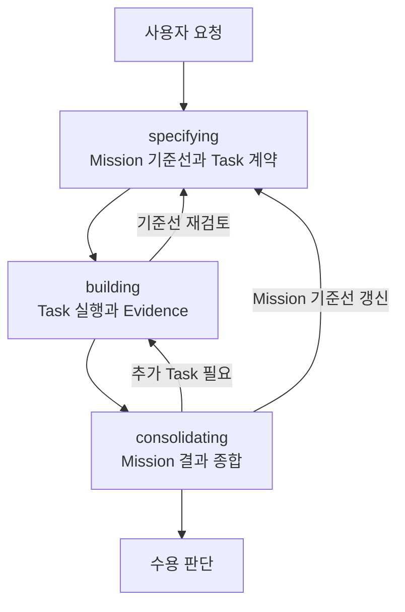
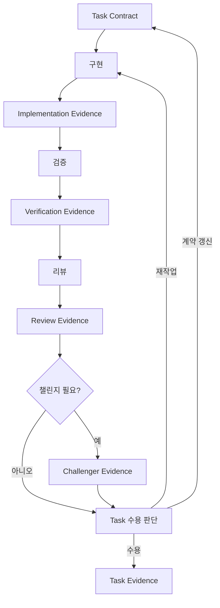

# Geas

Geas는 AI agent 작업을 명확한 계약, 실행, 검증 근거, 수용 판단, 회고로 구조화해 사람이 더 낮은 비용으로 책임 있게 결과를 판단할 수 있게 하는 운영 원칙과 Skill 묶음입니다.

## Geas가 필요한 이유

AI agent는 산출물을 빠르게 만들 수 있습니다. 하지만 빠른 산출물이 어떤 목표와 기준으로 만들어졌는지, 무엇을 확인했는지, 무엇을 확인하지 못했는지 남지 않으면 사람이 결과를 다시 검토하고 수용 판단하는 비용이 커집니다.

Geas가 줄이려는 것은 agent의 실행 시간이 아니라 사람이 결과를 검토하고, 수용 판단을 내리고, 유지하고, 다음 작업으로 이어가기까지 드는 총 비용입니다. 빠른 생성이 검증 근거와 미검증 범위를 갖춘 작업 상태로 남아야 장기적으로 더 이어가기 쉬운 프로젝트가 됩니다.

## 도입 효과

- 모호한 요청을 Mission과 Task 계약으로 바꿔 실행 기준과 제외 범위를 선명하게 합니다.
- 큰 작업을 사람이 판단 가능한 Task 단위로 나눠 검토와 재작업 부담을 낮춥니다.
- 수용 기준, verification checks, review focus를 먼저 정해 결과를 무엇으로 판단할지 고정합니다.
- 구현 결과와 함께 검증 근거, 미검증 범위, 남은 위험을 남겨 근거 기반 수용 판단을 돕습니다.
- 구현, 검증, 리뷰, 챌린지를 분리해 산출물의 맥락, 품질, 누락, 장기 위험을 따로 확인합니다.
- 작업 중 기준이 바뀌면 조용히 범위를 넓히지 않고 기준선 갱신과 재검토로 되돌립니다.
- 중단된 작업도 Mission 기준선, Task 상태, Evidence를 바탕으로 다시 이어갈 수 있습니다.
- gap, debt, follow-up, memory를 구분해 남은 문제와 반복 가능한 교훈을 다음 작업으로 연결합니다.

## Geas란 무엇인가

Geas는 agent 작업을 다음 흐름으로 다루는 기본 운영 원칙입니다.

- 작업 전에 목표, 범위, 산출물, 검증 방법, 하지 않을 일을 계약으로 고정합니다.
- agent는 계약 안에서 실행하고, 검증 근거와 미검증 범위를 남깁니다.
- 사람은 그 근거를 검토하고 결과를 수용할지 판단합니다.
- 작업에서 드러난 사실은 다음 작업을 위한 회고와 기억으로 남깁니다.

이 repository에는 그 원칙을 실행하기 위한 문서, Skill workflow, `.geas/` runtime 기록을 guard하는 CLI, Codex와 Claude Code용 marketplace plugin package가 함께 들어 있습니다.

## 설치

아래 방법 중 하나를 사용합니다.

<details>
<summary>Codex marketplace로 설치</summary>

```text
/plugin marketplace add choam2426/geas
/plugin install geas@geas
```

</details>

<details>
<summary>Claude Code marketplace로 설치</summary>

```text
/plugin marketplace add choam2426/geas
/plugin install geas@geas
```

</details>

<details>
<summary>Codex project-local Skill로 직접 설치</summary>

```bash
git clone https://github.com/choam2426/geas.git
mkdir -p .agents/skills
cp -R geas/skills/* .agents/skills/
```

</details>

<details>
<summary>Claude Code project-local Skill로 직접 설치</summary>

```bash
git clone https://github.com/choam2426/geas.git
mkdir -p .claude/skills
cp -R geas/skills/* .claude/skills/
```

</details>

## 사용 방법

Geas를 설치한 뒤 프로젝트에서 Codex나 Claude Code를 열고 `/mission`으로 Geas 작업을 시작하거나 이어 갑니다.

작업이 도중에 중단되어도 다시 `/mission`을 호출하면 남아 있는 Mission 기준선, Task 상태, Evidence를 바탕으로 이어갈 수 있습니다.

```text
/mission 로그인 실패 시 사용자가 원인을 알 수 있도록 오류 메시지 표시 기능 추가
```

```text
/mission 진행 중인 Mission 이어서 진행
```

Geas는 agent가 바로 완료를 선언하게 만들기보다, 먼저 작업 기준을 계약으로 잡고 실행 결과를 Evidence로 남긴 뒤 사람이 검토하고 수용 판단할 수 있게 흐름을 나눕니다.

## 핵심 흐름



`specifying`은 사용자 요청을 Mission 기준선과 Task 계약으로 구체화합니다. `building`은 수용된 Task 계약을 기준으로 구현, 검증, 리뷰를 진행하고 Evidence를 남깁니다. `consolidating`은 수용된 Task들을 Mission 기준으로 종합해 사람이 Mission 결과를 판단할 수 있게 정리합니다. 추가 Task나 기준선 갱신이 필요하면 이전 단계로 돌아갑니다.

Task는 다음 흐름으로 진행됩니다.



## 핵심 개념

- `Mission`: 사용자가 agent를 통해 이루려는 목표입니다. 배경, 범위, 제외 범위, 수용 기준을 담습니다.
- `Task`: Mission을 사람이 Evidence를 보고 판단할 수 있게 나눈 작업 단위입니다.
- `Evidence`: agent가 남기는 검증 근거와 미검증 범위입니다. 완료 선언이 아니라 사람의 검토를 돕는 근거 자료입니다.
- `User Judgment`: 사람이 Evidence를 검토한 뒤 결과를 수용, 제한부 수용, 재작업, 보류, 중단 중 하나로 판단한 기록입니다.
- `Reflection`: 실행과 검증에서 드러난 사실을 다음 작업의 계약, 검증 방법, 기록 방식에 반영하는 회고입니다.

## 먼저 읽을 문서

- [Geas 정의](docs/definition.md)
- [작업 운영](docs/operating/index.md)

## 라이선스

Apache License 2.0. 자세한 내용은 [LICENSE](LICENSE)를 확인하세요.
