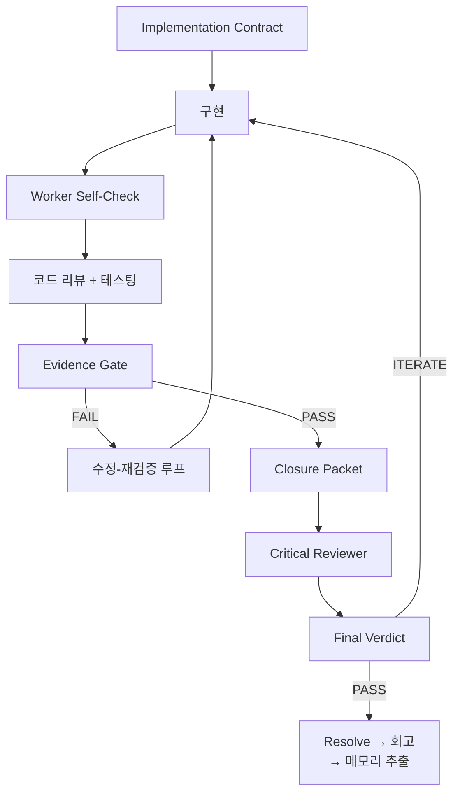

<div align="center">

**[English](README.md)** | **한국어**

# Geas

### Governance. Traceability. Verification. Evolution.

멀티 에이전트 AI 개발을 위한 거버넌스 프로토콜 — 결정에는 프로세스가 있고, 과정에는 기록이 남고, 결과물은 계약으로 검증하고, 팀은 세션마다 성장합니다.

[](#)
[](LICENSE)
[](docs/ko/reference/AGENTS.md)
[](docs/ko/reference/SKILLS.md)
[](docs/ko/reference/HOOKS.md)

</div>

---

## Geas란?

Geas는 멀티 에이전트 AI 개발을 위한 거버넌스 프로토콜입니다. 결정이 어떻게 통제되고, 행동이 어떻게 추적되고, 결과물이 어떻게 검증되고, 팀이 어떻게 진화하는지를 정의합니다. 프로토콜은 도구에 독립적이며, 포함된 Claude Code 플러그인은 하나의 구현체입니다. 미션을 설명하면 전문 에이전트 팀이 설계부터 검증까지 수행하고, 전 과정을 기록합니다.

---

## 네 가지 원칙

| 원칙 | 정의 | 구체적 예시 |
|------|------|------------|
| **Governance** | 결정마다 정해진 프로세스와 명시적 권한이 있습니다. | 아키텍처를 고를 때 투표를 거칩니다. 의견이 갈리면 토론을 열고, 트레이드오프를 기록합니다. |
| **Traceability** | 행동마다 기록이 남고, 나중에 추적할 수 있습니다. | 상태가 바뀔 때마다 타임스탬프와 함께 `.geas/ledger/events.jsonl`에 기록하고, `run.json` 체크포인트로 파이프라인 위치를 추적합니다. |
| **Verification** | 결과물을 계약 기준으로 검증합니다. "완료" = "계약 충족"입니다. | Evidence Gate가 3단계로 검증합니다: 기계적(빌드/린트/테스트), 의미론적(수용 기준 + 루브릭 점수), 제품(최종 판정). 어떤 단계도 특정 도구를 참조하지 않습니다. |
| **Evolution** | 팀이 세션을 거듭할수록 성장합니다. | 작업이 끝날 때마다 Process Lead가 회고를 실행합니다. 교훈은 `.geas/tasks/{task-id}/retrospective.json`에, 규칙은 `rules.md`에 쌓입니다. |

---

## 빠른 시작

**Claude Code 구현체**: [Claude Code CLI](https://claude.ai/code) 설치 및 인증

> Geas는 프로토콜입니다. 이 빠른 시작은 Claude Code 플러그인 구현체를 사용합니다.
> 다른 실행 엔진도 동일한 프로토콜을 구현할 수 있습니다.

### 1. 플러그인 설치

```bash
/plugin marketplace add choam2426/geas
/plugin install geas@choam2426-geas
```

### 2. 미션 시작

```text
/geas:mission
```

만들고 싶은 것, 추가할 기능, 결정할 사안을 설명하면 됩니다. 오케스트레이터가 4-phase 실행 흐름(Discovery, Build, Polish, Evolution)을 요청에 맞게 조절합니다. 의사결정만 필요한 요청은 decision 모드로 라우팅됩니다.

### 3. 과정 확인

```
[Orchestrator]     작업 시작. Frontend Engineer에게 할당.
[UI/UX Designer]   모바일 퍼스트 레이아웃. 세로 카드 스택.
[사람]             파이차트 대신 막대그래프로 해줘.
[Arch Authority]   동의. CSS-only 막대그래프.
[Frontend Eng]     구현 완료. 5개 컴포넌트.
[QA Engineer]      QA: 5/5 기준 통과.
[Critical Rev]     리스크: 오프라인 폴백 없음, 리사이즈 시 차트 리플로우.
[Orchestrator]     Evidence Gate PASSED.
[Product Auth]     Ship.
[Process Lead]     회고: CSS 애니메이션 규칙을 rules.md에 추가.
```

---

## 동작 방식

### 4-Phase 실행 흐름


### Per-Task 파이프라인



전 과정의 기록이 `.geas/`에 남습니다:

```
.geas/
├── spec/seed.json              # 고정된 요구사항
├── state/
│   ├── run.json                # 세션 체크포인트 (파이프라인 위치, 복구)
│   ├── locks.json              # lock 매니페스트 (path/interface/resource/integration)
│   ├── memory-index.json       # 메모리 검색 인덱스
│   ├── debt-register.json      # 구조화된 기술 부채 장부
│   ├── gap-assessment.json     # 스코프 전달 비교
│   ├── rules-update.json       # 제안/승인된 규칙 변경
│   ├── phase-review.json       # phase 전환 gate 결과
│   ├── health-check.json       # 건강 신호 모니터링
│   ├── session-latest.md       # 세션 상태 요약 (post-compact 복원용)
│   └── task-focus/             # 태스크별 컨텍스트 앵커
├── tasks/                      # TaskContract + 태스크별 아티팩트
│   └── {task-id}/
│       ├── task-contract.json
│       ├── worker-self-check.json
│       ├── gate-result.json
│       ├── closure-packet.json
│       ├── final-verdict.json
│       └── retrospective.json
├── contracts/                  # 구현 계약
├── packets/                    # 에이전트별 브리핑 + 메모리 패킷
├── evidence/                   # 작업별 증거
├── decisions/                  # 투표 기록, 결정 기록
├── ledger/events.jsonl         # 추가 전용 이벤트 로그
├── memory/
│   ├── _project/conventions.md # 프로젝트 규칙 (스택, 명령어, 패턴)
│   ├── candidates/             # 회고에서 나온 메모리 후보
│   ├── entries/                # 승격된 메모리 항목 (provisional → canonical)
│   └── logs/                   # 메모리 적용 효과 로그
├── recovery/                   # 세션 중단 시 복구 패킷
├── summaries/                  # 세션 요약 (감사 추적)
└── rules.md                    # 공유 프로젝트 규칙 (시간이 갈수록 성장)
```

---

## 팀

프로토콜은 12개의 에이전트 타입을 정의합니다. 각 타입은 거버넌스 파이프라인 내에서 고유한 권한과 책임을 가집니다:

| 그룹 | Agent Type | 역할 |
|------|-----------|------|
| **리더십** | Product Authority | 제품 판단, 최종 판정 |
| | Architecture Authority | 아키텍처, 코드 리뷰 |
| **디자인** | UI/UX Designer | 인터페이스 디자인 |
| **엔지니어링** | Frontend Engineer | 프론트엔드 구현 |
| | Backend Engineer | 백엔드 구현 |
| | Repository Manager | Git, 릴리스 관리 |
| **품질** | QA Engineer | 테스팅, 품질 보증 |
| **운영** | DevOps Engineer | CI/CD, 배포 |
| | Security Engineer | 보안 리뷰 |
| **전략** | Critical Reviewer | 악마의 변호인, 출시 전 도전 |
| **문서** | Technical Writer | 문서화 |
| **프로세스** | Process Lead | 회고, 규칙 진화 |

---

## 문서

### 아키텍처
| 문서 | 설명 |
|------|------|
| [설계](docs/ko/architecture/DESIGN.md) | 시스템 아키텍처, 데이터 흐름, 원칙 |

### 레퍼런스
| 문서 | 설명 |
|------|------|
| [Skills](docs/ko/reference/SKILLS.md) | 27개 skill 레퍼런스 |
| [Agents](docs/ko/reference/AGENTS.md) | 12명 에이전트 레퍼런스 |
| [Hooks](docs/ko/reference/HOOKS.md) | 18개 hook 레퍼런스 |

### 프로토콜
| 문서 | 설명 |
|------|------|
| [프로토콜](docs/ko/protocol/) | 15개 운영 프로토콜 문서 (canonical) |
| [스키마](docs/protocol/schemas/) | 22개 JSON Schema 정의 (draft 2020-12) |

---

## 라이선스

[Apache License 2.0](LICENSE)

---

<div align="center">

**프로토콜을 정의하세요. 미션을 시작하세요. 결과를 검증하세요. 팀이 성장하는 걸 지켜보세요.**

</div>
