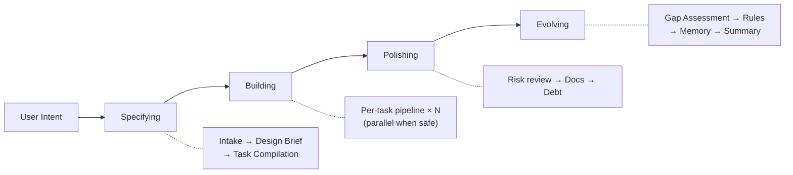

**[English](README.md)** | **한국어**

# Geas
### 에이전트의 “완료”를 증거로 검증하세요.
**구조화된 멀티 에이전트 작업을 위한 거버넌스 프로토콜 + Claude Code 플러그인**

[](LICENSE)
[](https://github.com/choam2426/geas/releases)

Geas는 여러 AI 에이전트를 그냥 많이 돌리는 도구가 아니라, **팀처럼 일하게 만드는 거버넌스 계층**입니다. “끝났다”는 말 대신 **증거**를, 느슨한 리뷰 대신 **명시된 권한**을, 세션 단절 대신 **재사용 가능한 기억**을 남깁니다.

현재 구현체는 **Claude Code 플러그인**으로 동작합니다. 지금 제공되는 도메인 프로필은 **소프트웨어**와 **연구**이며, 계약 엔진은 도메인에 종속되지 않도록 설계되어 이후 다른 프로필도 같은 거버넌스 모델 위에 올릴 수 있습니다.

> Geas는 “에이전트를 더 많이 돌리는” 프로젝트가 아닙니다. 에이전트가 어떻게 조율되고, 검증되고, 학습하는지를 통제하는 제어 시스템입니다.

**14개 agent 타입 · 12개 skill · 9개 lifecycle hook · 18개 JSON Schema**

---

## 왜 필요한가

| 구조 없는 멀티 에이전트 | Geas 적용 후 |
|---|---|
| 에이전트가 **“끝났다”**고 말하고 넘어간다 | **Evidence Gate**가 산출물, 평가 명령, 수용 기준을 확인한다 |
| 설계와 리뷰 결정이 컴팩션 뒤에 사라진다 | **Closure Packet**이 무엇을 했고, 왜 그렇게 했고, 누가 승인했는지 남긴다 |
| 병렬 작업 충돌을 늦게 발견한다 | **Task contract, 스케줄링, lock check**가 충돌을 더 일찍 드러낸다 |
| 모두가 리뷰하지만 아무도 최종 책임을 지지 않는다 | **Authority agent**가 승인과 최종 판정을 명시한다 |
| 세션이 바뀌면 같은 실수를 반복한다 | **회고, rules.md, agent memory**가 교훈을 다음 작업으로 이어 준다 |

---

## 빠른 시작

현재 구현체는 **Claude Code 플러그인**입니다. [Claude Code CLI](https://claude.ai/code)를 설치한 뒤 아래 명령을 실행하세요.

```bash
/plugin marketplace add choam2426/geas
/plugin install geas@choam2426-geas
/geas:mission
```

하고 싶은 미션을 설명하면, Geas가 요구사항 정리부터 task contract 생성, 에이전트 라우팅, 검증과 판정까지 프로토콜에 따라 진행합니다.

---

## Geas가 잘 맞는 경우

- 여러 단계로 이어지는 구현, 리팩터링, 마이그레이션
- 실패 비용이 커서 명시적인 검증이 중요한 작업
- 구현, QA, 보안, 운영, 문서화가 함께 얽힌 병렬 작업
- 추적 가능성과 기억이 필요한 장기 작업
- 역할 분리가 중요한 구조화된 연구·분석 작업

## 오히려 과한 경우

- 아주 작은 단일 파일 수정
- 금방 버릴 프로토타입
- 거버넌스보다 속도가 더 중요한 최소 토큰 작업

Geas는 절차를 추가합니다. 따라서 단순 프롬프팅보다 **단계도 많고 토큰도 더 듭니다**. 대신 틀렸을 때 비용이 큰 작업에서는 그 오버헤드를 충분히 상쇄합니다.

---

## Geas가 강제하는 것

- **구현 전에 계약부터** — 모든 task에 대해 범위, 수용 기준, reviewer, eval 명령, risk, escalation policy를 담은 기계 판독형 계약을 만듭니다.
- **종료 전에 독립 검증** — 프로토콜은 어떤 agent의 완료 주장도 그대로 믿지 않습니다.
- **고위험 작업에는 Challenger 리뷰** — Challenger는 *“왜 아직도 틀릴 수 있는가?”*를 묻습니다.
- **세션을 넘어가는 기억** — 회고, 승격된 memory, rules, debt tracking이 팀을 초기화 대신 학습시키게 만듭니다.
- **slot 기반 라우팅** — 계약 엔진은 추상 slot을 사용하고, 도메인 프로필이 이를 런타임에 구체 agent로 매핑합니다.

---

## 미션은 이렇게 진행됩니다

### 네 단계

모든 mission은 같은 네 단계를 거칩니다. 작은 변경은 가볍게, 큰 작업은 더 엄격하게 처리하지만 기본 흐름은 같습니다.



| 단계 | 수행 내용 |
|---|---|
| **Specifying** | 미션을 정의하고 brief를 고정한 뒤, 기계가 읽을 수 있는 task contract를 만듭니다. |
| **Building** | 각 task를 계약부터 최종 판정까지 이어지는 거버넌스 실행 파이프라인에 태웁니다. |
| **Polishing** | 실행 과정에서 드러난 debt, 문서 공백, 품질 이슈를 정리합니다. |
| **Evolving** | 교훈을 포착하고, rules를 업데이트하고, memory를 승격해 다음 미션에 반영합니다. |

### Task별 파이프라인

```text
Contract → Implementation → Self-check → Specialist review
→ Evidence Gate → Closure Packet → Challenger review
→ Final Verdict → Retrospective → Memory extraction
```

---

## 팀 모델

Geas는 **slot 기반 역할 아키텍처**를 사용합니다. Authority agent는 프로세스를 통제하고, Specialist agent는 실제 도메인 작업을 수행합니다.

| 그룹 | Agents |
|---|---|
| **Authority** (항상 활성) | Product Authority, Design Authority, Challenger |
| **Software profile** | Software Engineer, QA Engineer, Security Engineer, Platform Engineer, Technical Writer |
| **Research profile** | Literature Analyst, Research Analyst, Methodology Reviewer, Research Integrity Reviewer, Research Engineer, Research Writer |

미션에서 도메인 프로필을 선언하면, Orchestrator가 `implementer`, `quality_specialist`, `risk_specialist` 같은 추상 slot을 런타임에 구체 agent 타입으로 해석합니다.

---

## 실제 동작 예시

```text
[Orchestrator]     Specifying: intake complete. 2 tasks compiled.
[Orchestrator]     Building: starting task-001 (JWT auth API).
[Design Auth]      Tech guide: bcrypt + JWT, refresh token rotation.
[Orchestrator]     Implementation contract approved.
[SW Engineer]      Implementation complete. 4 endpoints. Workspace merged.
[SW Engineer]      Self-check: confidence 4/5. Token expiry edge case untested.
[Design Auth]      Review: approved.                                <- parallel
[QA Engineer]      Testing: 6/6 acceptance criteria passed.         <- parallel
[Orchestrator]     Evidence Gate: PASS. Closure packet assembled.
[Challenger]       Challenge: no rate limiting [BLOCKING].
[Orchestrator]     Vote round: iterate. Re-implementing.
[SW Engineer]      Rate limiter added. Re-verification passed.
[Product Auth]     Final Verdict: PASS.
[Orchestrator]     Committed. Retro: auth APIs need rate limiting — rule proposed.
[Orchestrator]     Polishing: risk review, docs, debt.
[Orchestrator]     Evolving: gap assessment, rules update, agent memory update.
[Orchestrator]     Mission complete. 2/2 tasks passed.
```

---

## 문서

| 문서 | 설명 |
|---|---|
| [Architecture](docs/architecture/DESIGN.md) | 시스템 설계, 4계층 아키텍처, 설계 근거 |
| [Protocol](docs/protocol/) | 12개 운영 프로토콜 문서 |
| [Schemas](docs/protocol/schemas/) | 18개 JSON Schema 정의 (draft 2020-12) |
| [Agents](docs/reference/AGENTS.md) | 14개 agent 타입과 slot 기반 권한 모델 |
| [Skills](docs/reference/SKILLS.md) | 12개 skill |
| [Hooks](docs/reference/HOOKS.md) | 9개 lifecycle hook |

---

## 라이선스

[Apache License 2.0](LICENSE)

---

**프로토콜을 정의하라. 미션을 기술하라. 산출물을 검증하라. 팀의 성장을 지켜보라.**
