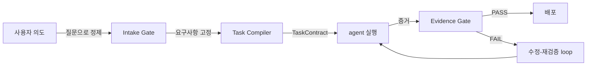

<div align="center">

**[English](README.md)** | **한국어**

# Geas

### Governance. Traceability. Verification. Evolution.

여러 AI agent가 함께 일할 때 생기는 문제를 해결합니다 — 결정에는 체계가 있고, 과정은 추적되고, 결과물은 검증되고, 팀은 세션마다 성장합니다.

[](https://claude.ai/code)
[](LICENSE)
[](docs/ko/reference/AGENTS.md)
[](docs/ko/reference/SKILLS.md)
[](docs/ko/reference/HOOKS.md)

</div>

---

## Geas란?

Geas는 Claude Code 기반의 계약 중심 멀티 에이전트 AI 개발 하네스입니다. 네 가지를 보장합니다: **Governance** (모든 결정이 정해진 프로세스를 따릅니다), **Traceability** (모든 행동이 추적 가능한 기록을 남깁니다), **Verification** (결과물이 수용 기준에 대해 검증됩니다 — "에이전트가 됐다고 함"이 아닙니다), **Evolution** (팀이 세션마다 지식을 축적합니다). 미션을 설명하면 Geas가 전문 에이전트 팀을 운영하여 설계, 구현, 리뷰, 검증을 수행하고 모든 과정을 기록합니다.

---

## 네 가지 원칙

| 원칙 | 정의 | 구체적 예시 |
|------|------|------------|
| **Governance** | 모든 결정이 명시적 권한을 가진 정해진 프로세스를 따릅니다. | 아키텍처 선택은 투표를 거칩니다. 의견이 갈리면 구조화된 토론이 실행됩니다. 트레이드오프가 기록됩니다. |
| **Traceability** | 모든 행동이 기록되고 사후에 감사할 수 있습니다. | 모든 전환이 실제 타임스탬프와 함께 `.geas/ledger/events.jsonl`에 기록됩니다. `run.json`의 체크포인트가 파이프라인 위치를 추적합니다. |
| **Verification** | 모든 결과물이 계약에 대해 검증됩니다 — "완료"는 "계약 충족"을 뜻합니다. | Evidence Gate가 3단계를 실행합니다: 기계적 (빌드/린트/테스트), 의미론적 (수용 기준 + 루브릭 점수), 제품 (Nova 판단). |
| **Evolution** | 팀이 시간이 지날수록 성장합니다. | 매 작업 후 Scrum 회고가 실행됩니다. 교훈이 `.geas/memory/retro/`에 저장됩니다. `rules.md`가 세션마다 성장합니다. |

---

## 빠른 시작

**준비물**: [Claude Code CLI](https://claude.ai/code) 설치 및 인증

### 1. plugin 설치

```bash
/plugin marketplace add choam2426/geas
/plugin install geas@choam2426-geas
```

### 2. 미션 시작

```text
/geas:mission
```

만들고 싶은 것, 추가하고 싶은 기능, 또는 결정하고 싶은 사안을 설명합니다. Compass가 적절한 모드를 감지하여 — Initiative (새 제품), Sprint (기능 추가), Debate (구조화된 의사결정) — 파이프라인을 실행합니다.

### 3. 과정을 확인합니다

```
[Compass]  작업 시작. Pixel에게 할당.
[Palette]  모바일 퍼스트 레이아웃. 세로 카드 stack.
[사람]     파이차트 대신 막대그래프로 해줘.          <- 사람의 개입
[Forge]    동의. CSS-only 막대그래프.
[Pixel]    구현 완료. 5개 컴포넌트.
[Sentinel] QA: 5/5 기준 통과.
[Critic]   risk: 오프라인 폴백 없음, 리사이즈 시 차트 리플로우.
[Compass]  Evidence Gate PASSED.
[Nova]     Ship.
[Scrum]    회고: CSS 애니메이션 규칙을 rules.md에 추가.
```

---

## 동작 방식



모든 기록은 `.geas/`에 남습니다 — 전체 과정을 되짚을 수 있는 근거입니다:

```
.geas/
├── spec/seed.json           # 고정된 요구사항
├── tasks/*.json             # 수용 기준이 포함된 TaskContract
├── packets/                 # agent별 briefing
├── evidence/                # task별 작업 증거
├── decisions/               # 투표 기록, 결정 기록
├── ledger/events.jsonl      # 추가 전용 event 로그
├── memory/
│   ├── retro/               # task별 회고 교훈
│   └── agents/              # agent별 memory (세션마다 축적)
└── rules.md                 # 공유 project 규칙 (시간이 갈수록 성장)
```

---

## 팀

Compass가 pipeline을 조율하고, 12명의 전문 agent가 각자의 Geas 아래에서 실행합니다:

| 그룹 | agent | 역할 |
|------|---------|------|
| **리더십** | Nova | CEO / 제품 판단 |
| | Forge | CTO / architecture |
| **design** | Palette | UI/UX 디자이너 |
| **엔지니어링** | Pixel | 프론트엔드 |
| | Circuit | 백엔드 |
| | Keeper | Git / release 매니저 |
| **품질** | Sentinel | QA 엔지니어 |
| **운영** | Pipeline | DevOps |
| | Shield | 보안 |
| **전략** | Critic | Devil's Advocate |
| **문서** | Scroll | 테크 라이터 |
| **process** | Scrum | 애자일 마스터 / 회고 |

---

## 문서

### 시작하기
| 문서 | 설명 |
|------|------|
| [빠른 시작](docs/ko/guides/QUICKSTART.md) | 5분 시작 가이드 |
| [Initiative 가이드](docs/ko/guides/INITIATIVE.md) | 새 제품 만들기 |
| [Sprint 가이드](docs/ko/guides/SPRINT.md) | 기존 프로젝트에 기능 추가 |
| [Debate 가이드](docs/ko/guides/DEBATE.md) | 구조화된 의사결정 |
| [시나리오](docs/ko/guides/SCENARIOS.md) | 테스트 데이터가 포함된 실제 예시 |

### 아키텍처
| 문서 | 설명 |
|------|------|
| [설계](docs/ko/architecture/DESIGN.md) | 시스템 아키텍처, 데이터 흐름, 원칙 |
| [파이프라인](docs/ko/architecture/PIPELINE.md) | 실행 파이프라인 단계별 참조 |
| [스키마](docs/ko/architecture/SCHEMAS.md) | 데이터 계약과 관계 |

### 레퍼런스
| 문서 | 설명 |
|------|------|
| [Skills](docs/ko/reference/SKILLS.md) | 22개 skill 레퍼런스 |
| [Agents](docs/ko/reference/AGENTS.md) | 12명 에이전트 레퍼런스 |
| [Hooks](docs/ko/reference/HOOKS.md) | 9개 hook 레퍼런스 |
| [Governance](docs/ko/reference/GOVERNANCE.md) | 평가 기준과 품질 게이트 |

---

## 라이선스

[Apache License 2.0](LICENSE)

---

<div align="center">

**플러그인을 설치하세요. 미션을 시작하세요. 결과를 검증하세요. 팀이 성장하는 걸 지켜보세요.**

</div>
