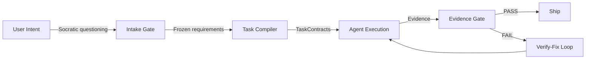

<div align="center">

**English** | **[한국어](README.ko.md)**

# Geas

### Governance. Traceability. Verification. Evolution.

A harness that brings structure to multi-agent AI development — so every decision follows a process, every action is traceable, every output is verified, and the team gets smarter over time.

[](https://claude.ai/code)
[](LICENSE)
[](docs/reference/AGENTS.md)
[](docs/reference/SKILLS.md)
[](docs/reference/HOOKS.md)

</div>

---

## What is Geas?

Geas is a contract-driven multi-agent AI development harness built for Claude Code. It brings four guarantees to any AI team: **Governance** (every decision follows a defined process), **Traceability** (every action produces a traceable artifact), **Verification** (output is proven against acceptance criteria — not just declared done), and **Evolution** (the team accumulates knowledge across sessions). You describe a mission; Geas runs a governed pipeline of specialist agents that design, build, review, and verify — and records everything.

---

## Four Pillars

| Pillar | Definition | Concrete Example |
|--------|-----------|-----------------|
| **Governance** | Every decision follows a defined process with explicit authority. | Architecture choices go through vote rounds with mandatory devil's advocacy. Disagreements trigger structured debates. Trade-offs are recorded. |
| **Traceability** | Every action is recorded and auditable after the fact. | All transitions log to `.geas/ledger/events.jsonl` with real timestamps. Checkpoint state in `run.json` tracks pipeline position. DecisionRecords capture the *why* behind escalations. |
| **Verification** | Every output is verified against its contract — "done" means "contract fulfilled." | Evidence Gate runs three tiers: mechanical (build/lint/test), semantic (acceptance criteria + rubric scores), product (Nova judgment). |
| **Evolution** | The team gets smarter over time. | Scrum retrospectives after every task. Lessons go to `.geas/memory/retro/`. `rules.md` grows with each session. |

---

## Quick Start

**Prerequisites**: [Claude Code CLI](https://claude.ai/code) installed and authenticated

### 1. Install the plugin

```bash
/plugin marketplace add choam2426/geas
/plugin install geas@choam2426-geas
```

### 2. Start a mission

```text
/geas:mission
```

Describe what you want to build, add, or decide. Compass detects the appropriate mode — Initiative (new product), Sprint (feature addition), or Debate (structured decision) — and runs the governed pipeline.

### 3. Watch the process

```
[Compass]  Task started. Assigned to Pixel.
[Palette]  Mobile-first layout. Vertical card stack.
[You]      Use bar charts instead of pie charts.        <- your input
[Forge]    Agreed. CSS-only bar chart approach.
[Pixel]    Implementation complete. 5 components.
[Sentinel] QA: 5/5 criteria passed.
[Critic]   Risks: no offline fallback, chart reflow on resize.
[Compass]  Evidence Gate PASSED.
[Nova]     Ship.
[Scrum]    Retro: added CSS animation rule to rules.md.
```

---

## How It Works



Every artifact is written to `.geas/` — the traceable record of the entire run:

```
.geas/
├── spec/seed.json           # frozen requirements
├── tasks/*.json             # TaskContracts with acceptance criteria
├── packets/                 # role-specific agent briefings
├── evidence/                # structured proof of work per task
├── decisions/               # vote records, decision records
├── ledger/events.jsonl      # append-only event log
├── memory/
│   ├── retro/               # retrospective lessons per task
│   └── agents/              # per-agent memory (grows across sessions)
└── rules.md                 # shared project conventions (grows over time)
```

---

## The Team

Compass orchestrates the pipeline. 12 specialist agents execute it, each under their own geas:

| Group | Agent | Role |
|-------|-------|------|
| **Leadership** | Nova | CEO / Product judgment |
| | Forge | CTO / Architecture |
| **Design** | Palette | UI/UX Designer |
| **Engineering** | Pixel | Frontend |
| | Circuit | Backend |
| | Keeper | Git / Release Manager |
| **Quality** | Sentinel | QA Engineer |
| **Operations** | Pipeline | DevOps |
| | Shield | Security |
| **Strategy** | Critic | Devil's Advocate |
| **Documentation** | Scroll | Tech Writer |
| **Process** | Scrum | Agile Master / Retrospectives |

---

## Documentation

### Getting Started
| Document | Description |
|----------|-------------|
| [Quick Start](docs/guides/QUICKSTART.md) | 5-minute getting started |
| [Initiative Guide](docs/guides/INITIATIVE.md) | Build a new product |
| [Sprint Guide](docs/guides/SPRINT.md) | Add a feature to existing project |
| [Debate Guide](docs/guides/DEBATE.md) | Structured decision-making |
| [Scenarios](docs/guides/SCENARIOS.md) | Real-world examples with test data |

### Architecture
| Document | Description |
|----------|-------------|
| [Design](docs/architecture/DESIGN.md) | System architecture, data flow, principles |
| [Pipeline](docs/architecture/PIPELINE.md) | Execution pipeline step-by-step |
| [Schemas](docs/architecture/SCHEMAS.md) | Data contracts and relationships |

### Reference
| Document | Description |
|----------|-------------|
| [Skills](docs/reference/SKILLS.md) | 23 skills reference |
| [Agents](docs/reference/AGENTS.md) | 12 agents reference |
| [Hooks](docs/reference/HOOKS.md) | 9 hooks reference |
| [Governance](docs/reference/GOVERNANCE.md) | Evaluation and quality gates |

---

## License

[Apache License 2.0](LICENSE)

---

<div align="center">

**Install the plugin. Describe the mission. Verify the output. Watch the team evolve.**

</div>
