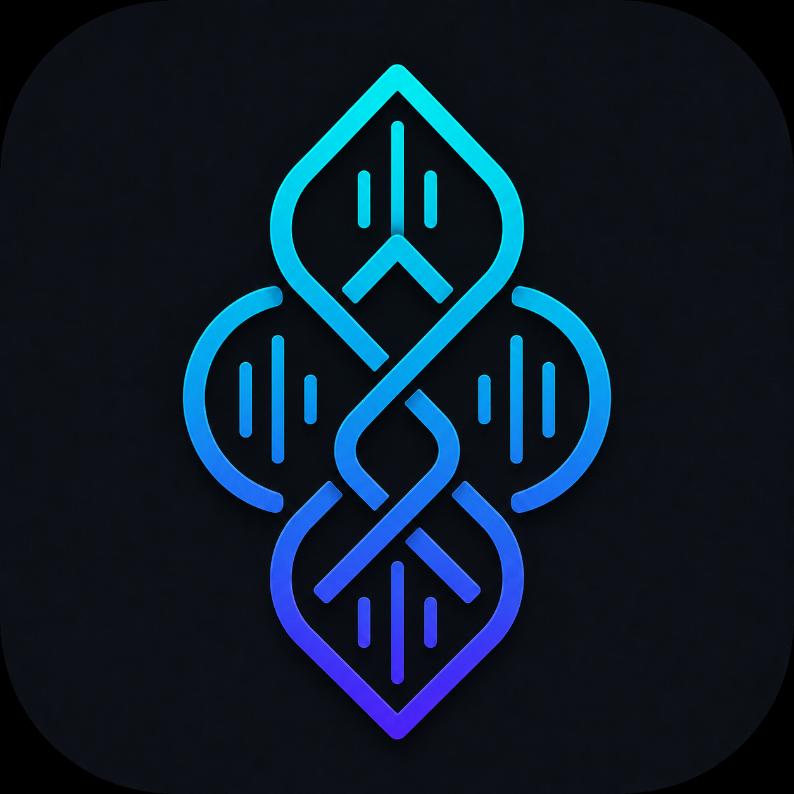
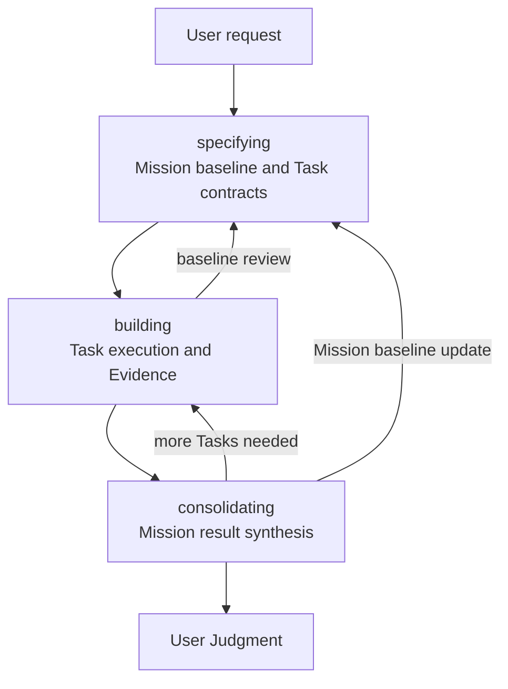
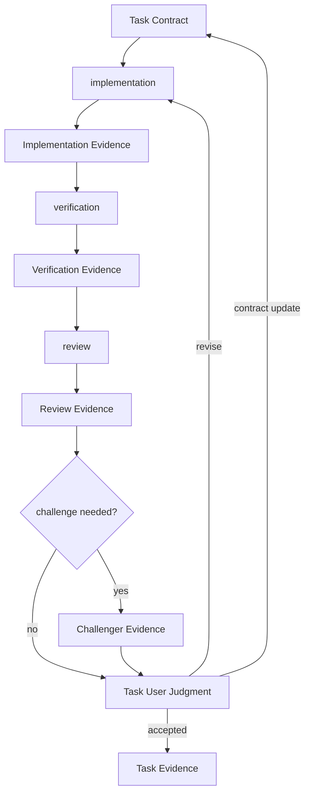

English | [한국어](README.ko.md)



# Geas

Geas is a set of operating principles and Skills that structure AI agent work around explicit contracts, execution, Evidence, User Judgment, and reflection so humans can judge results responsibly at lower cost.

## Why Geas Exists

AI agents can produce outputs quickly. But when fast outputs do not preserve the goal, criteria, checked scope, and unchecked scope, the cost of human review and acceptance judgment grows.

Geas reduces the total cost of reviewing, judging, maintaining, and continuing agent work. Productivity is not just output speed. Long-term productivity comes from making fast work remain reviewable, evidence-backed, and recoverable.

## Benefits

- Turns ambiguous requests into Mission and Task contracts with clear execution criteria and excluded scope.
- Splits large work into Task units that humans can review and judge.
- Fixes acceptance criteria, verification checks, and review focus before judging the result.
- Keeps verification evidence, unchecked scope, and remaining risks with the implementation result.
- Separates implementation, verification, review, and challenge so context, quality, omissions, and long-term risks can be inspected independently.
- Returns to baseline revision instead of silently expanding scope when the criteria change during work.
- Lets interrupted work resume from the Mission baseline, Task state, and Evidence.
- Separates gap, debt, follow-up, and memory so remaining issues and repeatable lessons can feed the next work.

## What Geas Is

Geas treats agent work as a basic operating flow.

- Before execution, fix the goal, scope, deliverables, verification method, and non-goals as a contract.
- The agent works inside that contract and leaves verification evidence and unchecked scope.
- The human reviews the evidence and judges whether to accept the result.
- Facts discovered during work become reflection and memory for future work.

This repository contains the documentation, Skill workflows, a CLI that guards `.geas/` runtime records, and marketplace plugin packages for Codex and Claude Code.

## Installation

Use one of the following methods.

<details>
<summary>Install through the Codex marketplace</summary>

```text
/plugin marketplace add choam2426/geas
/plugin install geas@geas
```

</details>

<details>
<summary>Install through the Claude Code marketplace</summary>

```text
/plugin marketplace add choam2426/geas
/plugin install geas@geas
```

</details>

<details>
<summary>Install as Codex project-local Skills</summary>

```bash
git clone https://github.com/choam2426/geas.git
mkdir -p .agents/skills
cp -R geas/plugins/geas/skills/* .agents/skills/
```

</details>

<details>
<summary>Install as Claude Code project-local Skills</summary>

```bash
git clone https://github.com/choam2426/geas.git
mkdir -p .claude/skills
cp -R geas/plugins/geas/skills/* .claude/skills/
```

</details>

## Usage

After installing Geas, open Codex or Claude Code in your project and use `/mission` to start or resume Geas work.

If work is interrupted, call `/mission` again to continue from the remaining Mission baseline, Task state, and Evidence.

```text
/mission Add login error messages that tell users why sign-in failed
```

```text
/mission Continue the current Mission
```

Geas does not push the agent to declare completion immediately. It first fixes the working criteria, then leaves Evidence from execution so a human can review the result and make a User Judgment.

## Core Workflow



`specifying` turns the user request into a Mission baseline and Task contracts. `building` executes accepted Task contracts and records Evidence through implementation, verification, and review. `consolidating` compares accepted Tasks against the Mission baseline so the human can judge the Mission result. When more work or baseline revision is needed, the flow returns to an earlier stage.

A Task moves through this flow.



## Core Concepts

- `Mission`: The goal the user wants to accomplish with the agent. It includes background, scope, excluded scope, and acceptance criteria.
- `Task`: A reviewable unit of Mission work that a human can judge from its outputs and Evidence.
- `Evidence`: Verification evidence and unchecked scope left by the agent. It is not a completion declaration; it is material for human review.
- `User Judgment`: The human decision after reviewing Evidence, such as accepted, accepted with limits, revise, defer, or stop.
- `Reflection`: The process of turning facts found during execution and verification into better contracts, verification methods, and records for future work.

## Start Here

- [Geas definition](docs/definition.md)
- [Operating model](docs/operating/index.md)

## License

Apache License 2.0. See [LICENSE](LICENSE).
