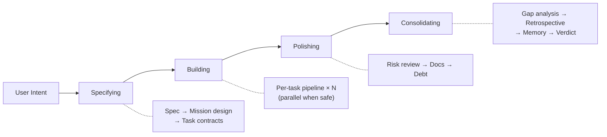
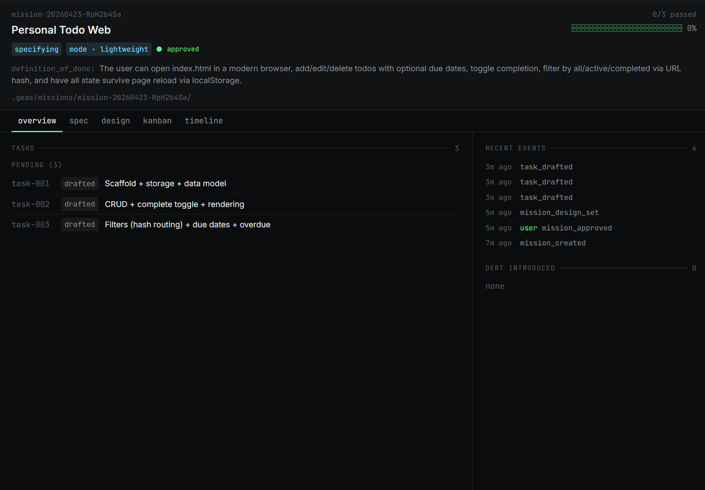
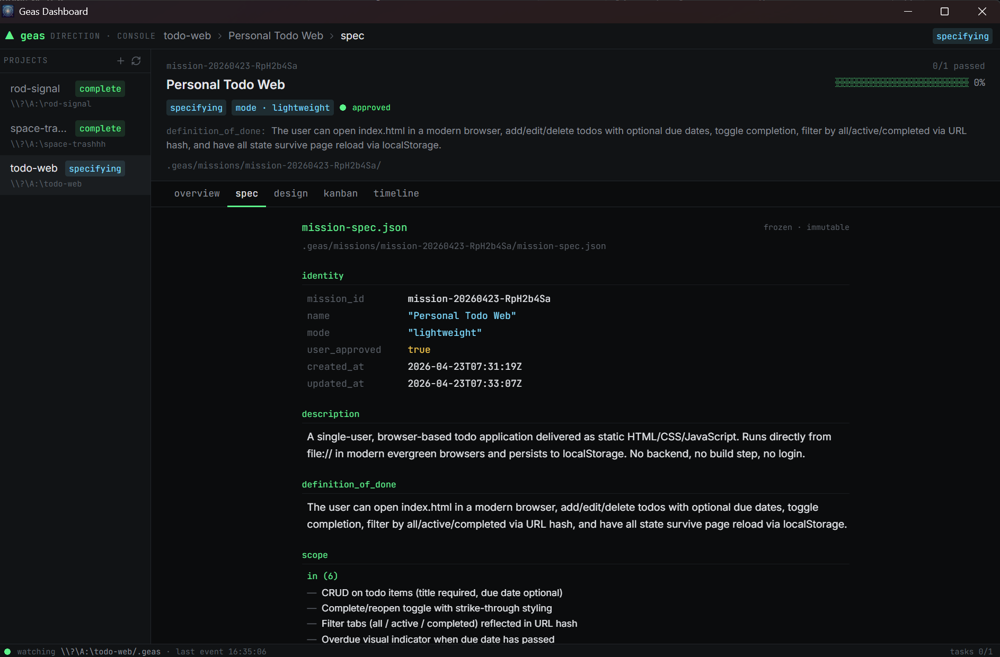
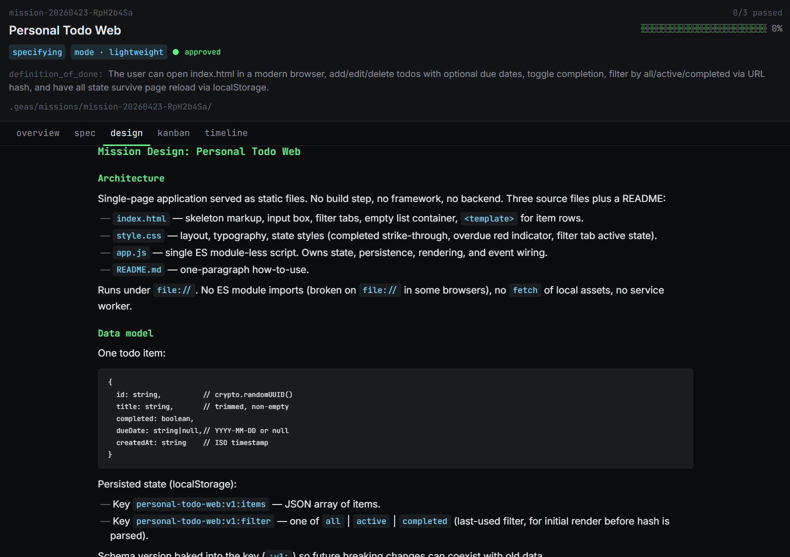
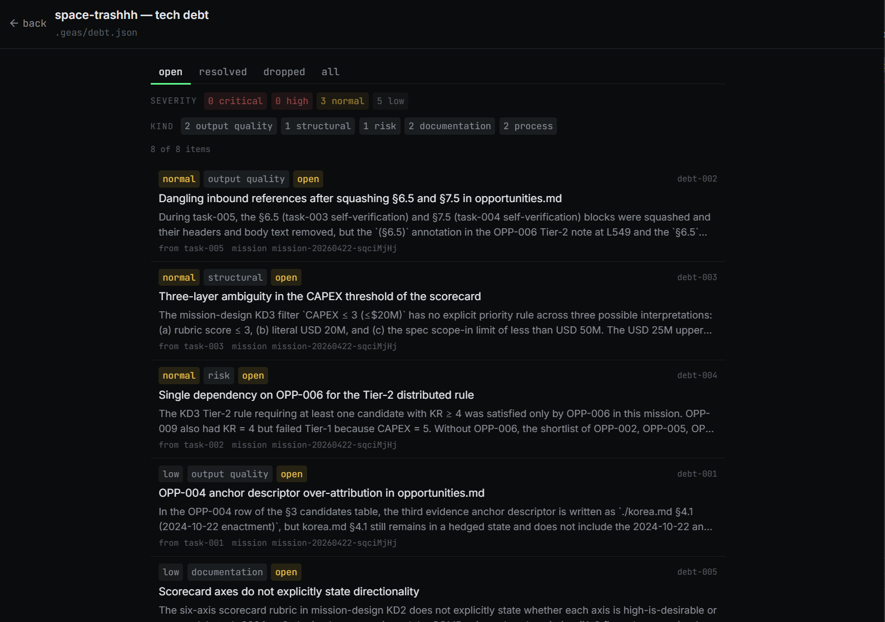
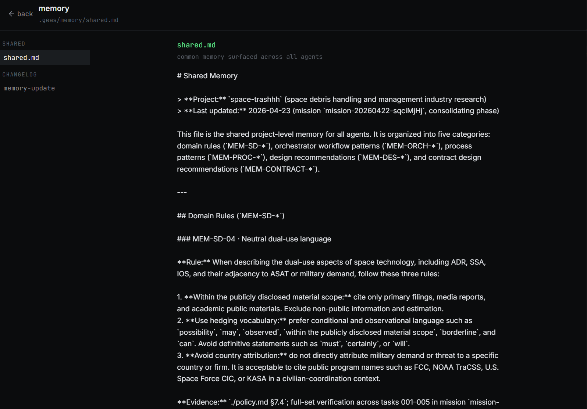

**English** | **[한국어](README.ko.md)**

<p align="center">
  
</p>

<h1 align="center">Geas</h1>
<h3 align="center">Make AI agents prove they're done.</h3>
<p align="center">Contract-driven execution, evidence-based verification, cross-session learning — a multi-agent governance protocol</p>

<p align="center">
  <a href="LICENSE"></a>
  <a href="https://github.com/choam2426/geas/releases"></a>
</p>

Geas is a protocol that makes AI agents work as a professional team. Evidence proves completion, authority grants approval, and lessons persist across sessions.

- **Task Contract** — Before any work begins, scope, acceptance criteria, reviewers, and verification plan are locked into a contract.
- **Traceable Artifacts** — Contracts, reviews, verifications, and verdicts are preserved as structured artifacts at every step.
- **Evidence Gate** — Three-tier verification proves completion. Artifacts decide, not agent claims.
- **Memory System** — Retrospectives accumulate in shared memory and per-agent notes, carrying over across sessions.

---

## Quick Start

Install as a Claude Code or Codex plugin.

```bash
/plugin marketplace add choam2426/geas
/plugin install geas@choam2426-geas
```

For Codex, install the repository as a Codex plugin so Codex reads `.codex-plugin/plugin.json` and exposes the Geas skills from `skills/`.

| Command | What it does |
|---|---|
| `/geas:mission` | Start or resume a mission — the main entry point. Handles everything from requirements to delivery. |
| `/geas:navigating-geas` | Explain the skill catalog, CLI surface, and how the mission dispatcher orchestrates multi-agent work. |

`/geas:mission` is all you need. Describe what you want to build, and Geas takes over: gathering requirements, compiling task contracts, routing agents, verifying evidence, and closing the mission. For trivial tasks (single file fix, obvious bug), it skips the full pipeline automatically.

---

## How a mission runs

### Four phases

Every mission passes through the same four phases. A small change gets a lightweight pass; a bigger effort gets the full treatment. The operating mode (`lightweight` / `standard` / `full_depth`) selects how much governance each phase applies.



| Phase | What happens |
|---|---|
| **Specifying** | Define the mission, freeze the mission design, and approve the initial task contracts. |
| **Building** | Run each task through a governed execution pipeline from contract to closure. |
| **Polishing** | Resolve debt, documentation gaps, and quality issues surfaced during execution. |
| **Consolidating** | Reconcile design versus delivery, promote lessons into memory, and issue the mission verdict. |

### Per-task pipeline

Each approved task runs through the same governed sequence. The evidence gate is the non-negotiable checkpoint: it reads the reviewer and verifier evidence directly and decides whether the task may close.

```text
Contract approved → Implementation contract → Implement → Self-check
→ Reviewer evidence + Verification → Evidence gate
→ Closure evidence → Retrospective
```

Task states move through `drafted → ready → implementing → reviewing → deciding → passed`, with `blocked` / `escalated` / `cancelled` as side exits.

---

## When Geas is a good fit

- Multi-step implementation, refactors, or migrations
- High-risk work where explicit verification matters
- Parallel work across implementation, QA, security, operations, and docs
- Long-running work where traceability and memory matter
- Structured research or analysis that benefits from separated reviewer roles

Geas adds process. That means **more steps and more tokens** than direct prompting. It pays off when the cost of being wrong is higher than the cost of coordination. For trivial tasks, Geas detects the scope and skips the full pipeline automatically.

---

## Features

   

### Socratic intake

Questions are asked one at a time until the mission spec is clear. No ambiguous handoffs. Intake determines scope, acceptance criteria, risk notes, and operating mode before any work starts. The approved mission spec is immutable.

### Task contracts

Each unit of work gets a machine-readable contract with scope, acceptance criteria, reviewers, verification plan, risk level, and routing policy. During the `implementing` state the implementer writes an implementation contract alongside the work; required reviewers submit their evidence after the implementer's self-check is appended.

### Evidence Gate

Three-tier verification:
- **Tier 0 (Preflight)** — required artifacts and required reviewer reviews have been submitted
- **Tier 1 (Objective)** — verification plan is executed per contract, whether automated or a fixed manual procedure
- **Tier 2 (Judgment)** — contract is read together with reviewer verdicts; acceptance criteria and known risks are checked

Gate verdicts: `pass`, `fail`, `block`, `error`. The gate is strictly objective — product judgment happens separately in the mission verdict.

### Parallel scheduling

Independent tasks run concurrently with surface-based conflict detection. Dependent tasks are sequenced automatically. The orchestrator holds exclusive write access to `.geas/` and dispatches implementers only when their surfaces are free.

### Challenger review

An adversarial reviewer asks *"why might this still be wrong?"* on high-risk tasks. It must raise at least one substantive concern. Blocking concerns trigger a deliberation to decide: ship, iterate, or escalate.

### Deliberation

Structured multi-role judgment for key decisions. Used for full-depth mission design approval and for resolving challenger blocking concerns. Participants submit independent evidence, then the decision maker issues a verdict.

### Session recovery

Runtime state is persisted to `.geas/` at every CLI write. Resume reconstructs the active mission, phase, and task set from disk — no matter whether the session was paused, compacted, or restarted across machines.

### Memory system

`shared.md` shares cross-agent knowledge. Per-agent memory notes capture role-specific lessons. Retrospectives after each task extract candidates, and the consolidating phase promotes validated lessons into memory. The team learns across sessions.

### Gap analysis

At the end of a mission, design versus delivery is compared. Each gap is classified and given a disposition: `resolve` inside this mission, carry as debt, or forward to a future mission. This drives the project-level debt ledger and informs the next mission.

### Real-time dashboard

Tauri desktop app that watches `.geas/` state. Terminal-inspired "console" direction with path stickers on every panel. File-watcher driven — no polling, no agent interruption. See the [Dashboard](#dashboard) section below.


---

## Dashboard

A Tauri desktop app that reads `.geas/` state in real time. It watches for file changes — no polling, no agent interruption. Styled in a terminal-inspired "console" direction: JetBrains Mono for IDs / paths / timestamps, Inter for prose, phosphor-green accent on deep-neutral surfaces. Every panel carries a `PathBadge` that shows the `.geas/` file driving the view.


### Layout

- **Top bar** — logo + breadcrumb (project › mission › sub-tab) + active phase pill.
- **Sidebar** — project list with path + phase per row. Click to switch projects.
- **Main area** — one of four top-level views (see below).
- **Status bar** — `.geas/` watch status + last file-event timestamp + real counts (tasks, debt).

### Views

**Dashboard (mission list)** — the landing view for a project. Active missions as large cards with ASCII progress bars; past missions inline in a history section (resolved ones collapsed by default). Click any card to open its mission detail.

**Mission detail** — per-mission shell with five sub-tabs:
- `overview` — task roster grouped by lifecycle, recent events, debts introduced, final verdict, phase reviews, gap summary
  
- `spec` — structured render of `mission-spec.json` (frozen after approval)
  
- `design` — `mission-design.md` rendered as Markdown with a sticky decision-log sidebar built from phase-review verdicts
  
- `kanban` — tasks across the 9-state lifecycle columns (drafted → ready → implementing → reviewing → deciding → passed, with blocked / escalated / cancelled side states)
- `timeline` — full `events.jsonl` chronological view with pagination

**Debt** — project-wide debt ledger. Filter by status tab (open / resolved / dropped / all) and severity chips. Click a row for the full entry.

**Memory** — shared memory (`shared.md`), per-agent notes (`agents/{type}.md`), and the latest mission's memory changelog (`memory-update.json`).


### Task detail modal

Click any task (in the overview tasks panel, the kanban board, or an event row) to open a full detail modal: contract with acceptance criteria, implementation contract, self-check (latest-of-N on verify-fix loops), gate result per tier, evidence timeline with per-entry drill-down, deliberations, and deps-stack navigation (clicking a dependency pushes the current task; ESC pops back).

### Install

Download the installer for your platform from [Releases](https://github.com/choam2426/geas/releases). Open the app, add a project directory that contains `.geas/`, and the dashboard starts reading state immediately.

---

## Team model

Geas uses a **slot-based role architecture**. Authority agents govern the process. Specialist agents do the domain work.

| Group | Agents |
|---|---|
| **Authority** (always active) | Decision Maker, Design Authority, Challenger |
| **Software profile** | Software Engineer, QA Engineer, Security Engineer, Platform Engineer, Technical Writer |
| **Research profile** | Literature Analyst, Research Analyst, Methodology Reviewer, Research Integrity Reviewer, Research Engineer, Research Writer |

Domain profiles set default agent preferences, but the orchestrator can freely pick the best agent per task regardless of profile. A software mission can use research agents for literature review tasks, and vice versa.

---

## Documentation

| Document | Description |
|---|---|
| [Architecture](docs/architecture/DESIGN.md) | System design, 4-layer architecture, and rationale |
| [Protocol](docs/protocol/) | 9 operational protocol documents |
| [Schemas](docs/schemas/) | 14 JSON Schema definitions (draft 2020-12) |
| [Agents](docs/reference/AGENTS.md) | 14 agent types and the slot-based authority model |
| [Skills](docs/reference/SKILLS.md) | 17 skills — 2 user-invocable, 15 sub-skills |
| [Hooks](docs/reference/HOOKS.md) | Session, subagent, and pre-tool-use lifecycle hooks |

---

## License

[Apache License 2.0](LICENSE)

---

**Define the protocol. Describe the mission. Verify the output. Watch the team evolve.**
