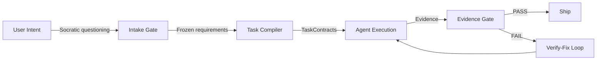

<div align="center">

**English** | **[한국어](README.ko.md)**

# Geas

### Governance. Traceability. Verification. Evolution.

A harness that brings structure to multi-agent AI development — so every decision follows a process, every action is traceable, every output is verified, and the team gets smarter over time.

[](https://claude.ai/code)
[](LICENSE)
[](docs/AGENTS.md)
[](docs/SKILLS.md)
[](docs/HOOKS.md)

</div>

---

## The Problem

Multi-agent AI systems are powerful, but they have a structural weakness: as the number of agents grows, so does the number of decisions — and no one is tracking them.

- **Who decided what?** Agent A picked the tech stack, Agent B designed the schema, Agent C implemented. But why those choices? No record.
- **Is the output correct?** Each agent says "done." No one verified whether the acceptance criteria were actually met.
- **Can you trace the process?** If something goes wrong, there is no audit trail. You cannot reconstruct how the system arrived at this result.
- **Does the team learn?** Next session starts from zero. No conventions, no lessons, no accumulated knowledge.

> In Celtic mythology, a **geas** is a binding obligation placed upon a hero — an unbreakable oath that defines what must and must not be done. Break the geas, and the consequences are severe.
>
> This project applies the same principle to AI agents. Every agent operates under a **contract** — verifiable acceptance criteria that must be fulfilled, boundaries that must not be crossed, and evidence that must be produced. No exceptions.

---

## Four Pillars

> **Governance** — Every decision follows a defined process. Architecture choices go through vote rounds with mandatory devil's advocacy. Disagreements trigger structured debates. Trade-offs are recorded. Nothing is decided "because the model felt like it."

> **Traceability** — Every action produces a traceable artifact. Missions freeze into seed specs. Tasks compile into contracts. Agents write evidence bundles. State transitions log to an append-only ledger. You can reconstruct exactly what happened, who did it, and why.

> **Verification** — "Done" means the evidence gate passed — not "agent says done." Every task goes through a 3-tier gate:
>
> | Tier | Question | Method |
> |------|----------|--------|
> | **Mechanical** | Does the code work? | Build, lint, test |
> | **Semantic** | Was the right thing built? | Acceptance criteria check |
> | **Product** | Does it serve the mission? | Product review judgment |

> **Evolution** — The team gets smarter with every session. Scrum runs retrospectives after each task, extracting conventions into `rules.md` and lessons into project memory. What was learned in session 1 shapes how session 5 operates. Knowledge compounds.

---

## Quick Start

**Prerequisites**: [Claude Code CLI](https://claude.ai/code) installed and authenticated

### 1. Install the plugin

```bash
/plugin marketplace add choam2426/geas
/plugin install geas@choam2426-geas
```

### 2. Describe the mission

```text
Build me a real-time polling app with shareable invite links.
```

Compass (the orchestrator) takes over — refines requirements, compiles contracts, dispatches specialist agents, and verifies output through evidence gates.

### 3. Watch the process

```
[Compass]  Task started. Assigned to Pixel.
[Palette]  Mobile-first layout. Vertical card stack.
[You]      Use bar charts instead of pie charts.        <- your input
[Forge]    Agreed. CSS-only bar chart approach.
[Pixel]    Implementation complete. 5 components.
[Sentinel] QA: 5/5 criteria passed.
[Critic]   Risks: no offline fallback, chart reflow on resize.
[Compass]  Evidence Gate PASSED.
[Nova]     Ship.
[Scrum]    Retro: added CSS animation rule to rules.md.
```

---

## How It Works



Every artifact is written to `.geas/` — the traceable record of the entire run:

```
.geas/
├── spec/seed.json           # frozen requirements
├── tasks/*.json             # TaskContracts with acceptance criteria
├── packets/                 # role-specific agent briefings
├── evidence/                # structured proof of work per task
├── decisions/               # vote records, decision records
├── ledger/events.jsonl      # append-only event log
├── memory/
│   ├── retro/               # retrospective lessons per task
│   └── agents/              # per-agent memory (grows across sessions)
└── rules.md                 # shared project conventions (grows over time)
```

---

## The Team

Compass orchestrates the pipeline. 12 specialist agents execute it, each under their own geas:

| Group | Agent | Role |
|-------|-------|------|
| **Leadership** | Nova | CEO / Product judgment |
| | Forge | CTO / Architecture |
| **Design** | Palette | UI/UX Designer |
| **Engineering** | Pixel | Frontend |
| | Circuit | Backend |
| | Keeper | Git / Release Manager |
| **Quality** | Sentinel | QA Engineer |
| **Operations** | Pipeline | DevOps |
| | Shield | Security |
| **Strategy** | Critic | Devil's Advocate |
| **Documentation** | Scroll | Tech Writer |
| **Process** | Scrum | Agile Master / Retrospectives |

---

## Execution Modes

| | Full Team | Sprint | Debate |
|---|---|---|---|
| **When** | Starting a new product | Adding a feature | Making a decision |
| **Phases** | Genesis → MVP → Polish → Evolution | Design → Build → Review → QA | Structured discussion |
| **Output** | Complete product + documentation | Verified feature + commit | DecisionRecord |

---

## Documentation

| Document | Description |
|----------|-------------|
| [User Guide](docs/GUIDE.md) | Installation, first mission, modes, .geas/ structure, FAQ |
| [Governance](docs/GOVERNANCE.md) | Vote rounds, debates, Critic's role, escalation paths |
| [Agent Reference](docs/AGENTS.md) | 12 specialist agents — roles, groups, evidence, MCP tools |
| [Skill Reference](docs/SKILLS.md) | 24 skills — contract engine, protocols, utilities |
| [Hooks Reference](docs/HOOKS.md) | 4 hooks — mechanical enforcement of pipeline rules |

---

## License

[Apache License 2.0](LICENSE)

---

<div align="center">

**Install the plugin. Describe the mission. Verify the output. Watch the team evolve.**

</div>
