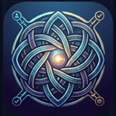
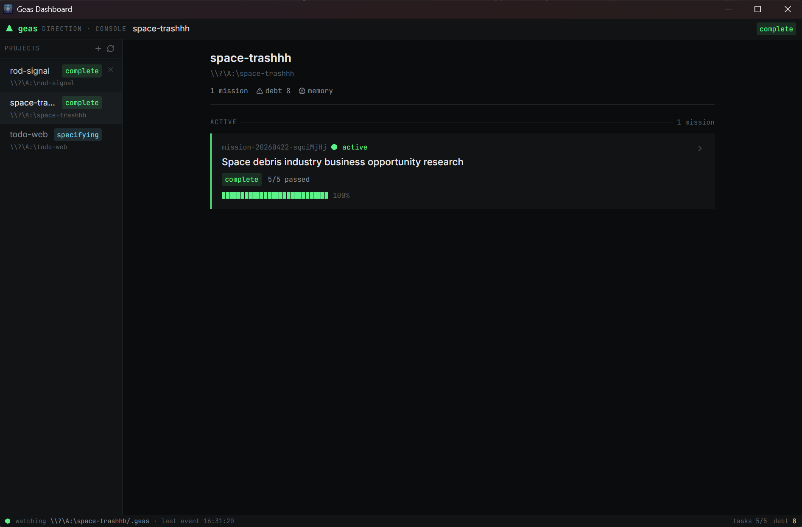
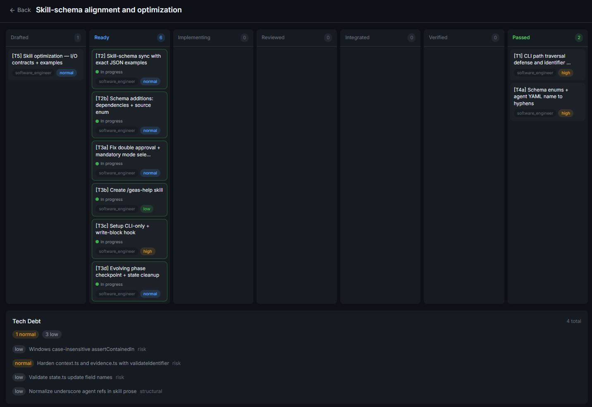
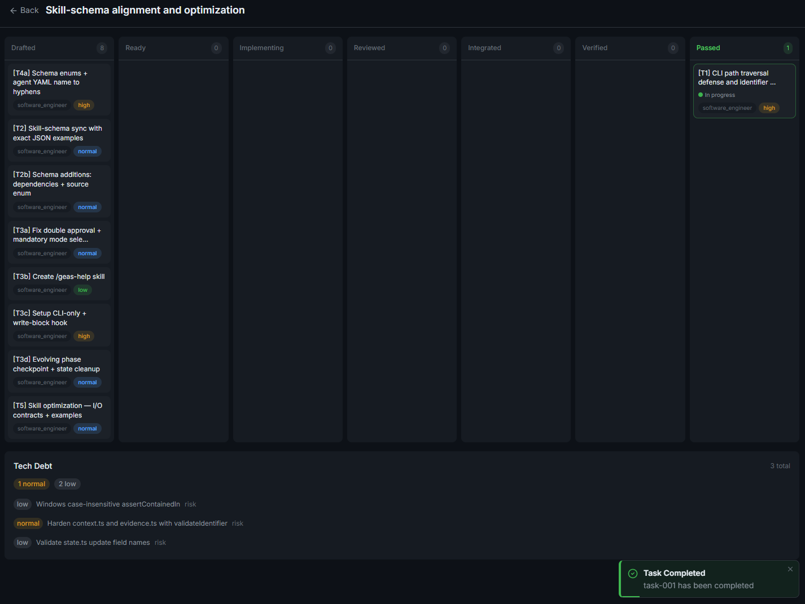

**English** | **[한국어](README.ko.md)**

<p align="center">
  
</p>

<h1 align="center">Geas</h1>
<h3 align="center">Make AI agents prove they're done.</h3>
<p align="center">Contract-driven execution, evidence-based verification, cross-session learning — a multi-agent governance protocol</p>

<p align="center">
  <a href="LICENSE"></a>
  <a href="https://github.com/choam2426/geas/releases"></a>
</p>

Geas is a protocol that makes AI agents work as a professional team. Evidence proves completion, authority grants approval, and lessons persist across sessions.

- **Task Contract** — Before any work begins, scope, acceptance criteria, reviewers, and eval commands are locked into a contract.
- **Traceable Artifacts** — Contracts, reviews, verifications, and verdicts are preserved as structured artifacts at every step.
- **Evidence Gate** — Three-tier verification proves completion. Artifacts decide, not agent claims.
- **Memory System** — Retrospectives and lessons accumulate in rules.md and agent memory, carrying over across sessions.

---

## Quick Start

Install as a Claude Code plugin.

```bash
/plugin marketplace add choam2426/geas
/plugin install geas@choam2426-geas
```

| Command | What it does |
|---|---|
| `/geas:mission` | Start or resume a mission — the main entry point. Handles everything from requirements to delivery. |
| `/geas:help` | Show all available commands, the 4-phase workflow, and how the team model works. |

`/geas:mission` is all you need. Describe what you want to build, and Geas takes over: gathering requirements, compiling task contracts, routing agents, verifying evidence, and closing the mission. For trivial tasks (single file fix, obvious bug), it skips the full pipeline automatically.

---

## How a mission runs

### Four phases

Every mission passes through the same four phases. A small change gets a lightweight pass; a bigger effort gets the full treatment.


| Phase | What happens |
|---|---|
| **Specifying** | Define the mission, freeze the design brief, and compile machine-readable task contracts. |
| **Building** | Run each task through a governed execution pipeline from contract to verdict. |
| **Polishing** | Resolve debt, documentation gaps, and quality issues surfaced during execution. |
| **Evolving** | Capture lessons, update rules, promote memory, and summarize the mission. |

### Per-task pipeline

Each task passes through up to 15 steps. Steps marked with `*` are conditional.

```text
Design* → Design Guide* → Implementation Contract → Implementation
→ Self-check → Specialist Review + Testing → Evidence Gate
→ Integration → Closure Packet → Challenger Review*
→ Final Verdict → Retrospective → Memory Extraction → Resolve
```

---

## When Geas is a good fit

- Multi-step implementation, refactors, or migrations
- High-risk work where explicit verification matters
- Parallel work across implementation, QA, security, operations, and docs
- Long-running work where traceability and memory matter
- Structured research or analysis that benefits from separated reviewer roles

Geas adds process. That means **more steps and more tokens** than direct prompting. It pays off when the cost of being wrong is higher than the cost of coordination. For trivial tasks, Geas detects the scope and skips the full pipeline automatically.

---

## Features

   

### Socratic intake

Questions are asked one at a time until the mission spec is clear. No ambiguous handoffs. The intake process determines scope, acceptance criteria, risk notes, and domain profile before any work starts.

### Task contracts

Each unit of work gets a machine-readable contract with scope, acceptance criteria, reviewers, eval commands, risk level, and escalation policy. Workers and reviewers agree on an implementation contract before code is written.

### Evidence Gate

Three-tier verification:
- **Tier 0 (Precheck)** — required artifacts exist, task state is eligible, baseline is valid
- **Tier 1 (Mechanical)** — eval commands from the contract are executed and results recorded
- **Tier 2 (Contract + Rubric)** — acceptance criteria checked, scope violations detected, known risks verified, rubric dimensions scored

Gate verdicts: `pass`, `fail`, `block`, `error`. The gate is strictly objective — product judgment happens separately in the Final Verdict.

### Parallel scheduling

Independent tasks run concurrently with lock-based conflict detection (path, interface, and resource locks). Dependent tasks are sequenced automatically. Integration uses a single-flight merge lane to prevent collisions.

### Challenger review

An adversarial reviewer asks *"why might this still be wrong?"* on high-risk tasks. Must raise at least one substantive concern. Blocking concerns trigger a vote round to decide: ship, iterate, or escalate.

### Vote round

Structured parallel voting for key decisions. Used during full-depth design briefs and when challenger concerns require resolution. Participants vote independently, then results are aggregated into a decision.

### Session recovery

Checkpoint-based recovery handles five recovery classes: post-compaction, warm resume, interrupted subagent, dirty state, and manual repair. Sessions pick up where they left off with full context restoration.

### Memory system

`rules.md` shares cross-agent knowledge. Per-agent memory notes capture role-specific lessons. Retrospectives after each task extract candidates, and the evolving phase promotes validated lessons. The team learns across sessions.

### Gap assessment

At the end of a mission, planned scope is compared against actual delivery. Each item is classified as fully delivered, partially delivered, or not delivered — with rationale. This drives debt registration and informs the next mission.

### Real-time dashboard

Tauri desktop app that watches `.geas/` state. Kanban board, timeline, memory browser, debt tracking, toast notifications. See the [Dashboard](#dashboard) section below.


---

## Dashboard

A Tauri desktop app that reads `.geas/` state in real time. It watches for file changes — no polling, no agent interruption.



### Views

**Project overview** — current mission, active agent, phase, task progress, last activity timestamp. Multiple projects in the sidebar.

**Kanban board** — tasks flow through the 7-state lifecycle columns (drafted → ready → implementing → reviewed → integrated → verified → passed). Click a card for contract details, evidence, and record sections.



**Mission detail** — design brief, task list, gap assessment, debt register, mission summary. Everything the protocol produced for one mission.

**Memory browser** — `rules.md` content and per-agent memory notes. See what the team has learned.

**Timeline** — event log visualization. Every state transition, gate result, and agent spawn in chronological order.

**Tech debt panel** — debt items by severity and kind. Filter by status (open / resolved / deferred).

### Notifications

File-system watcher triggers toast notifications when tasks complete, gates pass or fail, or phases change. No need to switch windows to check progress.



### Install

Download the installer for your platform from [Releases](https://github.com/choam2426/geas/releases). Open the app, add a project directory that contains `.geas/`, and the dashboard starts reading state immediately.

---

## Team model

Geas uses a **slot-based role architecture**. Authority agents govern the process. Specialist agents do the domain work.

| Group | Agents |
|---|---|
| **Authority** (always active) | Product Authority, Design Authority, Challenger |
| **Software profile** | Software Engineer, QA Engineer, Security Engineer, Platform Engineer, Technical Writer |
| **Research profile** | Literature Analyst, Research Analyst, Methodology Reviewer, Research Integrity Reviewer, Research Engineer, Research Writer |

Domain profiles set default agent preferences, but the orchestrator can freely pick the best agent per task regardless of profile. A software mission can use research agents for literature review tasks, and vice versa.

---

## Documentation

| Document | Description |
|---|---|
| [Architecture](docs/architecture/DESIGN.md) | System design, 4-layer architecture, and rationale |
| [Protocol](docs/protocol/) | 12 operational protocol documents |
| [Schemas](docs/protocol/schemas/) | 16 JSON Schema definitions (draft 2020-12) |
| [Agents](docs/reference/AGENTS.md) | 14 agent types and the slot-based authority model |
| [Skills](docs/reference/SKILLS.md) | 13 skills (12 core + 1 utility) |
| [Hooks](docs/reference/HOOKS.md) | 10 lifecycle hooks |

---

## License

[Apache License 2.0](LICENSE)

---

**Define the protocol. Describe the mission. Verify the output. Watch the team evolve.**
