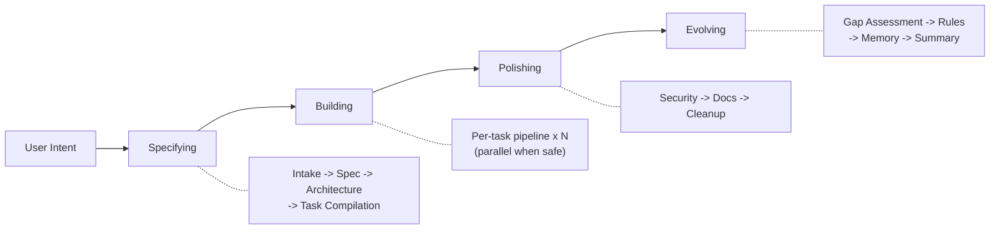

<div align="center">

**English** | **[한국어](README.ko.md)**

# Geas

### Governance for multi-agent AI development

[](LICENSE)
[](https://github.com/choam2426/geas/releases)

</div>

Geas is a protocol that makes a team of agents behave like an engineering organization.

- **Governed decisions** — 12 agent types with explicit authority scopes. Architecture choices go through vote rounds. Disagreements trigger structured resolution with escalation paths. Every role has defined permissions and output responsibilities.
- **Traceable artifacts** — task contracts, state transitions, evidence, and verdicts are recorded in `.geas/` as append-only artifacts. Session checkpoints enable exact resume after interruption. An event ledger tracks every significant action.
- **Contract-based verification** — each task has acceptance criteria and a rubric. A 3-tier Evidence Gate checks preconditions, runs build/lint/test, and scores against the rubric. A Critical Reviewer challenges high-risk work. A product-level Final Verdict closes the loop.
- **Continuous learning** — every task produces a retrospective. Lessons become memory candidates that get promoted through review. Rules evolve in a shared `rules.md`. Technical debt is tracked in a debt register and feeds back into future priorities. Context packets inject relevant memories into future work.

## Quick Start

> Geas is a protocol. This Quick Start uses the **Claude Code plugin**, one implementation.

```bash
/plugin marketplace add choam2426/geas
/plugin install geas@choam2426-geas
/geas:mission
```

Describe what you want to build. The orchestrator takes the mission through the full governed workflow.

## Design principles

- **Humans stay in control** — agents propose, but authority and final judgment remain explicit
- **Evidence before completion** — no task is "done" without passing verification
- **State must survive interruption** — checkpoints and recovery artifacts support exact resume
- **Grows with every mission** — rules and memory are first-class outputs

---

## Why Geas exists

Multi-agent development is powerful, but without governance it fails in predictable ways:

- **"Done" without proof** — an agent says the task is complete, but nobody verified it against acceptance criteria
- **Lost decisions** — architecture choices, trade-offs, and reviewers' reasoning disappear
- **Parallel chaos** — multiple agents touch overlapping files and conflicts surface late
- **Zero institutional memory** — the same mistakes repeat across sessions

When you scale from one agent to many, these problems do not add up. They multiply.

---

## How It Works



A mission always runs all four phases. The scale adapts to the request — a small change gets a lightweight pass; a larger effort gets the full treatment.

Each task goes through a **14-step governed pipeline**: implementation contract -> implementation -> self-check -> code review + testing -> evidence gate -> closure packet -> critical reviewer -> final verdict -> retrospective -> memory extraction. [-> Full pipeline details](docs/architecture/DESIGN.md)

### Verification flow

A task is only closed after it passes:

- **Tier 0** — prechecks, required artifacts, task-state eligibility
- **Tier 1** — build, lint, test, typecheck
- **Tier 2** — acceptance criteria and rubric scoring
- **Final Verdict** — product-level judgment after the evidence is assembled

This is the difference between *an agent saying it is done* and *the protocol proving that the contract was fulfilled*.

### What lands in your repository

Geas writes operational state and evidence to `.geas/`:

```
.geas/
├── state/          # session checkpoint, locks, health signals
├── tasks/          # contracts, evidence, verdicts per task
├── memory/         # learned patterns (candidate -> canonical)
├── ledger/         # append-only event log
└── rules.md        # shared conventions (grows over time)
```

---

## The Team

The protocol defines **12 agent types** with explicit authority and output responsibilities.

**Core authorities** — Product Authority, Architecture Authority, Critical Reviewer, Process Lead

**Specialist roles** — Frontend Engineer, Backend Engineer, QA Engineer, Security Engineer, UI/UX Designer, DevOps Engineer, Technical Writer, Repository Manager

[-> Full team reference](docs/reference/AGENTS.md)

---

## See It In Action

```
[Orchestrator]     Specifying: intake complete. 3 tasks compiled.
[Orchestrator]     Building: starting task-001.

[UI/UX Designer]   Mobile-first layout. Vertical card stack.
[You]              Use bar charts instead of pie charts.        <- your input
[Arch Authority]   Agreed. CSS-only bar chart approach.
[Frontend Eng]     Implementation complete. 5 components.
[QA Engineer]      5/5 acceptance criteria passed.
[Critical Rev]     Risk: no offline fallback.
[Orchestrator]     Evidence Gate: PASS. Closure packet assembled.
[Product Auth]     Final Verdict: PASS.
[Process Lead]     Retro: CSS animation rule added to rules.md.

[Orchestrator]     Polishing: security review, docs, cleanup.
[Orchestrator]     Evolving: gap assessment, memory promotion, summary.
[Orchestrator]     Mission complete. 3/3 tasks passed.
```

You stay in control. Agents propose; you decide. The protocol ensures nothing ships without verification.

---

## Documentation

| Document | Description |
|----------|-------------|
| [Architecture](docs/architecture/DESIGN.md) | System design, data flow, principles |
| [Protocol](docs/protocol/) | 14 operational protocol documents |
| [Schemas](docs/protocol/schemas/) | 29 JSON Schema definitions (draft 2020-12) |
| [Agents](docs/reference/AGENTS.md) | 12 agent types with explicit authority model |
| [Skills](docs/reference/SKILLS.md) | 27 skills reference |
| [Hooks](docs/reference/HOOKS.md) | 18 lifecycle hooks reference |

---

## License

[Apache License 2.0](LICENSE)

---

<div align="center">

**Define the protocol. Describe the mission. Verify the output. Watch the team evolve.**

</div>
