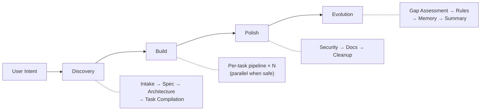
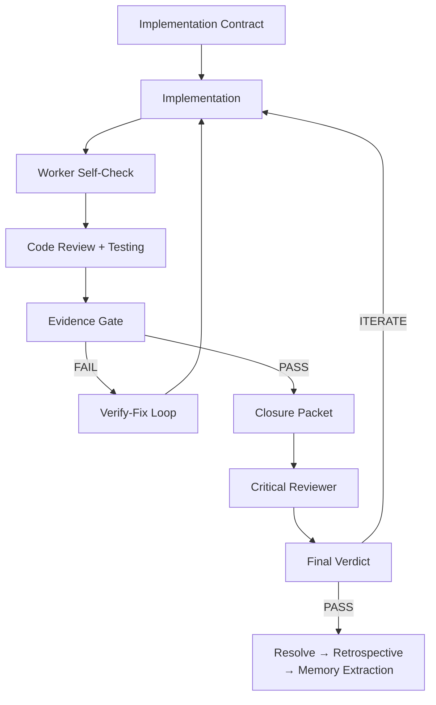

<div align="center">

**English** | **[한국어](README.ko.md)**

# Geas

### Governance. Traceability. Verification. Evolution.

A governance protocol for multi-agent AI development — so every decision follows a process, every action is traceable, every output is verified, and the team gets smarter over time.

[](#)
[](LICENSE)
[](docs/reference/AGENTS.md)
[](docs/reference/SKILLS.md)
[](docs/reference/HOOKS.md)

</div>

---

## What is Geas?

Geas is a governance protocol for multi-agent AI development. It defines how decisions are governed, actions are traced, outputs are verified, and teams evolve. The protocol is tool-agnostic; the included Claude Code plugin is one implementation. You describe a mission; Geas runs a governed pipeline of specialist agents that design, build, review, and verify — and records everything.

---

## Four Pillars

| Pillar | Definition | Concrete Example |
|--------|-----------|-----------------|
| **Governance** | Every decision follows a defined process with explicit authority. | Architecture choices go through vote rounds with mandatory devil's advocacy. Disagreements trigger structured debates. Trade-offs are recorded. |
| **Traceability** | Every action is recorded and auditable after the fact. | All transitions log to `.geas/ledger/events.jsonl` with real timestamps. Checkpoint state in `run.json` tracks pipeline position. DecisionRecords capture the *why* behind escalations. |
| **Verification** | Every output is verified against its contract — "done" means "contract fulfilled." | Evidence Gate runs three tiers: mechanical (build/lint/test), semantic (acceptance criteria + rubric scores), product (final verdict). No tier references specific tools. |
| **Evolution** | The team gets smarter over time. | Process Lead retrospectives after every task. Lessons go to `.geas/tasks/{task-id}/retrospective.json`. `rules.md` grows with each session. |

---

## Quick Start

**Claude Code Implementation**: [Claude Code CLI](https://claude.ai/code) installed and authenticated

> Geas is a protocol. This Quick Start uses the Claude Code plugin implementation.
> Other execution engines can implement the same protocol.

### 1. Install the plugin

```bash
/plugin marketplace add choam2426/geas
/plugin install geas@choam2426-geas
```

### 2. Start a mission

```text
/geas:mission
```

Describe what you want to build, add, or decide. The orchestrator runs a 4-phase execution flow (Discovery, Build, Polish, Evolution) scaled to the request. For decision-only requests, it routes to decision mode.

### 3. Watch the process

```
[Orchestrator]     Task started. Assigned to frontend-engineer.
[UI/UX Designer]   Mobile-first layout. Vertical card stack.
[You]              Use bar charts instead of pie charts.
[Arch Authority]   Agreed. CSS-only bar chart approach.
[Frontend Eng]     Implementation complete. 5 components.
[QA Engineer]      QA: 5/5 criteria passed.
[Critical Rev]     Risks: no offline fallback, chart reflow on resize.
[Orchestrator]     Evidence Gate PASSED.
[Product Auth]     Ship.
[Process Lead]     Retro: added CSS animation rule to rules.md.
```

---

## How It Works

### 4-Phase Execution Flow



### Per-Task Pipeline



Every artifact is written to `.geas/` — the traceable record of the entire run:

```
.geas/
├── spec/seed.json              # frozen requirements
├── state/
│   ├── run.json                # session checkpoint (pipeline position, recovery)
│   ├── locks.json              # lock manifest (path/interface/resource/integration)
│   ├── memory-index.json       # memory entry index for retrieval
│   ├── debt-register.json      # structured technical debt ledger
│   ├── gap-assessment.json     # scope delivery comparison
│   ├── rules-update.json       # proposed/approved rule changes
│   ├── phase-review.json       # phase transition gate results
│   ├── health-check.json       # health signal monitoring
│   ├── session-latest.md       # human-readable session state (post-compact restore)
│   └── task-focus/             # per-task context anchors
├── tasks/                      # TaskContracts + per-task artifacts
│   └── {task-id}/
│       ├── task-contract.json
│       ├── worker-self-check.json
│       ├── gate-result.json
│       ├── closure-packet.json
│       ├── final-verdict.json
│       └── retrospective.json
├── contracts/                  # implementation contracts
├── packets/                    # role-specific agent briefings + memory packets
├── evidence/                   # structured proof of work per task
├── decisions/                  # vote records, decision records
├── ledger/events.jsonl         # append-only event log
├── memory/
│   ├── _project/conventions.md # project conventions (stack, commands, patterns)
│   ├── candidates/             # memory candidates from retrospectives
│   ├── entries/                # promoted memory entries (provisional → canonical)
│   └── logs/                   # memory application effect logs
├── recovery/                   # recovery packets from session interruptions
├── summaries/                  # run summaries (session audit trail)
└── rules.md                    # shared project rules (grows over time)
```

---

## The Team

The protocol defines 12 agent types. Each has a specific authority and responsibility within the governed pipeline:

| Group | Agent Type | Role |
|-------|-----------|------|
| **Leadership** | Product Authority | Product judgment, final verdict |
| | Architecture Authority | Architecture, code review |
| **Design** | UI/UX Designer | Interface design |
| **Engineering** | Frontend Engineer | Frontend implementation |
| | Backend Engineer | Backend implementation |
| | Repository Manager | Git, release management |
| **Quality** | QA Engineer | Testing, quality assurance |
| **Operations** | DevOps Engineer | CI/CD, deployment |
| | Security Engineer | Security review |
| **Strategy** | Critical Reviewer | Devil's advocate, pre-ship challenge |
| **Documentation** | Technical Writer | Documentation |
| **Process** | Process Lead | Retrospectives, rules evolution |

---

## Documentation

### Architecture
| Document | Description |
|----------|-------------|
| [Design](docs/architecture/DESIGN.md) | System architecture, data flow, principles |

### Reference
| Document | Description |
|----------|-------------|
| [Skills](docs/reference/SKILLS.md) | 27 skills reference |
| [Agents](docs/reference/AGENTS.md) | 12 agents reference |
| [Hooks](docs/reference/HOOKS.md) | 18 hooks reference |

### Protocol
| Document | Description |
|----------|-------------|
| [Protocol](docs/protocol/) | 15 operational protocol documents (canonical) |
| [Schemas](docs/protocol/schemas/) | 22 JSON Schema definitions (draft 2020-12) |

---

## License

[Apache License 2.0](LICENSE)

---

<div align="center">

**Define the protocol. Describe the mission. Verify the output. Watch the team evolve.**

</div>
