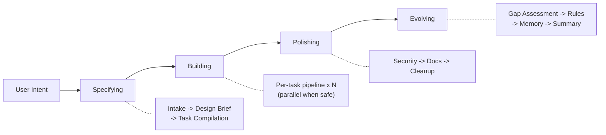

<div align="center">

**English** | **[한국어](README.ko.md)**

# Geas

### A protocol that brings order to multi-agent team-driven development

[](LICENSE)
[](https://github.com/choam2426/geas/releases)

</div>

> *"One of our tasks will be to maintain appropriate discipline, so that we do not lose track of what we are doing."*
> — Alan Turing

Geas is a protocol that makes a team of agents behave like an engineering organization.

- **Governed decisions** — 12 agent types with explicit authority scopes. Architecture choices go through vote rounds. Disagreements trigger structured resolution with escalation paths. Every role has defined permissions and output responsibilities.
- **Traceable artifacts** — task contracts, state transitions, evidence, and verdicts are recorded in `.geas/` as append-only artifacts. Session checkpoints enable exact resume after interruption. An event ledger tracks every significant action.
- **Contract-based verification** — each task has acceptance criteria and a rubric. A 3-tier Evidence Gate checks preconditions, runs build/lint/test, and scores against the rubric. A Critical Reviewer challenges high-risk work. A product-level Final Verdict closes the loop.
- **Continuous learning** — every task produces a retrospective. Lessons become memory candidates that get promoted through review. Rules evolve in a shared `rules.md`. Technical debt is tracked in a debt register and feeds back into future priorities. Context packets inject relevant memories into future work.

## Quick Start

The current implementation is a **Claude Code plugin**. Install [Claude Code CLI](https://claude.ai/code), then:

```bash
/plugin marketplace add choam2426/geas
/plugin install geas@choam2426-geas
/geas:mission
```

Describe what you want to build or improve. The orchestrator drives the work following the Geas protocol.

## Design principles

- **Completion is judged by evidence** — a task only closes after passing 3-tier verification and a product-level final verdict
- **Context never breaks** — state and decision history persist through interruptions and session changes
- **Grows with every mission** — every task's retrospective accumulates into rules and memory, and technical debt is tracked alongside

---

## Why Geas exists

Multi-agent development is fast and powerful, but without control it falls apart in the same ways every time:

- **"Done" without proof** — the agent says it's finished, but nobody actually verified against acceptance criteria
- **Lost decisions** — why this architecture was chosen, what was discussed in review — gone
- **Parallel chaos** — multiple agents touch the same files, and conflicts are discovered far too late
- **Unclear authority** — agents debate, but nobody has defined decision-making power
- **Zero institutional memory** — the same mistakes repeat across sessions

When you scale from one agent to many, these problems do not add up. They multiply.

---

## How It Works



A mission always runs all four phases. The scale adapts to the request — a small change gets a lightweight pass; a larger effort gets the full treatment.

Each task goes through a **14-step pipeline**. [-> Full pipeline details](docs/architecture/DESIGN.md)

```
implementation contract -> implementation -> self-check -> code review + testing
-> evidence gate -> closure packet -> critical reviewer
-> final verdict -> retrospective -> memory extraction
```

### Verification flow

A task is only closed after passing each step in order:

- **Evidence Gate** — Tier 0 (prechecks), Tier 1 (build/lint/test), Tier 2 (acceptance criteria + rubric scoring)
- **Closure Packet** — all evidence assembled into a single packet after Gate pass
- **Critical Reviewer** — separate verification for high-risk tasks
- **Final Verdict** — product-level judgment with all evidence assembled

### What lands in your repository

Geas writes operational state and evidence to `.geas/`:

```
.geas/
├── state/                        # session checkpoint, locks, health signals
├── missions/
│   └── {mission_id}/
│       ├── spec.json                 # mission spec (frozen at intake)
│       ├── design-brief.json         # design brief (user-approved)
│       ├── tasks/
│       │   ├── task-001.json         # task contract
│       │   └── task-001/
│       │       ├── worker-self-check.json
│       │       ├── gate-result.json
│       │       ├── closure-packet.json
│       │       ├── challenge-review.json
│       │       ├── final-verdict.json
│       │       └── retrospective.json
│       ├── evidence/                 # specialist review evidence
│       ├── evolution/                # debt register, gap assessments
│       └── phase-reviews/            # phase transition reviews
├── memory/                       # learned patterns (candidate -> canonical)
├── ledger/                       # append-only event log
└── rules.md                      # shared conventions (grows over time)
```

---

## The Team

The protocol defines **12 agent types** with explicit authority and output responsibilities.

**Core authorities** — Product Authority, Architecture Authority, Critical Reviewer, Process Lead

**Specialist roles** — Frontend Engineer, Backend Engineer, QA Engineer, Security Engineer, UI/UX Designer, DevOps Engineer, Technical Writer, Repository Manager

[-> Full team reference](docs/reference/AGENTS.md)

---

## See It In Action

```
[Orchestrator]     Specifying: intake complete. 2 tasks compiled.
[Orchestrator]     Building: starting task-001 (JWT auth API).

[Arch Authority]   Tech guide: bcrypt + JWT, refresh token rotation.
[Orchestrator]     Implementation contract approved.
[Backend Eng]      Implementation complete. 4 endpoints. Worktree merged.
[Backend Eng]      Self-check: confidence 4/5. Token expiry edge case untested.
[Arch Authority]   Code review: approved.                        <- parallel
[QA Engineer]      Testing: 6/6 acceptance criteria passed.      <- parallel
[Orchestrator]     Evidence Gate: PASS. Closure packet assembled.
[Critical Rev]     Challenge: no rate limiting [BLOCKING].
[Orchestrator]     Vote round: iterate. Re-implementing.
[Backend Eng]      Rate limiter added. Re-verification passed.
[Product Auth]     Final Verdict: PASS.
[Repo Manager]     Committed.
[Process Lead]     Retro: auth APIs must include rate limiting — rule proposed.
[Orchestrator]     Memory extraction: 3 candidates.

[Orchestrator]     Polishing: security review, docs, cleanup.
[Orchestrator]     Evolving: gap assessment, rules update, memory promotion.
[Orchestrator]     Mission complete. 2/2 tasks passed.
```

---

## Documentation

| Document | Description |
|----------|-------------|
| [Architecture](docs/architecture/DESIGN.md) | System design, data flow, principles |
| [Protocol](docs/protocol/) | 14 operational protocol documents |
| [Schemas](docs/protocol/schemas/) | 29 JSON Schema definitions (draft 2020-12) |
| [Agents](docs/reference/AGENTS.md) | 12 agent types with explicit authority model |
| [Skills](docs/reference/SKILLS.md) | 27 skills reference |
| [Hooks](docs/reference/HOOKS.md) | 18 lifecycle hooks reference |

---

## License

[Apache License 2.0](LICENSE)

---

<div align="center">

**Define the protocol. Describe the mission. Verify the output. Watch the team evolve.**

</div>
