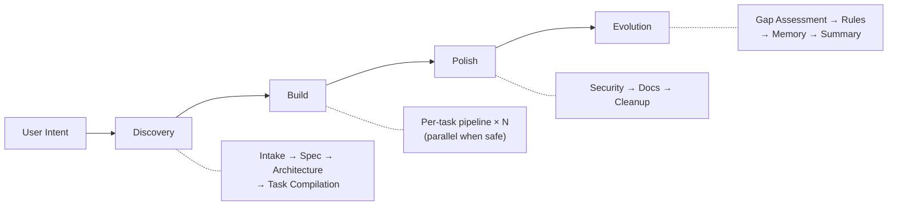

<div align="center">

**English** | **[한국어](README.ko.md)**

# Geas

### Governance. Traceability. Verification. Evolution.

A governance protocol for multi-agent AI development.

[](#)
[](LICENSE)

</div>

---

## The Problem

Multi-agent AI development is powerful but ungoverned:

- **"Done" means nothing** — An agent says the task is complete, but nobody verified it against acceptance criteria
- **Decisions vanish** — Who chose this architecture? Why was that library picked? No record exists
- **Zero learning** — The team makes the same mistakes session after session
- **Parallel chaos** — Two agents modify the same files, and nobody notices until integration breaks

When you scale from one agent to twelve, these problems don't add — they multiply.

---

## What Geas Does

Geas is a protocol that governs the entire lifecycle of multi-agent work:

**Every decision follows a process** — Architecture choices go through vote rounds. Disagreements trigger structured decisions. Trade-offs are recorded in decision records.

**Every action is traceable** — State transitions log to an append-only ledger. Checkpoints track pipeline position. Recovery packets enable exact-resume after interruption.

**Every output is verified against its contract** — Evidence Gate runs three tiers: mechanical (build/lint/test), semantic (acceptance criteria + rubric scoring), then the product authority delivers a final verdict. "Done" means "contract fulfilled."

**The team gets smarter** — Retrospectives after every task. Lessons become memory candidates that get promoted through review. Rules evolve. Context packets inject relevant memories into future work.

---

## See It In Action

```
[Orchestrator]     Discovery: intake complete. 3 tasks compiled.
[Orchestrator]     Build: starting task-001.

[UI/UX Designer]   Mobile-first layout. Vertical card stack.
[You]              Use bar charts instead of pie charts.        ← your input
[Arch Authority]   Agreed. CSS-only bar chart approach.
[Frontend Eng]     Implementation complete. 5 components.
[QA Engineer]      5/5 acceptance criteria passed.
[Critical Rev]     Risk: no offline fallback.
[Orchestrator]     Evidence Gate: PASS. Closure packet assembled.
[Product Auth]     Final Verdict: PASS.
[Process Lead]     Retro: CSS animation rule added to rules.md.

[Orchestrator]     Polish: security review, docs, cleanup.
[Orchestrator]     Evolution: gap assessment, memory promotion, summary.
[Orchestrator]     Mission complete. 3/3 tasks passed.
```

You stay in control. Agents propose; you decide. The protocol ensures nothing ships without verification.

---

## How It Works



Every phase always runs. Scale adapts to the request — a single feature gets a lightweight pass; a full product gets the full treatment.

Each task goes through a **14-step governed pipeline**: implementation contract → implementation → self-check → code review + testing → evidence gate → closure packet → critical reviewer → final verdict → retrospective → memory extraction. [→ Full pipeline details](docs/architecture/DESIGN.md)

Everything is recorded in `.geas/`:

```
.geas/
├── state/          # session checkpoint, locks, health signals
├── tasks/          # contracts, evidence, verdicts per task
├── memory/         # learned patterns (candidate → canonical)
├── ledger/         # append-only event log
└── rules.md        # shared conventions (grows over time)
```

[→ Full directory structure](docs/architecture/DESIGN.md)

---

## The Team

The protocol defines **12 agent types** — from Product Authority (product judgment, final verdict) to Process Lead (retrospectives, rules evolution) — each with specific authority and responsibility within the governed pipeline.

[→ Full team reference](docs/reference/AGENTS.md)

---

## Quick Start

> Geas is a protocol. This Quick Start uses the **Claude Code plugin**, one implementation of the protocol.

**Prerequisites**: [Claude Code CLI](https://claude.ai/code) installed and authenticated

```bash
# Install
/plugin marketplace add choam2426/geas
/plugin install geas@choam2426-geas

# Run
/geas:mission
```

Describe what you want to build, add, or decide. The orchestrator handles the rest.

---

## Documentation

| | Document | Description |
|---|----------|-------------|
| 📐 | [Architecture](docs/architecture/DESIGN.md) | System design, data flow, principles |
| 📋 | [Protocol](docs/protocol/) | 15 operational protocol documents |
| 📦 | [Schemas](docs/protocol/schemas/) | 22 JSON Schema definitions (draft 2020-12) |
| 🔧 | [Skills](docs/reference/SKILLS.md) | 27 skills reference |
| 🤖 | [Agents](docs/reference/AGENTS.md) | 12 agent types reference |
| ⚡ | [Hooks](docs/reference/HOOKS.md) | 18 lifecycle hooks reference |

---

## License

[Apache License 2.0](LICENSE)

---

<div align="center">

**Define the protocol. Describe the mission. Verify the output. Watch the team evolve.**

</div>
