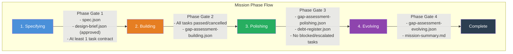
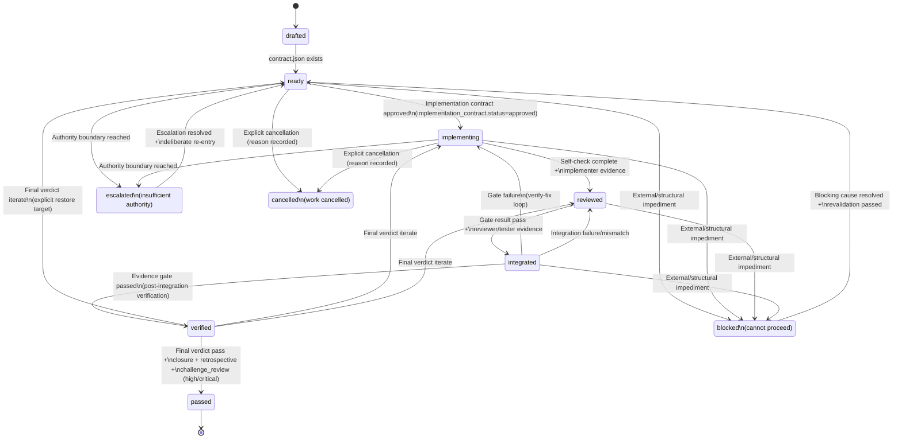
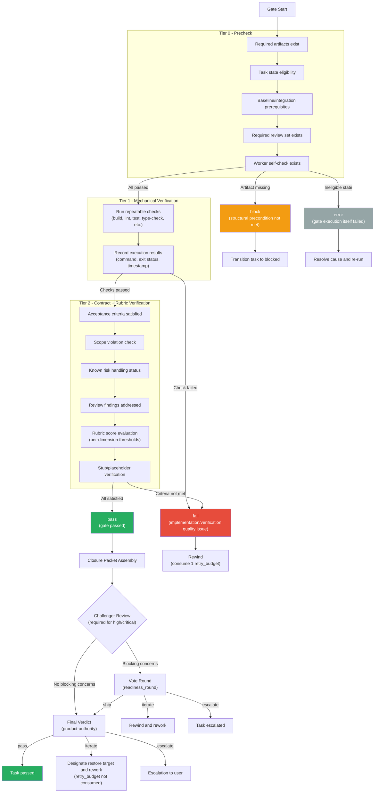
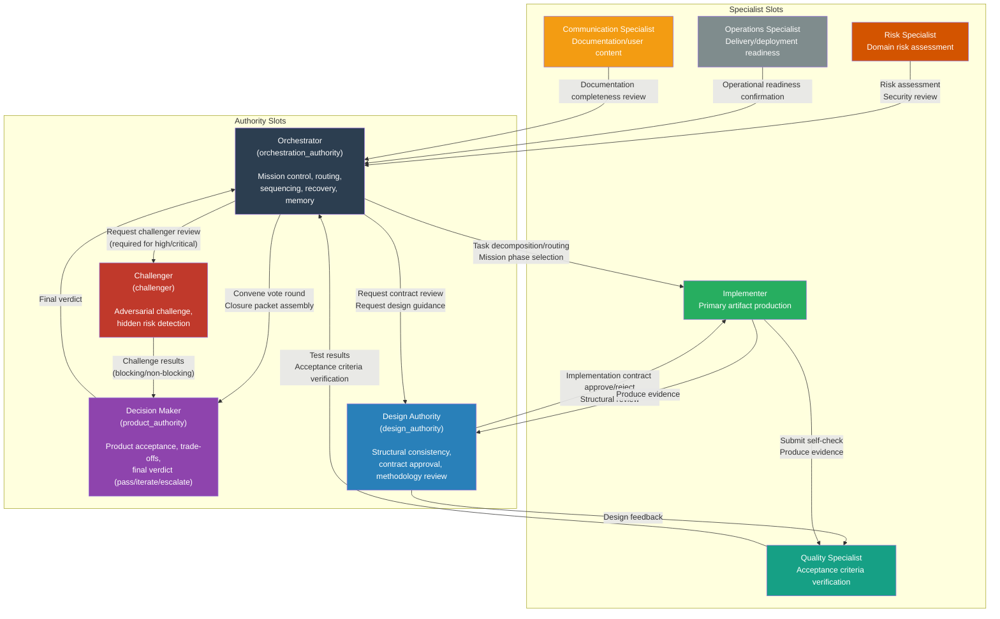
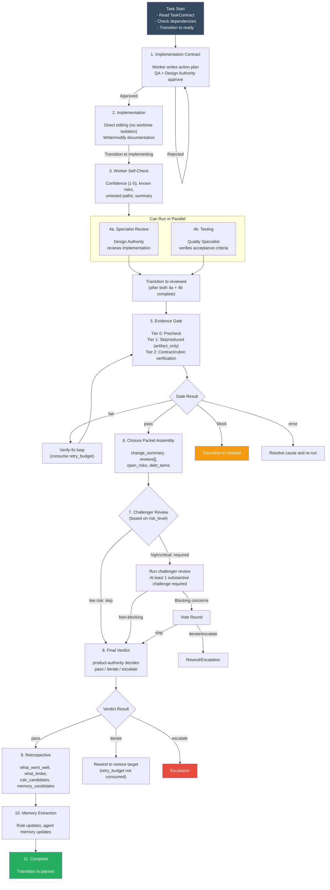

# Geas Protocol Diagrams

This document visualizes the core flows of the Geas protocol using Mermaid diagrams. Each diagram references its corresponding protocol document number.

## Table of Contents

1. [Mission Lifecycle](#1-mission-lifecycle)
2. [Task State Machine](#2-task-state-machine)
3. [Evidence Gate Flow](#3-evidence-gate-flow)
4. [Agent Interactions](#4-agent-interactions)
5. [Pipeline Execution Flow](#5-pipeline-execution-flow)

---

## 1. Mission Lifecycle

> Reference: `protocol/02_MODES_MISSIONS_AND_RUNTIME.md`

A mission passes through 4 phases in order. A phase gate exists at each transition, and all required artifacts must be satisfied before entering the next phase.

### Key Activities by Phase

| Phase | Key Activities | Primary Artifacts |
|-------|---------------|-------------------|
| Specifying | Requirements normalization, scope finalization, task decomposition | Mission spec, design brief, task contracts |
| Building | Core value path implementation, task closure cycles | Implementation contracts, gate results, closure packets, final verdicts |
| Polishing | Delivery hardening, specialist slot reviews | Specialist reviews, debt register updates |
| Evolving | Lesson extraction, debt cleanup, memory system updates | Gap assessments, rule updates, mission summary |

---

## 2. Task State Machine

> Reference: `protocol/03_TASK_MODEL_AND_LIFECYCLE.md`

A task has 7 primary states and 3 auxiliary states. Each transition has required preconditions, and states cannot be skipped.

### Representative Paths

| Path | State Flow |
|------|-----------|
| Normal path | drafted -> ready -> implementing -> reviewed -> integrated -> verified -> passed |
| Verify-fix path | integrated(fail) -> implementing -> reviewed -> integrated -> verified -> passed |
| Product-iterate path | verified -> iterate -> implementing/reviewed -> ... -> verified -> passed |

---

## 3. Evidence Gate Flow

> Reference: `protocol/05_GATE_VOTE_AND_FINAL_VERDICT.md`

The Evidence Gate is a 3-tier (Tier 0/1/2) verification mechanism. The gate, vote round, and final verdict must always remain separate.

### Gate Profile Coverage

| Gate Profile | Tier 0 | Tier 1 | Tier 2 | When Used |
|-------------|--------|--------|--------|-----------|
| implementation_change | Run | Run | Run | Standard tasks with implementation changes |
| artifact_only | Run | Skip/reduced | Run | Documentation, design, review, analysis work |
| closure_ready | Run | Optional | Simplified | Cleanup, delivery, closure assembly tasks |

---

## 4. Agent Interactions

> Reference: `protocol/01_AGENT_TYPES_AND_AUTHORITY.md`

Geas organizes roles into a two-tier structure: Authority Slots and Specialist Slots. A single physical agent may fill multiple slots, but role separation must be maintained in artifacts.

### Decision Boundaries

| Decision | Primary Owner | Notes |
|----------|--------------|-------|
| Mission phase selection | Orchestrator | Based on mission intent, mode, and current evidence |
| Task decomposition/routing | Orchestrator | Design Authority consulted for large-scale work |
| Design brief approval | Decision Maker | Design Authority review required for full_depth |
| Implementation contract approval | Design Authority-led reviewer set | May include domain expert signatures |
| Evidence gate verdict | Gate executor | Objective mechanism |
| Final verdict | Decision Maker | Based on closure packet |

---

## 5. Pipeline Execution Flow

> Reference: `pipeline.md` (per-task pipeline reference)

This shows the pipeline execution flow for a documentation task (task_kind). The design, design_guide, implementation (worktree isolation), and integration steps are skipped.

### Documentation Task Skip Rules

| Step | Status |
|------|--------|
| design | Skipped |
| design_guide | Skipped |
| implementation (worktree isolation) | Skipped (direct editing) |
| integration | Skipped |
| implementation_contract through resolve | Required (cannot be skipped) |

### Steps That Can Never Be Skipped

The following steps must always be executed regardless of task_kind:

- implementation_contract
- self_check
- specialist_review
- testing
- evidence_gate
- closure_packet
- final_verdict
- retrospective
- memory_extraction
- resolve
