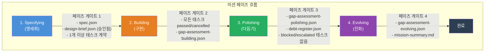
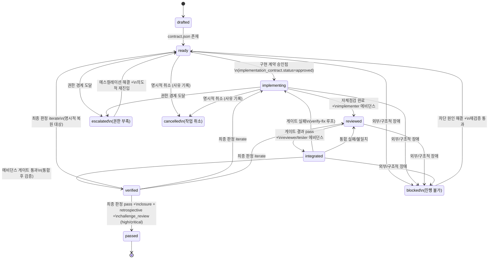
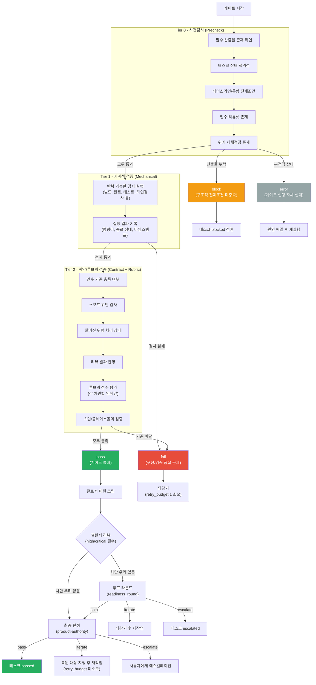
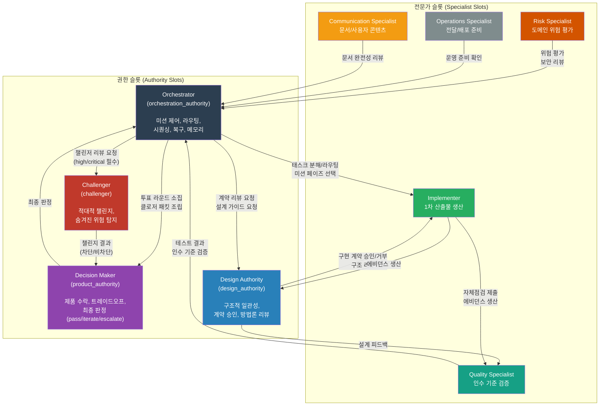
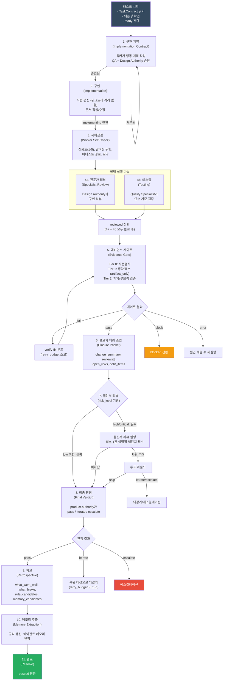

# Geas 프로토콜 다이어그램

이 문서는 Geas 프로토콜의 핵심 흐름을 Mermaid 다이어그램으로 시각화한다. 각 다이어그램은 해당 프로토콜 문서 번호를 명시한다.

## 목차

1. [미션 라이프사이클](#1-미션-라이프사이클)
2. [태스크 상태머신](#2-태스크-상태머신)
3. [에비던스 게이트 플로우](#3-에비던스-게이트-플로우)
4. [에이전트 상호작용](#4-에이전트-상호작용)
5. [파이프라인 실행 흐름](#5-파이프라인-실행-흐름)

---

## 1. 미션 라이프사이클

> 참조: `protocol/02_MODES_MISSIONS_AND_RUNTIME.md`

미션은 4개의 페이즈를 순서대로 통과한다. 각 페이즈 전환에는 페이즈 게이트가 존재하며, 필수 산출물이 충족되어야 다음 페이즈로 진입할 수 있다.

### 페이즈별 핵심 활동

| 페이즈 | 핵심 활동 | 주요 산출물 |
|--------|----------|------------|
| Specifying | 요구사항 정규화, 스코프 확정, 태스크 분해 | 미션 스펙, 디자인 브리프, 태스크 계약 |
| Building | 핵심 가치 경로 구현, 태스크 클로저 순환 | 구현 계약, 게이트 결과, 클로저 패킷, 최종 판정 |
| Polishing | 전달 준비 경화, 전문가 슬롯 리뷰 | 전문가 리뷰, 부채 레지스터 갱신 |
| Evolving | 교훈 추출, 부채 정리, 메모리 시스템 반영 | 갭 평가, 규칙 갱신, 미션 요약 |

---

## 2. 태스크 상태머신

> 참조: `protocol/03_TASK_MODEL_AND_LIFECYCLE.md`

태스크는 7개의 주요 상태와 3개의 보조 상태를 가진다. 각 전환에는 필수 조건이 존재하며, 상태를 건너뛸 수 없다.

### 대표 경로

| 경로 | 상태 흐름 |
|------|----------|
| 정상 경로 | drafted -> ready -> implementing -> reviewed -> integrated -> verified -> passed |
| 검증-수정 경로 | integrated(fail) -> implementing -> reviewed -> integrated -> verified -> passed |
| 제품-반복 경로 | verified -> iterate -> implementing/reviewed -> ... -> verified -> passed |

---

## 3. 에비던스 게이트 플로우

> 참조: `protocol/05_GATE_VOTE_AND_FINAL_VERDICT.md`

에비던스 게이트는 3단계(Tier 0/1/2) 검증 메커니즘이다. 게이트, 투표 라운드, 최종 판정은 반드시 분리되어야 한다.

### 게이트 프로필별 적용 범위

| 게이트 프로필 | Tier 0 | Tier 1 | Tier 2 | 사용 시점 |
|--------------|--------|--------|--------|----------|
| implementation_change | 실행 | 실행 | 실행 | 구현 변경이 있는 표준 태스크 |
| artifact_only | 실행 | 생략/축소 | 실행 | 문서, 설계, 리뷰, 분석 작업 |
| closure_ready | 실행 | 선택적 | 간소화 | 정리, 전달, 클로저 조립 태스크 |

---

## 4. 에이전트 상호작용

> 참조: `protocol/01_AGENT_TYPES_AND_AUTHORITY.md`

Geas는 권한 슬롯(Authority Slots)과 전문가 슬롯(Specialist Slots) 2계층 구조로 역할을 조직한다. 물리적 에이전트 하나가 여러 슬롯을 담당할 수 있으나, 산출물에서 역할 분리를 유지해야 한다.

### 의사결정 경계

| 의사결정 | 주 소유자 | 비고 |
|----------|----------|------|
| 미션 페이즈 선택 | Orchestrator | 미션 의도, 모드, 현재 에비던스 기반 |
| 태스크 분해/라우팅 | Orchestrator | 대규모 작업 시 Design Authority 자문 |
| 디자인 브리프 승인 | Decision Maker | full_depth 시 Design Authority 리뷰 필수 |
| 구현 계약 승인 | Design Authority 주도 리뷰어셋 | 도메인 전문가 서명 포함 가능 |
| 에비던스 게이트 판정 | 게이트 실행기 | 객관적 메커니즘 |
| 최종 판정 | Decision Maker | 클로저 패킷 기반 |

---

## 5. 파이프라인 실행 흐름

> 참조: `pipeline.md` (per-task pipeline reference)

documentation 종류(task_kind) 태스크의 파이프라인 실행 흐름이다. design, design_guide, implementation(워크트리 격리), integration 단계가 생략된다.

### documentation 태스크 생략 규칙

| 단계 | 상태 |
|------|------|
| design | 생략 |
| design_guide | 생략 |
| implementation (워크트리 격리) | 생략 (직접 편집) |
| integration | 생략 |
| implementation_contract ~ resolve | 필수 (생략 불가) |

### 절대 생략 불가 단계

다음 단계는 task_kind에 관계없이 반드시 실행해야 한다:

- implementation_contract
- self_check
- specialist_review
- testing
- evidence_gate
- closure_packet
- final_verdict
- retrospective
- memory_extraction
- resolve
