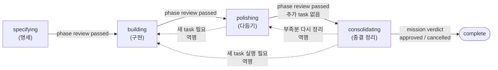
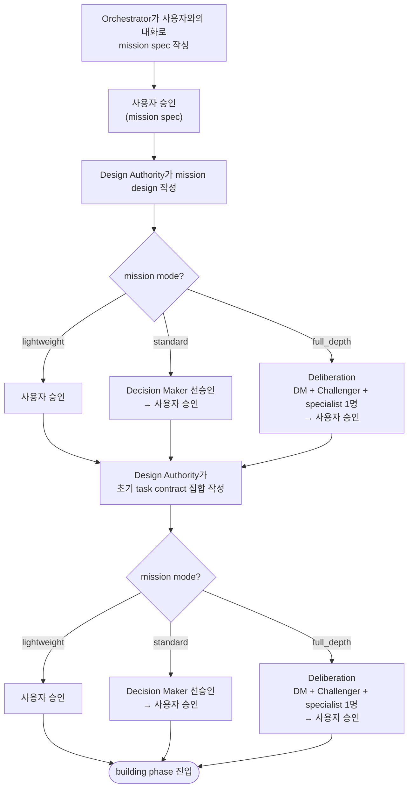
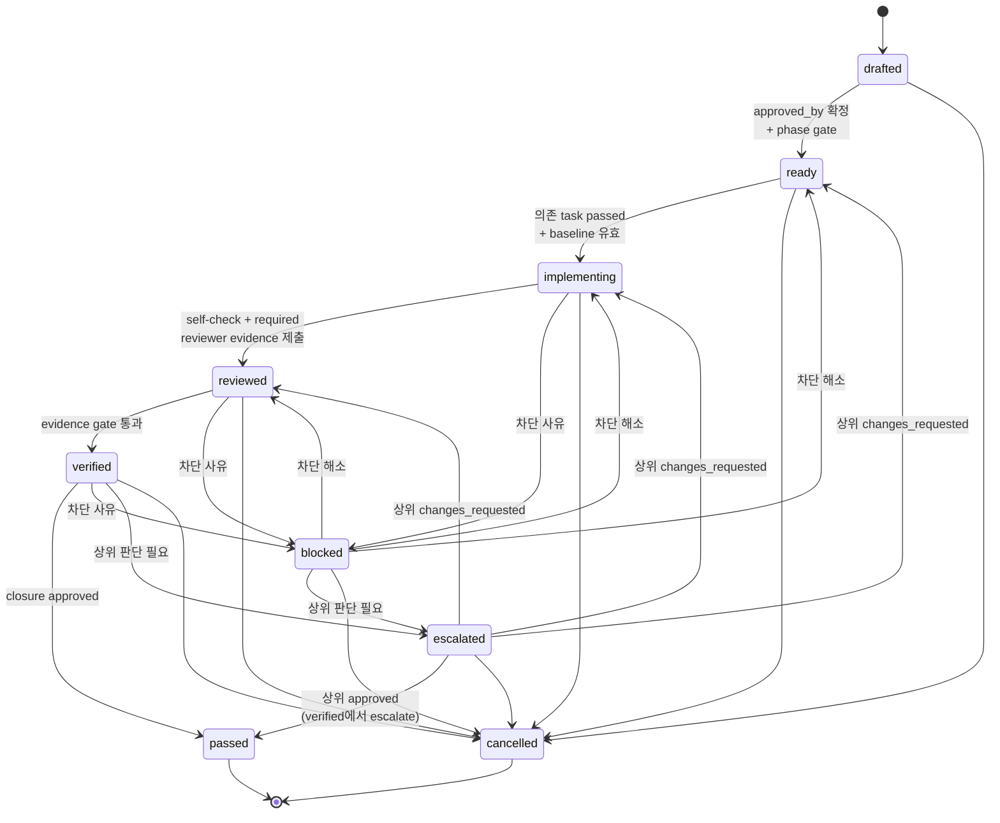
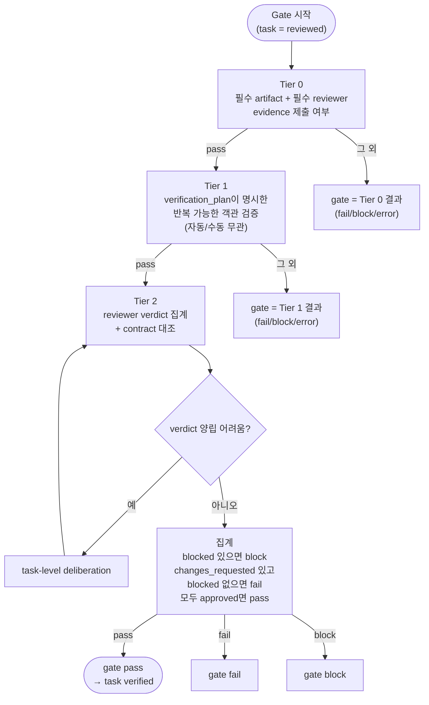
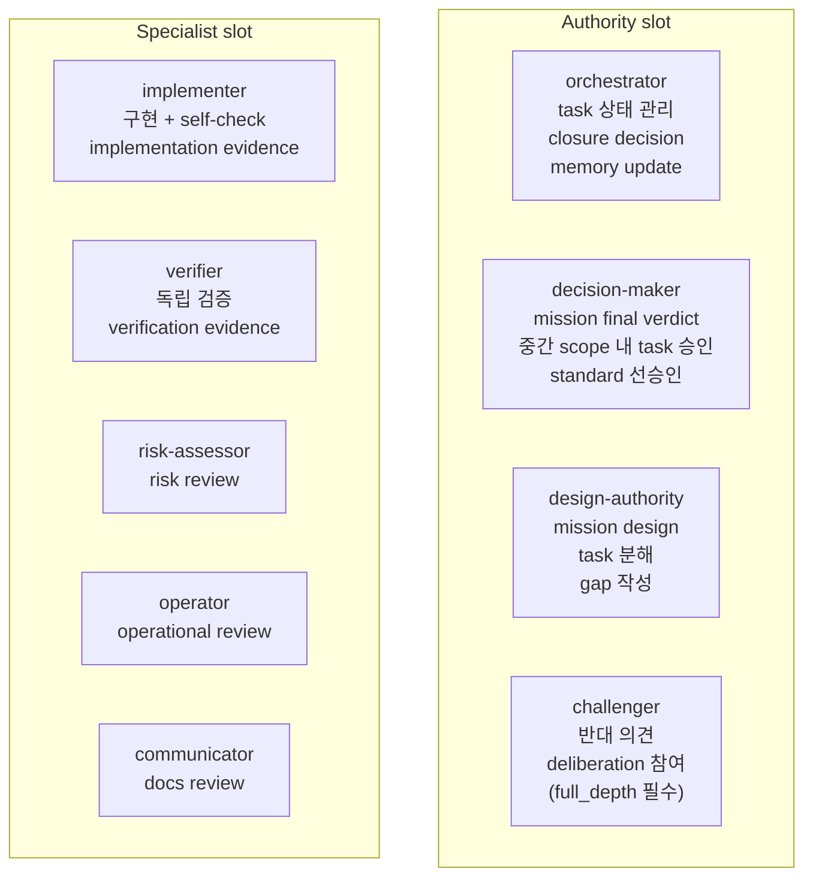
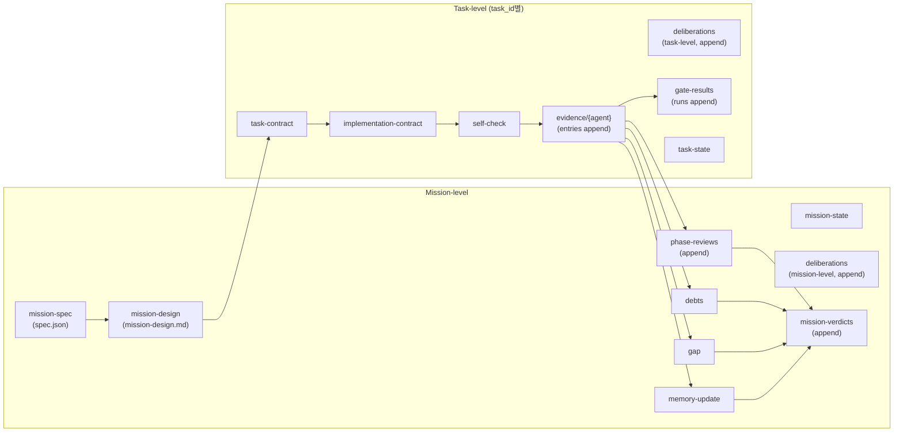

# Geas 프로토콜 다이어그램

이 문서는 Geas 프로토콜(`docs/ko/protocol/` 9 docs)과 JSON schema(`docs/schemas/` 14 schemas)에 정의된 핵심 흐름을 Mermaid 다이어그램으로 보여 준다. 각 다이어그램은 출처 문서를 상단에 표시한다.

## 목차

1. [미션 페이즈 흐름](#1-미션-페이즈-흐름)
2. [Specifying 승인 흐름](#2-specifying-승인-흐름)
3. [Task lifecycle](#3-task-lifecycle)
4. [Evidence Gate](#4-evidence-gate)
5. [Agent slot과 책임](#5-agent-slot과-책임)
6. [Artifact 관계](#6-artifact-관계)

---

## 1. 미션 페이즈 흐름

> 참조: `protocol/02_MISSIONS_PHASES_AND_FINAL_VERDICT.md`

미션은 네 phase를 차례로 통과해 `complete`로 종결된다. 각 phase 끝에 phase gate가 있고, phase review가 `passed`여야 다음 phase로 간다. Polishing과 consolidating에서만 제한적 역행이 허용된다 (specifying으로의 역행은 금지).

Mission verdict은 `approved` / `changes_requested` / `escalated` / `cancelled` 중 하나다. `changes_requested`나 `escalated`는 추가 작업 후 새 verdict를 배열에 append한다. `cancelled`는 종결 유형이며, spec 승인 전 포기는 consolidating을 건너뛰고 바로 complete로 간다.

---

## 2. Specifying 승인 흐름

> 참조: `protocol/02_MISSIONS_PHASES_AND_FINAL_VERDICT.md` (`Operating mode별 요구` + `specifying` phase)

Mission spec은 모든 mode에서 사용자 단독 승인이다. Mission design과 초기 task contract 집합은 operating mode에 따라 선행 절차가 다르다.

Task contract의 `approved_by` 필드에는 최종 승인 주체가 기록된다 (`user` 또는 `decision_maker`; 초기 task 집합은 `user`). Building/polishing 중 추가되는 scope 내 task는 `decision_maker` 승인만으로 ready 전이 가능하다. Scope 밖 작업은 이 mission 안에서 처리하지 않으며, 사용자가 scope를 넓히려면 현재 mission을 escalate하거나 후속 mission을 새로 생성한다.

---

## 3. Task lifecycle

> 참조: `protocol/03_TASK_LIFECYCLE_AND_EVIDENCE.md`

Task는 6개 주 상태(`drafted` → `ready` → `implementing` → `reviewed` → `verified` → `passed`)와 3개 보류/종결 상태(`blocked`, `escalated`, `cancelled`)를 가진다. `blocked`와 `escalated`는 일시 상태이며 해소되면 해당 조건에 따라 복귀하거나 종결된다.

Closure verdict는 `approved` / `changes_requested` / `escalated` / `cancelled` 중 하나다. `changes_requested`는 rewind에 해당하며 Orchestrator가 rationale에 복원 대상과 근거를 담는다. `cancelled` 종결에서 대체 계약이 있으면 새 task contract의 `supersedes` 필드가 이 task를 가리킨다.

---

## 4. Evidence Gate

> 참조: `protocol/03_TASK_LIFECYCLE_AND_EVIDENCE.md` (`Evidence Gate` 섹션)

Evidence gate는 Tier 0 → Tier 1 → Tier 2 순서로 진행한다. 어느 Tier에서든 `fail` / `block` / `error`가 나오면 그것이 곧 전체 gate verdict가 된다. Tier 2는 reviewer verdict를 집계한다.

Gate verdict는 `gate-results.json`의 `runs` 배열에 immutable object로 append된다. 재시도는 새 run으로 누적되며 이전 run은 덮어쓰지 않는다.

---

## 5. Agent slot과 책임

> 참조: `protocol/01_AGENTS_AND_AUTHORITY.md`

Slot은 역할 자리다. 구현체는 concrete agent type으로 매핑하지만 프로토콜 의미는 slot 이름으로 읽는다. 한 concrete agent가 여러 slot을 맡을 수 있으나 역할 전환은 명시적으로 드러나야 한다.

Evidence kind와 slot의 기본 연결:

| kind | 주 생산자 |
|---|---|
| `implementation` | `implementer` |
| `review` | `risk-assessor`, `operator`, `communicator`, `challenger` |
| `verification` | `verifier` |
| `closure` | `orchestrator` |

---

## 6. Artifact 관계

> 참조: `protocol/08_RUNTIME_ARTIFACTS_AND_SCHEMAS.md`

Mission-level과 task-level artifact가 계층으로 쌓인다. Append-only 로그(phase-reviews, mission-verdicts, gate-results, deliberations, evidence)는 이전 entry를 덮어쓰지 않고 array에 새 entry를 추가한다.

Consolidating phase에서 Orchestrator가 task evidence의 `debt_candidates`·`memory_suggestions`·`gap_signals`를 읽고 `debts.json`, `memory-update.json`을 작성한다. Design Authority는 `gap.json`을 작성한다. Decision Maker는 이들을 모두 읽고 mission verdict를 내린다.
