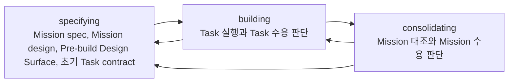
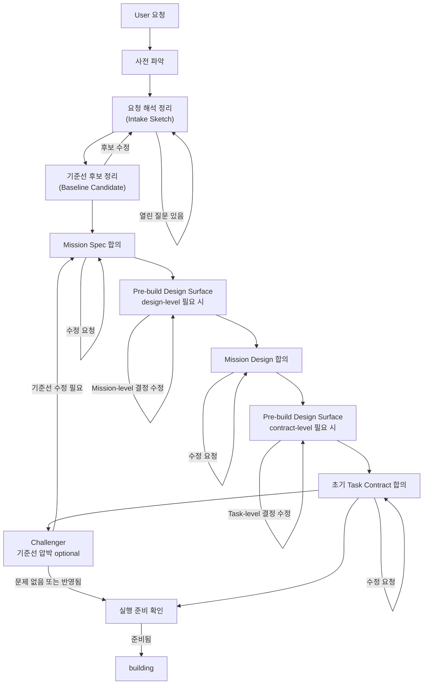
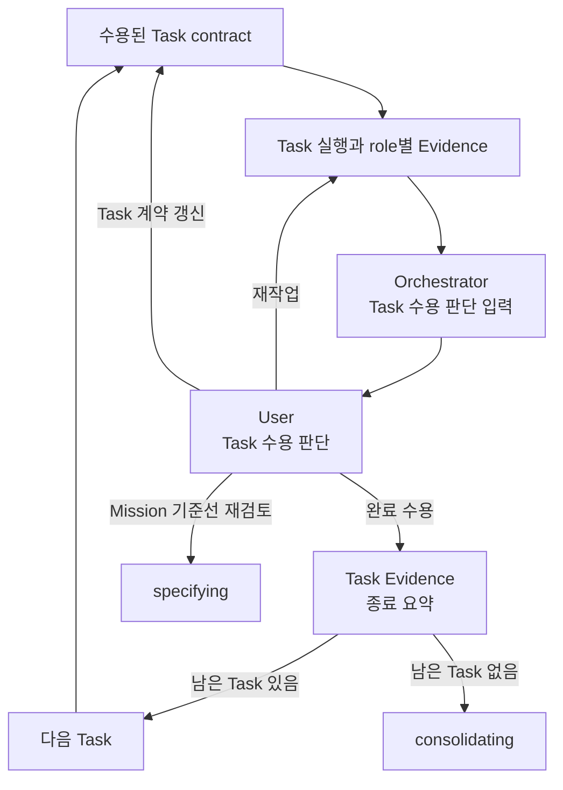
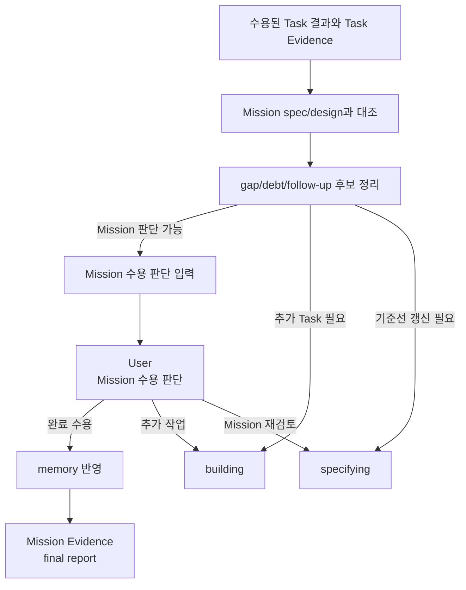

# Mission

## 목적

이 문서는 Mission의 의미, Mission spec, Mission design, Mission 흐름을 정의한다.

Mission은 User가 agent를 사용해 이루고자 하는 목표를 구체화한 것이다.

Mission은 User의 목표를 검토 가능한 기준선으로 만들고, 그 기준선을 실행 가능한 구조와 Task 계약으로 이어지게 하는 상위 작업 단위다.

## Mission

Mission은 최소한 다음 질문에 답해야 한다.

- 무엇을 이루려는가?
- 왜 필요한가?
- 어디까지 포함하는가?
- 어디까지 제외하는가?
- 어떤 기준으로 결과를 판단할 것인가?
- 어떤 위험이나 제약이 있는가?

Mission은 하나의 Task로 끝날 수도 있고, 여러 Task로 나뉠 수도 있다. 어떤 경우에도 Mission spec, Mission design, 초기 Task contract를 가진다. 단순한 Mission에서는 이 기준선들이 매우 짧을 수 있다.

## Mission Spec

Mission spec은 User의 목표를 검토 가능한 기준선으로 만드는 작업 기획이다.

Mission spec은 무엇을 하려는지, 왜 필요한지, 어디까지 포함하거나 제외하는지, 어떤 완료 기준과 수용 기준으로 판단할지를 고정한다.

Mission spec에는 다음 내용이 들어간다.

|항목|의미|
|---|---|
|이름|Mission을 식별할 수 있는 짧은 이름|
|목표|User가 agent를 사용해 이루려는 목표|
|배경|왜 이 Mission이 필요한지|
|완료 기준|Mission이 끝났다고 판단할 상위 기준|
|포함 범위|이번 Mission이 맡는 일|
|제외 범위|이번 Mission에서 하지 않을 일|
|수용 기준|결과를 판단할 구체 기준|
|제약|반드시 지켜야 하는 조건|
|가정|User 요청을 해석할 때 둔 전제|
|고려해야 할 위험|Mission을 실행하거나 수용 판단할 때 미리 의식해야 할 위험|

Mission spec은 User가 이해하고 받아들일 수 있어야 한다.

수용 기준은 나중에 Evidence와 대조하기 쉽도록 안정적인 식별자를 붙여 쓸 수 있다. 예를 들어 `AC-001:`처럼 시작하면 Mission Evidence와 Task Evidence에서 어떤 기준을 확인했는지 추적하기 쉽다. 이는 작성 관례이며 runtime schema를 바꾸는 규칙은 아니다.

Mission spec이 받아들여진 뒤 완료 기준이나 범위가 바뀌어야 한다면 기존 실행 기준을 조용히 확장하지 않는다. Mission을 갱신할지, 보류할지, 중단할지, 후속 Mission으로 넘길지 판단해야 한다.

## Mission Design

Mission design은 Mission spec을 바탕으로 Mission 진행 방식을 User가 검토하기 쉬운 계획으로 구체화하는 기준선이다.

Mission design은 Mission의 목표, 범위, 제약을 어떤 접근, 핵심 개념, scope, 판단 지점, 가정, 위험 관리 방식으로 다룰지 설명한다.

Mission design에는 다음 내용이 들어간다.

|항목|의미|
|---|---|
|접근 전략|Mission을 어떤 방식으로 진행할지와 그 이유|
|대안|검토했지만 선택하지 않은 주요 접근과 선택하지 않은 이유|
|핵심 개념|Mission을 이해하는 데 필요한 핵심 개념과 이번 Mission에서의 의미|
|scope in|Mission 진행 계획에 포함하는 구조적 범위|
|scope out|Mission 진행 계획에서 제외하는 구조적 범위|
|계획 outline|Task로 쪼개기 전에 User가 이해해야 할 주요 진행 초점, 목적, 기대 결과|
|판단 지점|진행 중 User에게 돌아가야 하거나 기준선 재검토가 필요한 지점|
|주요 가정|작업 계획이 의존하는 전제|
|위험|선택한 Mission 진행 계획에서 고려해야 하는 위험|
|변경 trigger|Mission Design이나 Task Contract를 다시 합의해야 하는 조건|

Mission design은 Task 분리의 정본이 아니다. Task id, Task 분리, 의존 관계, Task별 mission coverage는 Task contract에서 정한다.

Task를 나눌 때는 `task.md`의 판단 가능한 작업 단위 기준을 Task contract 단계에서 따른다. 하나의 Task는 User가 그 Task의 산출물과 Evidence만 보고 완료 수용, 재작업, 보류, 중단을 판단할 수 있어야 한다. 서로 다른 수용 판단이 필요한 일이 섞이거나, 확인 방법과 위험 수준이 크게 다르거나, 앞선 결과가 받아들여져야 뒤의 결과를 판단할 수 있으면 별도 Task Contract로 나눈다.

## Mission 흐름

Mission은 다음 흐름을 따른다.

### specifying

목적은 사용자 요청을 User가 수용 판단할 수 있는 Mission 기준선으로 바꾸는 것이다.

주요 흐름은 다음과 같다.

User 요청을 바로 Mission Spec으로 옮기지 않는다. 먼저 기존 runtime 상태, 관련 문서, 프로젝트 구조, 검증 후보를 사전 파악하고, 현재 해석과 열린 질문을 요청 해석 정리(Intake Sketch)로 드러낸다.

목표, 범위, 검증 경로, 판단 책임이 충분히 잡히면 기준선 후보(Baseline Candidate)를 정리한다. User가 이 후보를 받아들이면 Mission Spec 합의로 넘어간다.

Mission Spec에 합의하면 Mission Design을 잠그기 전에 design-level Pre-build Design Surface가 필요한지 판단한다. Mission 접근, 최종 산출물 형태, 외부 interface contract, domain/structural model, 큰 tradeoff를 prose만으로 판단하기 어렵고 임시 표면이 판단 비용을 낮추면 HTML, diagram, prototype, comparison 같은 표면을 만든다. 필요 여부를 판단할 때 result, data, workflow, export, acceptance, operational lens를 각각 분류해 빠뜨리기 쉬운 기준선 결정을 찾는다. 이 표면은 runtime 정본이나 Evidence가 아니며, User가 선택한 Mission-level 결정만 Mission Design에 반영한다.

design-level 결정이 필요하지 않거나 필요한 결정이 반영되면 Mission Design에 합의한다. Mission Design은 접근 전략, 계획 outline, 판단 지점, 가정과 위험이 User가 이해하고 검토할 수 있는지 확인하는 기준선이다.

Mission Design 합의 이후에는 Task Contract를 잠그기 전에 contract-level Pre-build Design Surface가 필요한지 판단한다. Task slicing, 산출물, 수용 기준, verification checks, dependency, 첫 building Task를 prose만으로 판단하기 어렵고 임시 표면이 판단 비용을 낮추면 HTML, diagram, prototype, comparison 같은 표면을 만든다. 이 표면은 runtime 정본이나 Evidence가 아니며, User가 선택한 Task-level 결정만 초기 Task Contract에 반영한다.

contract-level Pre-build Design Surface가 필요하지 않거나 필요한 결정이 반영되면 초기 Task Contract에 합의한다. 초기 Task Contract는 Task 분리, Task id, 의존 관계와 각 Task를 실행하기 전에 범위, 산출물, 수용 기준, verification checks, review focus를 고정한다.

세 기준선이 각각 합의되고 필요한 Pre-build Design Surface 결정이 Mission Design이나 Task Contract에 반영되면 실행 준비 확인을 거쳐 building으로 넘어간다.

Mission Spec에 합의했다고 Mission Design까지 합의한 것은 아니다. Mission Design에 합의했다고 contract-level Pre-build Design Surface 결정이나 초기 Task Contract까지 합의한 것은 아니다. 초기 Task Contract 합의는 Task 결과 수용 판단이 아니다.

Challenger가 참여하면 Mission Spec과 Mission Design의 숨은 가정, scope 경계, 계획 위험을 드러내고, Pre-build Design Surface 결정과 초기 Task Contract가 정하는 Task 분리, 의존 관계, 검증·검토 경계의 장기 위험을 드러낸다. Orchestrator는 드러난 내용을 User와 토론하고 합의된 기준선에 반영한다.

User는 Mission Spec, 필요한 design-level Pre-build Design Surface 결정, Mission Design, 필요한 contract-level Pre-build Design Surface 결정, 초기 Task Contract를 순서대로 확인하고 합의한다. 수정이 필요하면 specifying 안에서 기준선을 다시 다듬고, 합의되면 building으로 넘어간다.

남겨야 할 것은 versioned Mission Spec, Mission Design, 초기 Task Contract다. Pre-build Design Surface 파일이나 링크는 판단 맥락으로 briefing에 남길 수 있지만 기준선 정본은 아니며, 선택된 결정은 Mission Design이나 초기 Task Contract에 들어가야 한다. 이 기준선 합의는 별도 User Judgment artifact로 남기지 않는다.

다음 경우에는 조용히 실행 범위를 넓히지 않고 specifying 안에서 기준선을 다시 합의한다.

- Mission 목표, 포함 범위, 제외 범위, 수용 기준이 바뀐다.
- Mission 진행 방식, 주요 scope framing, 판단 지점, 가정, 위험, 변경 trigger가 바뀐다.
- Pre-build Design Surface에서 선택한 구현 전 결정이 바뀌거나, 필요한 결정이 Mission Design 또는 Task Contract에 반영되지 않았다.
- Task 추가, 삭제, dependency, task별 mission coverage가 바뀐다.
- Task 결과나 Evidence가 Mission 기준선 자체의 문제를 드러낸다.
- User가 Task 수준 재작업이 아니라 Mission 수준 재검토를 요청한다.

### building

목적은 수용된 Task contract에 따라 작업을 수행하고, 각 Task에 대해 User가 수용 판단할 수 있도록 Evidence를 남기는 것이다.

Run State는 현재 Task를 찾고, Task State는 Task 내부의 현재 phase를 찾는다.

주요 흐름은 다음과 같다.

Mission 문서의 building은 Task 수용 루프를 다룬다. Task 내부의 구현, 검증, review 세부 흐름은 `task.md`가 다룬다.

Orchestrator는 수용된 Task contract를 기준으로 role 호출, handoff, verification, review 흐름을 조율한다. 각 role은 자기 책임 범위에서 Task 결과를 만들거나 확인하고 role별 Evidence를 남긴다.

Orchestrator는 산출물, role별 Evidence, Task contract를 대조해 User가 Task를 수용 판단할 수 있는 입력을 구성한다.

User는 Task 결과와 Evidence를 보고 완료 수용, 재작업, Task 계약 갱신, Mission 기준선 재검토 중 필요한 판단을 내린다. Task가 수용 판단으로 종료되면 Orchestrator가 Task Evidence를 남기고, 남은 Task가 있으면 building 안에서 다음 Task로 이어 간다.

runtime에서 재작업, Task 계약 갱신, Mission 기준선 재검토는 `User Judgment.decision: revise`와 `requested_actions`로 표현한다.

남겨야 할 것은 Task 결과, Implementation Evidence, Verification Evidence, Review Evidence다. Task가 종료되면 Task Evidence도 남긴다. Challenger가 참여했다면 Challenger Evidence도 남긴다.

### consolidating

목적은 수용된 Task들을 Mission 기준선과 대조하고, User가 Mission 전체를 수용 판단할 수 있는 상태로 정리하는 것이다.

주요 흐름은 다음과 같다.

gap, debt, follow-up 후보는 Mission 수용 판단 전에 정리한다. memory는 User의 Mission 수용 판단 이후에 반영한다.

Orchestrator는 수용된 Task 결과와 Task Evidence를 Mission spec, Mission design과 대조한다. 이때 Mission 기준선과 실제 결과 사이의 gap, 수용한 결과 안에 남는 debt, 현재 Mission 밖에서 다룰 follow-up 후보를 정리한다.

추가 Task나 Task contract 갱신이 필요하면 building으로 돌아간다. Mission spec이나 Mission design 수정이 필요하면 specifying으로 돌아간다.

Mission 진행 방식, 주요 scope framing, 판단 지점, 가정, 위험, 변경 trigger가 바뀌면 새 Mission design을 남긴다. Task 추가, 삭제, dependency, Task별 Mission coverage, 실행 범위, 산출물, 수용 기준, verification checks, review focus, 위험 수준이 바뀌면 새 Task contract를 남긴다.

Mission 판단이 가능하면 Orchestrator는 Task Evidence, 필요한 role별 Evidence, Mission 기준선, gap, debt, follow-up 후보를 대조해 Mission 수용 판단 입력, agent 측 권고, 가능한 선택지를 구성한다.

User가 Mission을 수용하면 수용된 gap과 debt, 남기기로 한 follow-up을 확인하고 필요한 memory를 반영한다. 이후 Orchestrator가 Mission Evidence를 final report로 남긴다.

runtime에서 추가 Task 요청과 Mission 재검토는 `User Judgment.decision: revise`와 `requested_actions`로 표현한다.

남겨야 할 것은 Mission 결과 요약, Mission Evidence, agent 측 권고, User의 수용 판단, gap, debt, follow-up, memory 업데이트다.

Mission은 User의 수용 판단이 남고, 수용된 gap과 debt, 남기기로 한 follow-up, 필요한 memory가 정리되었을 때 complete로 볼 수 있다.

## Mission 판단

모든 Task가 수용되어도 Mission이 자동으로 완료되는 것은 아니다.

Mission 수용 판단에서는 수용된 Task들이 Mission spec과 Mission design을 충족하는지 다시 본다. 이때 전체 목표와 Task 결과 사이의 gap, Evidence에 드러난 미검증 범위, follow-up, 현재 Mission에서 더 진행하지 않을 debt가 함께 판단 대상이 된다.

Mission의 최종 판단은 agent의 완료 선언이나 Task 상태가 아니라, 수용 판단 입력과 User의 수용 판단 위에 성립한다. Memory로 반영할 교훈은 수용 판단 이후 회고에서 정리한다. Mission Evidence는 수용 판단, 회고, memory 업데이트 이후 Mission 전체를 다시 열어볼 수 있게 남기는 final report다.
