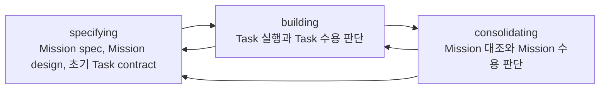

# Mission

## 목적

이 문서는 Mission의 의미, Mission spec, Mission design, 운영 깊이, Mission 흐름을 정의한다.

Mission은 User가 agent를 사용해 이루고자 하는 목표를 구체화한 것이다.

Mission은 User의 목표를 검토 가능한 기준선으로 만들고, 그 기준선을 실행 가능한 구조와 Task 계약으로 이어지게 하는 상위 작업 단위다.

## Mission

Mission은 최소한 다음 질문에 답해야 한다.

- 무엇을 이루려는가?
- 왜 필요한가?
- 어디까지 포함하는가?
- 어디까지 제외하는가?
- 어떤 기준으로 결과를 판단할 것인가?
- 어떤 위험이나 제약이 있는가?

Mission은 하나의 Task로 끝날 수도 있고, 여러 Task로 나뉠 수도 있다. 어떤 경우에도 Mission spec, Mission design, 초기 Task contract를 가진다. 단순한 Mission에서는 이 기준선들이 매우 짧을 수 있다.

## Mission Spec

Mission spec은 User의 목표를 검토 가능한 기준선으로 만드는 작업 기획이다.

Mission spec은 무엇을 하려는지, 왜 필요한지, 어디까지 포함하거나 제외하는지, 어떤 완료 기준과 수용 기준으로 판단할지를 고정한다.

Mission spec에는 다음 내용이 들어간다.

|항목|의미|
|---|---|
|이름|Mission을 식별할 수 있는 짧은 이름|
|목표|User가 agent를 사용해 이루려는 목표|
|배경|왜 이 Mission이 필요한지|
|완료 기준|Mission이 끝났다고 판단할 상위 기준|
|포함 범위|이번 Mission이 맡는 일|
|제외 범위|이번 Mission에서 하지 않을 일|
|수용 기준|결과를 판단할 구체 기준|
|제약|반드시 지켜야 하는 조건|
|가정|User 요청을 해석할 때 둔 전제|
|고려해야 할 위험|Mission을 실행하거나 수용 판단할 때 미리 의식해야 할 위험|

Mission spec은 User가 이해하고 받아들일 수 있어야 한다.

Mission spec이 받아들여진 뒤 완료 기준이나 범위가 바뀌어야 한다면 기존 실행 기준을 조용히 확장하지 않는다. Mission을 갱신할지, 보류할지, 중단할지, 후속 Mission으로 넘길지 판단해야 한다.

## Mission Design

Mission design은 Mission spec을 실행 가능한 작업 구조로 바꾸는 작업 계획이다.

Mission design은 Mission을 어떤 Task 구조와 검증 흐름으로 진행할지 설명한다.

Mission design에는 다음 내용이 들어간다.

|항목|의미|
|---|---|
|접근 전략|Mission을 어떤 방식으로 진행할지와 그 이유|
|Task 분해|Mission을 어떤 Task로 나누는지와 그 이유|
|진행 순서|Task 진행 순서와 주요 의존 관계|
|검증 전략|Mission과 Task를 어떤 Evidence로 판단할지|
|주요 가정|작업 계획이 의존하는 전제|
|위험과 대응|고려해야 할 위험과 대응 방식|

## Mission 흐름

Mission은 다음 흐름을 따른다.

### specifying

목적은 사용자 요청을 User가 수용 판단할 수 있는 Mission 기준선으로 바꾸는 것이다.

주요 활동은 다음과 같다.

- Orchestrator가 User 요청을 User가 검토할 수 있는 Mission spec 초안으로 구체화한다.
- Work Designer가 Mission spec을 바탕으로 Mission design을 작성한다.
- Work Designer가 Mission design을 바탕으로 초기 Task contract를 작성한다.
- 필요한 경우 Challenger가 Mission 기준선을 검토하고 Challenger Evidence를 남긴다.
- User가 Mission spec, Mission design, 초기 Task contract를 검토하고 수용 판단한다.

남겨야 할 것은 Mission spec, Mission design, 초기 Task contract다. Challenger가 검토했다면 Challenger Evidence도 남긴다.

### building

목적은 수용된 Task contract에 따라 작업을 수행하고, 각 Task에 대해 User가 수용 판단할 수 있도록 Evidence를 남기는 것이다.

주요 활동은 다음과 같다.

- Orchestrator가 수용된 Task contract에 따라 role 호출, handoff, review, verification 흐름을 조율한다.
- Implementer가 Task를 수행하고 Implementation Evidence를 남긴다.
- Reviewer가 Task 결과를 검토하고 Review Evidence를 남긴다.
- Challenger가 검토했다면 Challenger Evidence를 남긴다.
- Verifier가 Task 결과를 검증하고 Verification Evidence를 남긴다.
- Orchestrator가 Task Evidence를 User가 판단 가능한 상태로 모은다.
- User가 각 Task의 Evidence를 검토하고 수용 판단한다.
- 재작업이 필요하면 building 안에서 반복한다.
- Mission spec이나 Mission design 변경이 필요하면 specifying으로 돌아간다.

남겨야 할 것은 Task 결과, Implementation Evidence, Review Evidence, Verification Evidence다. Challenger가 참여했다면 Challenger Evidence도 남긴다.

### consolidating

목적은 수용된 Task들을 Mission 기준선과 대조하고, User가 Mission 전체를 수용 판단할 수 있는 상태로 정리하는 것이다.

주요 활동은 다음과 같다.

- Orchestrator가 수용된 Task 결과와 Task Evidence를 Mission spec과 Mission design에 대조한다.
- 남은 부족분을 추가 Task, gap, debt, follow-up, no action 중 하나로 분류한다.
- 추가 Task나 Task contract 갱신이 필요하면 building으로 돌아간다.
- Mission spec이나 Mission design 수정이 필요하면 specifying으로 돌아간다.
- Orchestrator가 Mission Evidence, agent 측 권고, 가능한 선택지를 정리한다.
- User가 Mission Evidence를 검토하고 Mission 수용 판단을 내린다.
- 수용 판단 이후 회고 항목을 정리하고 필요한 memory를 업데이트한다.

남겨야 할 것은 Mission 결과 요약, Mission Evidence, agent 측 권고, User의 수용 판단, 회고 항목, memory 업데이트다.

Mission은 User의 수용 판단이 남고, 필요한 회고와 후속 항목이 정리되었을 때 complete로 볼 수 있다.

## Mission 판단

모든 Task가 수용되어도 Mission이 자동으로 완료되는 것은 아니다.

Mission 수용 판단에서는 수용된 Task들이 Mission spec과 Mission design을 충족하는지 다시 본다. 이때 전체 목표와 Task 결과 사이의 gap, Evidence에 드러난 미검증 범위, 후속 Mission으로 넘길 항목, 현재 Mission에서 더 진행하지 않을 debt, memory로 남길 교훈이 함께 판단 대상이 된다.

Mission의 최종 판단은 agent의 완료 선언이나 Task 상태가 아니라, Mission Evidence와 User의 수용 판단 위에 성립한다.
