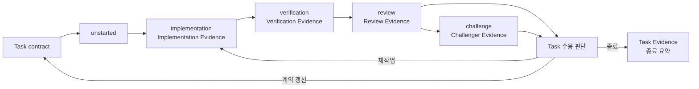
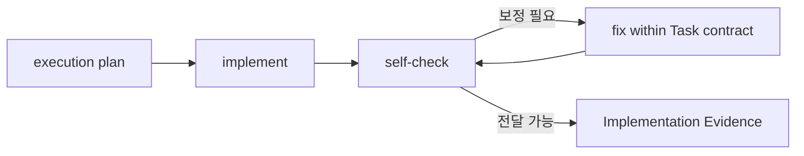

# Task

## 목적

이 문서는 Task의 의미, Task contract, Task 흐름, 재작업 흐름을 정의한다.

Task는 Mission의 일부를 User가 Evidence를 보고 수용 판단할 수 있게 나눈 작업 단위다. Task는 agent가 완료를 선언하는 단위가 아니라, User의 수용 판단 비용을 낮추기 위한 실행 단위다.

## Task

Task는 최소한 다음 질문에 답해야 한다.

- 이 Task는 Mission의 어떤 부분을 담당하는가?
- 무엇을 바꾸거나 만들어야 하는가?
- 어디까지 다룰 것인가?
- 어디까지 다루지 않을 것인가?
- 어떤 결과가 나오면 충분한가?
- 어떤 Evidence가 필요한가?
- 무엇을 확인하지 못할 수 있는가?

Task는 User가 그 단위만 보고 완료 수용, 재작업, 보류, 중단을 판단할 수 있어야 한다. 이를 위해 Task는 산출물이 분명하고, 수용 기준과 확인 방법이 있으며, 한 번에 검토 가능한 크기이고, 확인하지 못한 범위와 남은 위험을 Evidence에서 따로 드러낼 수 있어야 한다.

하나의 Task 안에 서로 다른 수용 판단이 필요한 일이 섞이면 Task를 나누는 것이 좋다. 한 산출물은 받아들일 수 있지만 다른 산출물은 재작업이 필요하거나, 확인 방법과 위험 수준이 크게 다르거나, 앞선 결과가 받아들여져야 뒤의 작업을 판단할 수 있으면 별도 Task로 다룬다.

## Task Contract

Task contract는 Task가 맡는 Mission의 일부, 수행 범위, 산출물, 수용 기준, verification checks, review focus, 위험 수준을 고정하는 실행 계약이다.

Task contract에는 다음 내용이 들어간다.

|항목|의미|
|---|---|
|설명|이 Task가 무엇을 다루는지 한 문장으로 설명|
|Mission과의 관계|이 Task가 Mission의 어떤 부분을 담당하는지|
|depends on|이 Task를 시작하기 전에 충족되어야 하는 Task나 조건|
|scope in|이번 Task에서 변경하거나 작성할 표면|
|scope out|이번 Task에서 하지 않을 일|
|산출물|Task가 끝났을 때 남아야 하는 결과|
|수용 기준|Task 결과를 판단할 기준|
|verification checks|Verifier가 확인할 대상, 기준, 방법|
|review focus|Reviewer가 품질, 경계, 위험 관점에서 특히 점검할 지점|
|위험 수준|`low`, `medium`, `high` 중 하나로 표현한 실행 전 위험 분류|
|고려해야 할 위험|Task를 실행하거나 수용 판단할 때 미리 의식해야 할 구체 위험|

Task contract는 실행 전에 User와 합의되어야 한다. 단순한 Task에서는 이 계약이 대화 안의 짧은 합의일 수 있다. runtime에 남은 `task-contract-NNN.yaml`은 User와 합의된 실행 기준선이다.

위험 수준은 Task를 나눌지, Challenger를 넣을지, 검토 부담을 어떻게 설명할지 정하는 라우팅 신호다. `low`는 좁고 되돌리기 쉬운 변경, `medium`은 일반적인 verification과 review가 필요한 변경, `high`는 실패 비용이 크고 되돌리기 어렵거나, 사용자·운영·데이터·보안·배포·외부 동작에 큰 영향을 줄 수 있는 변경을 뜻한다.

Mission design의 Task 분해는 Mission 수준 planned task graph의 정본이고, Task contract는 해당 Task node의 실행 계약이다.

Task State는 Task 안에서 현재 이어갈 phase를 찾는 진행 위치 pointer다. Task contract는 실행 기준선이다.

`unstarted` phase는 Task contract가 기록되었지만 아직 implementation으로 들어가지 않은 Task를 가리킨다.

`closed` phase는 Task result User Judgment와 Task Evidence가 기록된 뒤 Task 흐름이 종료 요약까지 도달했음을 가리킨다. Task 수용 판단의 근거는 User Judgment와 Task Evidence에 남긴다.

verification checks와 review focus는 Evidence 자체가 아니라, Verification Evidence와 Review Evidence가 무엇을 확인하고 점검해야 하는지 정하는 초점이다.

building 중 Task contract의 범위, 산출물, 수용 기준, verification checks, review focus, 위험 수준이 바뀌어야 하면 조용히 실행 기준을 넓히지 않는다. Orchestrator는 Work Designer 또는 적절한 작성 role을 호출해 갱신안을 만들고, 합의된 Task contract를 새 `task-contract-NNN.yaml`로 남긴다.

Mission spec이나 Mission design 수정이 필요하면 specifying으로 돌아간다.

## Task 흐름

Task 흐름에서 phase가 바뀌면 Task State의 `phase`를 갱신한다.

### implementation

Implementer는 수용된 Task contract를 바탕으로 execution plan을 세운 뒤 Task를 수행한다.

산출물을 넘기기 전에 자기 점검을 수행하고, Task contract 범위 안의 문제를 발견하면 구현을 보정한 뒤 다시 자기 점검한다.

이후 Implementation Evidence를 남긴다.

Implementation Evidence에는 작업 결과, 변경 또는 생성한 산출물, 영향을 받은 범위, 중요한 판단과 이유, 계약과 달라진 점이나 갱신이 필요한 지점, 자기 점검 범위와 발견한 한계, 회고 후보가 들어간다.

Implementation Evidence가 남으면 Task 흐름은 verification으로 이어진다.

### verification

Verifier는 Task contract의 수용 기준과 verification checks에 따라 실제로 확인하고 Verification Evidence를 남긴다.

verification checks가 부족하거나 실행할 수 없으면 그 사실을 Verification Evidence에 남긴다.

Verification Evidence에는 검증 결과 요약, 실제로 확인한 대상, 수행한 verification check, 기준별 결과, 실행 출력 또는 관찰 결과, 기준선과 달라진 점, 미검증 범위와 이유, 다시 확인할 항목, verdict가 들어간다.

Verification Evidence가 확인 범위 안에서 통과 근거를 남기면 Task 흐름은 review로 이어진다.

Verification Evidence에서 수정 요청이나 User 판단으로 올릴 항목이 드러나면 Orchestrator는 이를 Task 수용 판단 입력으로 올린다. 재작업, review 진행, 기준선 갱신은 User 수용 판단과 이후 Task State 갱신으로 다룬다.

### review

Reviewer는 산출물, Implementation Evidence, Verification Evidence를 점검·평가하고 Review Evidence를 남긴다.

Reviewer는 산출물이 계약 기준과 기대 품질에 비추어 충분한지, 품질, 경계, 누락, 위험, 일관성 관점에서 남은 위험이나 재작업할 부분이 있는지 평가한다.

Review Evidence에는 Review 결과 요약, 실제로 점검한 대상, 사용한 review focus, 점검한 범위와 점검하지 않은 범위, 리뷰 방식, finding, 남은 위험, verdict, 전체 권고가 들어간다.

Review Evidence가 남으면 Orchestrator는 산출물과 Evidence를 대조해 Task 수용 판단 입력을 구성한다.

### challenge

Challenger가 참여하면 devil's advocate 관점에서 산출물, Implementation Evidence, Verification Evidence, Review Evidence를 압박해 보고 Challenger Evidence를 남긴다.

Challenger는 과도한 낙관, 암묵적 범위 확장, 빠진 질문, 검증 공백, 장기 운영 비용, User 판단으로 올려야 할 위험을 finding과 근거로 드러낸다.

Challenger Evidence는 Verification Evidence와 Review Evidence 이후에도 User 수용 판단 전에 봐야 할 위험을 압박해 드러낸다.

Challenger Evidence가 남으면 Orchestrator는 드러난 위험과 판단 항목을 Task 수용 판단 입력에 반영한다.

## Task 수용 판단

Orchestrator는 산출물, 각 role이 남긴 Evidence, Task contract를 대조해 판단 입력을 구성하고, 가능한 선택지를 User가 비교할 수 있게 제시한다. 선택은 User가 한다.

User는 산출물과 Evidence를 검토하고 다음 중 하나로 수용 판단한다.

|판단|쓰는 경우|
|---|---|
|완료 수용|User가 산출물과 Evidence가 Task contract를 충분히 만족한다고 판단한다.|
|재작업|Task contract는 유지해도 되지만 Review Evidence나 Verification Evidence에서 반영해야 할 문제가 드러났다.|
|계약 갱신|Task의 범위, 산출물, 수용 기준, verification checks, review focus, 위험 수준을 바꿔야 한다.|
|Task 폐기|Task 결과를 수용하지 않고 작업 이전 상태로 되돌린다.|
|Mission 재검토|Task 수준을 넘어 Mission spec이나 Mission design을 다시 봐야 한다.|

runtime에서 재작업, 계약 갱신, Task 폐기, Mission 재검토는 `User Judgment.decision: revise`와 `requested_actions`로 표현한다.

Mission 수용 판단은 모든 Task Evidence를 종합해 별도로 남긴다. 모든 Task가 수용되어도 Mission이 자동으로 완료되는 것은 아니다.

Task가 수용 판단으로 종료되면 Orchestrator는 Task 결과, User 수용 판단, 기준별 근거, 받아들인 미검증 범위와 위험을 Task Evidence로 짧게 정리한다. Task Evidence는 다음 작업, 회고, 컨텍스트 복원을 위한 종료 요약 Evidence다.

Task Evidence의 기준별 Evidence 참조에는 최신 Evidence뿐 아니라 재작업 후에도 여전히 유효한 이전 Evidence가 포함될 수 있다.

Task Evidence가 남으면 Task 흐름은 닫힌다.

### 재작업

재작업은 Task contract를 유지한 채 다시 implementation으로 돌아가는 흐름이다.

|상황|돌아갈 위치|남길 것|
|---|---|---|
|Review Evidence에서 반영할 문제가 드러났다.|implementation|문제와 기대 결과|
|Verification Evidence에서 실패나 미검증 범위가 드러났다.|implementation 또는 verification|실패한 기준, 미검증 범위, 다시 확인할 방법|

재작업은 이전 내용을 지우는 방식으로 처리하지 않는다. 무엇이 부족했고 어떤 기준으로 다시 진행하는지 Evidence로 남겨야 한다.

재작업 뒤에는 Orchestrator가 현재 수용 판단 입력을 갱신한다. 갱신된 입력에는 재작업 사유, User의 재작업 판단, 바뀐 산출물, 새 Evidence, 여전히 유효한 이전 Evidence, 다시 확인해야 할 범위가 드러나야 한다.

### 기준선 갱신

기준선 갱신은 Task contract나 Mission 기준선을 바꿔야 할 때 돌아가는 흐름이다.

|상황|돌아갈 위치|남길 것|
|---|---|---|
|Task contract의 범위, 산출물, 수용 기준, verification checks, review focus, 위험 수준이 바뀌어야 한다.|Task contract|바뀐 내용과 이유|
|Task 수준을 넘어 Mission spec이나 Mission design을 다시 봐야 한다.|Mission 재검토|Mission 기준선 재검토가 필요한 이유|

Task 추가, 삭제, 기본 진행 순서, dependency, Mission coverage가 바뀌면 새 Mission design을 남긴다. Task의 실행 범위, 산출물, 수용 기준, verification checks, review focus, 위험 수준이 바뀌면 새 Task contract를 남긴다.

기준선이 갱신되면 Orchestrator는 이전 기준선과 새 기준선의 차이, 갱신 사유, 영향을 받는 산출물과 Evidence, 재검증이 필요한 범위를 남긴다. 이전 Evidence는 자동 폐기하지 않고, 새 기준선에서도 유효한 범위와 참고만 가능한 범위를 구분한다.
