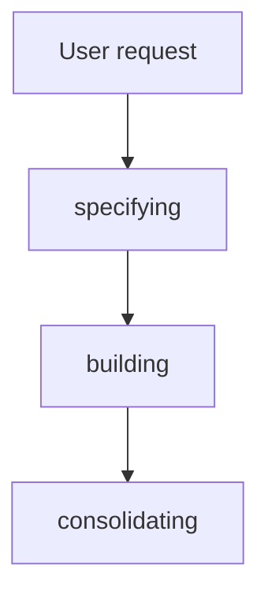
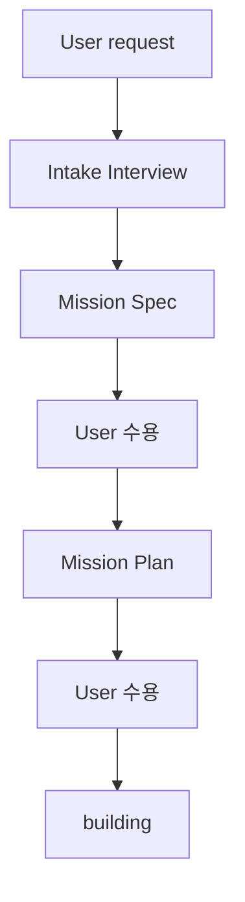
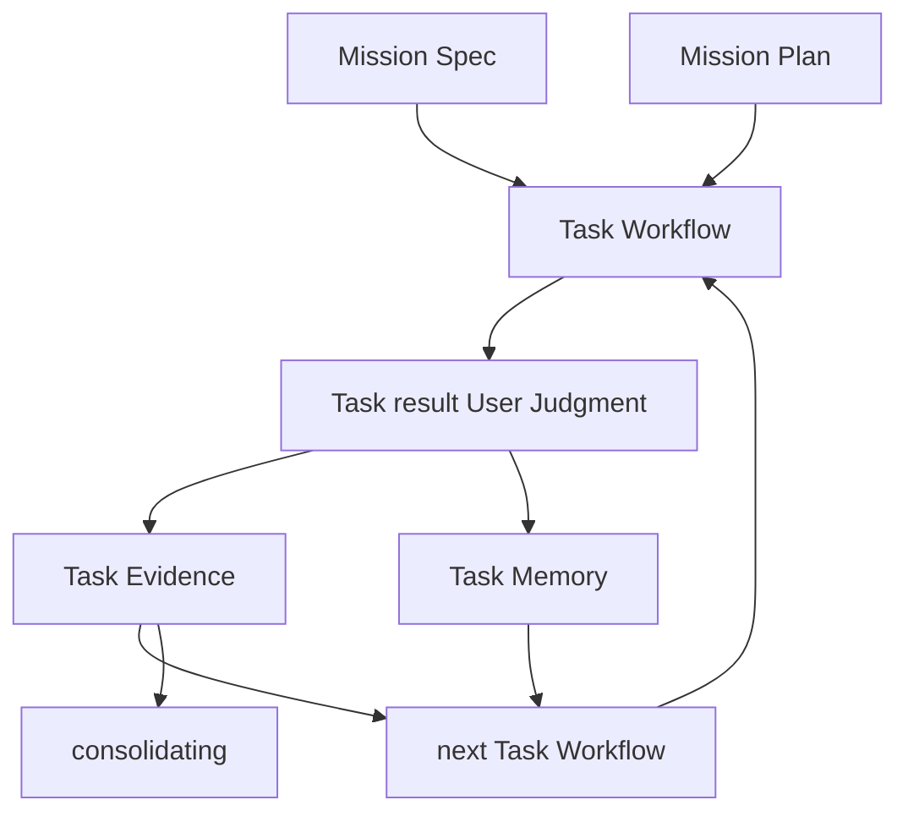
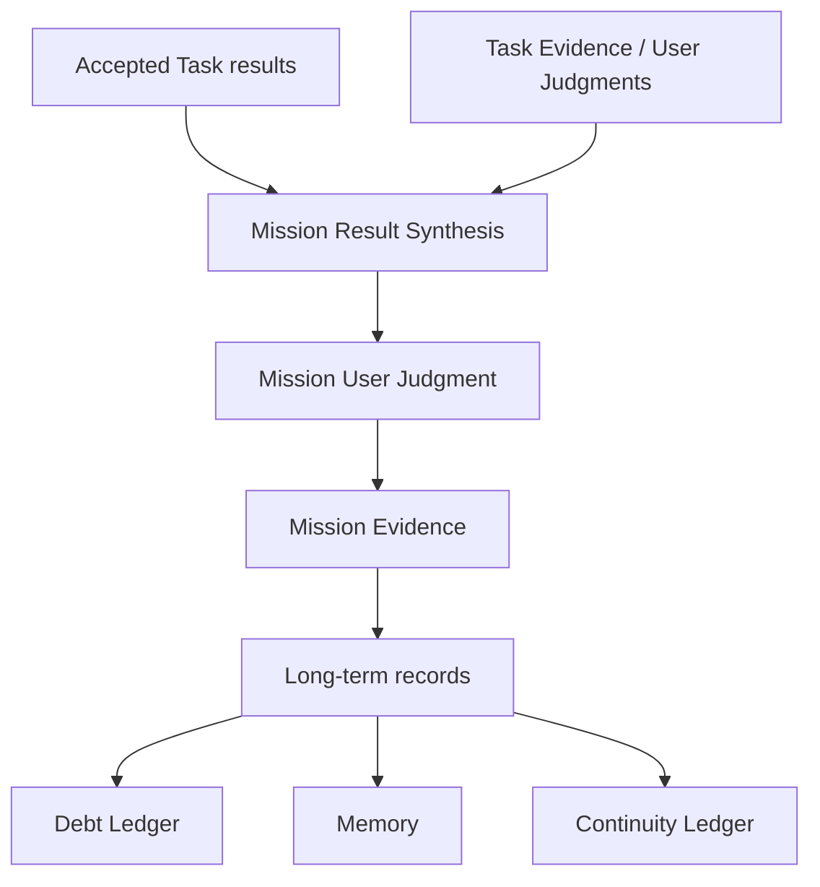
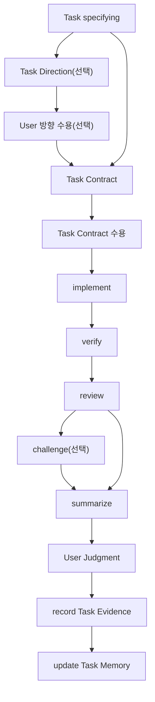

# Mission And Task

## 목적

이 문서는 Geas Workflow에서 *Mission*과 *Task*가 어떻게 시작되고, 실행되며, 판단되는지 설명한다.

*Mission*은 User가 AI Agent에게 맡긴 목표를 판단 기준과 진행 계획으로 잡아 두는 단위다. *Task*는 그 Mission을 User가 짧은 범위 안에서 검토하고 수용 판단할 수 있게 나눈 실행 단위다.

이 문서는 User 요청이 `Mission Spec`과 `Mission Plan`이 되고, `Mission Plan`이 Task로 이어지며, Task 결과가 Evidence와 `User Judgment`를 거쳐 Mission 판단과 다음 작업으로 이어지는 과정을 다룬다.

## Mission

Mission은 목표를 바로 작업으로 넘기기 전에, User가 나중에 판단할 수 있는 기준과 진행 계획으로 잡아 두는 단위다.

Mission은 User 요청을 곧바로 실행 지시로 바꾸지 않는다. 먼저 무엇을 이루려는지, 어떤 기준으로 결과를 받아들일지, 어떤 흐름으로 진행할지 잡는다. 이 기준과 계획이 있어야 Task를 나누고, Task 결과가 Mission에 실제로 기여했는지 판단할 수 있다.

### Mission Spec

`Mission Spec`은 User가 Mission에서 이루려는 핵심 의도와 판단 기준을 담는 출발점이다.

Orchestrator는 User와 대화하며 모호한 요청에서 `Mission Spec`을 끌어내고 선명하게 만든다. 이 과정에서 무엇을 이루려는지, 왜 필요한지, 어디까지 포함하고 제외하는지, 어떤 상태를 충분하다고 볼지, 어떤 제약과 위험을 의식해야 하는지 확인한다.

`Mission Spec`은 Task를 나누고, Task 결과를 해석하고, Mission 결과를 수용 판단할 때마다 돌아오는 기준점이다. `Mission Spec`이 분명할수록 agent는 실행 기준을 덜 추측하고, User는 Task 결과와 Mission 결과가 자신의 의도에서 벗어났는지 더 낮은 비용으로 검토할 수 있다.

`Mission Spec`은 다음 내용을 가진다.

|항목|역할|
|---|---|
|Goal|User가 AI Agent를 통해 이루려는 목표|
|Background|왜 이 Mission이 필요한지|
|Scope|Mission에 포함되는 범위와 제외되는 범위|
|Acceptance Criteria|Mission 결과를 수용 판단할 구체 기준|
|Constraints|Mission 안에서 지켜야 하는 조건|
|Assumptions|User 요청을 해석할 때 둔 전제|
|Risks|Mission을 실행하거나 수용 판단할 때 의식해야 하는 위험|

### Mission Plan

`Mission Plan`은 `Mission Spec`을 실제 Task 흐름으로 옮기는 진행 맥락이다.

`Mission Plan`은 `Mission Spec`을 어떤 접근으로 진행할지, Task를 어떤 구조로 나눌지, 각 Task가 어떤 `Mission Spec` 기준에 기여하는지, 어떤 판단 지점에서 User에게 돌아와야 하는지 잡는다. 또 변경이나 산출물이 영향을 줄 수 있는 파일, 문서, 흐름, 의존 관계를 살피고, 예상되는 side effect와 확인해야 할 범위를 남긴다.

`Mission Plan`은 다음 내용을 가진다.

|항목|역할|
|---|---|
|Plan Summary|Mission을 어떤 흐름으로 진행할지 한눈에 잡는 요약|
|Approach|선택한 접근 방식과 이유|
|Key Context|Task 진행 중 계속 참고해야 할 User 의도, 도메인 맥락, 제약, 선행 결정|
|Impact Surface|관련 파일, 문서, 모듈, UI 흐름, 데이터, 의존 관계, side effect 가능 범위|
|Task Structure|Mission을 User가 검토 가능한 Task 단위로 나누고, 각 Task가 어떤 `Mission Spec` 기준에 기여하는지 연결한 구조|
|Validation And Review Strategy|어떤 검증, review, challenge, 수동 확인 근거가 필요한지에 대한 전략|
|User Decision Points|어느 시점에 User 판단으로 돌아와야 하는지와 그때 무엇을 보고 판단할지|
|Risks And Mitigations|불확실성, side effect, 누락 위험, 장기 비용과 대응 방식|
|Change Triggers|`Mission Spec`, `Mission Plan`, `Task Contract`를 다시 봐야 하는 조건|
|Continuity Requirements|다음 Task, 다음 세션, 다른 agent 도구가 이어받아야 할 상태, 결정, 열린 질문, 반복 위험|

`Mission Plan`은 Task들이 같은 `Mission Spec`과 맥락을 공유한 채 이어지도록 잡아 준다.

## Task

Task는 Mission을 User가 짧은 범위 안에서 검토하고 수용 판단할 수 있게 나눈 실행 단위다.

Task는 `Mission Plan`의 Task Structure에서 나오며, `Mission Spec`의 일부 기준을 담당한다.

### Task 분해 기준

Task 분해의 기준은 agent 작업량보다 User 판단 비용이다.

Task는 하나의 목적, 하나의 수용 기준 묶음, 하나의 검증 전략, 설명 가능한 영향 범위를 가진다. Task가 너무 크면 User가 산출물, Evidence, 미검증 범위, 남은 위험을 함께 놓고 보기 어렵다. Task가 너무 작으면 판단과 기록 비용이 실행 가치보다 커진다.

Task를 나누는 조건은 다음과 같다.

|상황|이유|
|---|---|
|수용 기준이 다르다.|User가 받아들일 기준이 달라진다.|
|기준 산출물과 그 기준을 적용하는 실행이 함께 있다.|User가 기준을 먼저 수용한 뒤 실행 결과를 판단한다.|
|산출물의 성격이 다르다.|문서, 코드, UI, 데이터 변경은 검토 방식이 다를 수 있다.|
|검증 방법이 다르다.|테스트, 실행 확인, 리뷰, 수동 확인이 다르면 Evidence도 달라진다.|
|영향 범위가 다르다.|side effect를 확인할 파일, 문서, 흐름, 의존 관계가 달라진다.|
|위험 수준이 다르다.|높은 위험 작업은 별도 검토와 challenge로 다룬다.|
|User가 중간 결과를 보고 방향을 정한다.|User 판단 지점을 Task 경계로 만든다.|
|독립적으로 설명하기 어렵다.|Task 설명만으로 결과와 판단 기준을 이해하기 어려우면 더 나눈다.|

Task 안에서 서로 다른 판단이 섞인 것이 드러나면 `Task Contract`를 다시 정리하거나 Task를 나눈다.

### Task Direction

Task Direction은 Task를 실행하기 전에 User 선택이 필요한 방향을 먼저 고정하는 결정이다.

Task Direction은 접근, 디자인 방향, 산출물 형태, 구현 전략, tradeoff에 따라 결과와 검토 기준이 달라지는 Task에서 작성한다. 같은 `Task Contract`처럼 보여도 방향 선택에 따라 User가 보게 될 결과, 받아들일 위험, 확인해야 할 Evidence가 달라지면 Task Direction을 먼저 수용한다.

Task Direction의 형식은 고정하지 않는다. User가 방향을 판단하기 쉬운 형식이면 Markdown 문서, HTML artifact, UI 시안, Mermaid 다이어그램, 비교표, 짧은 브리핑을 사용할 수 있다.

Task Direction은 다음 내용을 예시로 가질 수 있다.

|항목|역할|
|---|---|
|Decision Context|이번 Task에서 왜 방향 결정이 필요한지 설명한다.|
|Options Considered|User가 비교해야 할 주요 선택지를 정리한다.|
|Selected Direction|User가 받아들인 방향을 고정한다.|
|Rationale|선택한 방향이 `Mission Spec`과 `Mission Plan`에 어떻게 맞는지 설명한다.|
|Tradeoffs|선택으로 얻는 것과 포기하는 것, 받아들일 위험을 드러낸다.|
|User Decisions|User가 명시적으로 받아들인 결정과 조건을 남긴다.|
|Contract Implications|선택한 방향이 `Task Contract`의 Scope, Deliverables, Acceptance Criteria, Verification Strategy에 미치는 영향을 남긴다.|
|Open Questions|`Task Contract`로 넘기기 전에 닫아야 할 질문을 드러낸다.|

위 항목은 필수 schema가 아니다. Orchestrator는 Task 성격에 맞춰 User가 비교하고 선택할 수 있을 만큼의 방향 표면을 만든다.

Task Direction은 `Task Contract`를 대체하지 않는다. Task Direction은 어떤 방향으로 갈지 정하고, `Task Contract`는 그 방향을 실행 가능한 경계와 수용 기준으로 고정한다.

### Task Contract

`Task Contract`는 agent가 Task를 실행할 때 지킬 경계와, User가 결과를 수용 판단할 때 볼 기준을 함께 묶어 둔 계약이다.

`Task Contract`가 분명하면 agent는 실행 전에 추측을 줄이고, 불필요한 범위 확장과 side effect를 피하며, implement, verify, review를 같은 기준으로 진행할 수 있다. User는 Task 결과와 Evidence를 같은 기준으로 대조해 수용, 재작업, 취소를 판단한다.

`Task Contract`는 다음 내용을 가진다.

|항목|역할|
|---|---|
|Task Summary|Task가 달성하려는 상태를 짧게 고정한다.|
|Mission Relation|`Mission Spec` 기준과 `Mission Plan`의 Task Structure를 연결한다.|
|Starting Context|수용된 선행 Task, 기준 산출물, 필요한 입력, 전제, 작업 전에 먼저 읽고 확인해야 할 파일, 문서, 테스트, 실행 흐름을 정한다.|
|Scope|포함 범위와 제외 범위를 정한다.|
|Deliverables|Task가 끝났을 때 남아야 하는 산출물을 정한다.|
|Impact Surface|변경이 닿을 파일, 문서, UI 흐름, 데이터, 의존 관계, side effect 가능 범위를 보인다.|
|Acceptance Criteria|User가 수용 판단할 기준을 정한다.|
|Execution Guardrails|지켜야 할 구현 경계, 기존 스타일, 건드리지 않을 영역, 관련 없는 리팩터링 금지를 고정한다.|
|Verification Strategy|어떤 테스트, 실행 확인, 수동 확인, regression 확인을 할지 정한다.|
|Review And Challenge Focus|review와 User 검토에서 봐야 할 품질, 경계, 사용자 영향, edge case, 유지보수 위험, challenge가 필요한 조건을 정한다.|

Starting Context는 실행 전에 이해해야 할 기준과 입력이고, Impact Surface는 변경이 영향을 줄 수 있어 확인해야 할 표면이다.

`Task Contract`는 세부 구현 순서보다 실행 경계와 판단 기준을 고정하는 데 초점을 둔다.

## Mission Workflow

Mission은 specifying, building, consolidating 세 단계로 진행된다.

### specifying

specifying에서는 User 요청을 `Mission Spec`과 `Mission Plan`으로 정리하고, 각각 User 수용을 받는다.

Intake Interview는 `Mission Spec`을 쓰기 전에 User 요청의 모호성을 줄이는 과정이다. Orchestrator는 User와 대화하며 목표, 배경, 포함 범위, 제외 범위, 성공 기준, 제약, 검증 가능성, 위험, User가 결정해야 할 항목을 확인한다. 선택지가 User의 판단 비용을 낮출 때는 2-3개로 좁혀 제시하고, 안전한 가정은 영향과 검증 위치를 붙여 제안한다.

Intake Interview를 거친 뒤 Orchestrator는 `Mission Spec`에서 핵심 의도와 판단 기준을 명확하게 만든다. User가 `Mission Spec`을 수용하면, Orchestrator는 그 Spec을 기준으로 `Mission Plan`을 작성한다.

`Mission Plan`은 Spec을 실제 Task 흐름으로 옮기기 위한 진행 맥락이다. User가 `Mission Plan`을 수용하면 building으로 넘어간다.

이때 수용은 결과 수용 판단이 아니라, `Mission Spec`과 `Mission Plan`을 작업 기준으로 받아들이는 결정이다.

### building

building은 `Mission Spec`과 `Mission Plan`을 기준으로 Task Workflow를 반복하고, 수용된 Task 결과를 Mission 판단의 근거로 쌓는 단계다.

각 Task Workflow는 Task specifying으로 시작한다. Task specifying에서 Task Direction과 `Task Contract`가 수용되면, agent는 그 기준 안에서 implement, verify, review, 선택적 challenge, summarize를 진행한다. User는 Task 결과와 Evidence를 보고 수용, 재작업, 취소를 판단한다.

수용된 Task 결과, `User Judgment`, 받아들인 위험, 미검증 범위, `Task Memory`는 이후 Task Workflow에 반영된다. Task 진행 중 `Mission Spec`이나 `Mission Plan`이 바뀌어야 하면 specifying으로 돌아가 `Mission Spec`이나 `Mission Plan`을 다시 수용한다.

### consolidating

consolidating은 수용된 Task 결과를 `Mission Spec`과 `Mission Plan` 기준으로 종합하고, Mission User Judgment와 장기 기록을 남기는 단계다.

Orchestrator는 수용된 Task 결과, Evidence, `User Judgment`, 받아들인 위험, 미검증 범위, `Debt Ledger` 후보, Memory 후보, `Continuity Ledger` 후보를 `Mission Spec`과 `Mission Plan`에 비춰 본다. User는 이를 보고 Mission을 완료로 받아들일지, 추가 Task를 진행할지, 취소할지 판단한다.

Mission User Judgment 뒤에는 오래 가져갈 기록을 세 갈래로 남긴다.

|항목|역할|
|---|---|
|`Debt Ledger`|User가 알고 수용했지만 장기 비용이나 이후 작업 부담으로 남는 위험, 미검증 범위, 품질 부채, 미충족 gap, follow-up 후보를 추적한다.|
|Memory|Mission 회고에서 나온 반복 가능한 교훈, User 선호, codebase rule, workflow improvement를 다음 작업에 적용할 수 있게 남긴다.|
|`Continuity Ledger`|현재 작업을 이어가기 위해 필요한 상태, User가 받아들인 결정과 tradeoff, 열린 질문, 다음 행동을 계속 갱신한다.|

Mission 완료는 Task 수용 판단의 단순 합계가 아니라, `Mission Spec`의 수용 기준과 `Mission Plan`의 진행 맥락을 다시 대조한 뒤 User의 Mission 수용 판단으로 성립한다.

#### Mission Evidence

`Mission Evidence`는 Mission User Judgment 뒤에 Mission 결과와 장기 기록 반영을 종합해 남기는 종료 기록이다.

`Mission Evidence`는 Mission을 다시 열어볼 때 가장 먼저 읽는 기록이다. Task별 상세는 `Task Evidence`에 두고, `Mission Evidence`는 `Mission Spec` 기준별 결과, `Mission Plan`과 실제 진행의 차이, 장기 기록으로 넘긴 항목을 종합한다.

`Mission Evidence`는 다음 내용을 가진다.

|항목|역할|
|---|---|
|Mission Result|Mission 결과를 요약한다.|
|User Judgment Summary|User의 Mission 수용 판단을 남긴다.|
|Mission Criteria Results|`Mission Spec` 기준별 결과와 근거 참조를 남긴다.|
|Task Evidence References|Mission 판단을 뒷받침한 `Task Evidence`를 연결한다.|
|Mission Plan Deltas|`Mission Plan`과 실제 진행의 차이를 남긴다.|
|Accepted Limits|최종적으로 받아들인 미검증 범위와 남은 위험을 남긴다.|
|Decisions And Tradeoffs|Mission 중 확정된 주요 결정과 대가를 남긴다.|
|Debt Ledger Updates|`Debt Ledger`에 남긴 항목의 참조와 이유를 남긴다.|
|Memory Updates|장기 Memory로 승격한 교훈을 남긴다.|
|Continuity Ledger Updates|`Continuity Ledger`에 남긴 상태, 열린 질문, 다음 행동을 요약한다.|

`Mission Criteria Results`는 `Mission Spec` 기준별로 Result, Evidence refs, Unverified scope, Remaining risks를 드러낸다.

|Result|의미|
|---|---|
|satisfied|기준이 충족되었고 User가 별도 한계를 받아들이지 않아도 되는 상태|
|satisfied_with_limits|기준을 수용하되 User가 알고 받아들인 미검증 범위나 남은 위험이 있는 상태|
|not_satisfied|기준이 충족되지 않아 추가 Task나 Mission 취소가 필요한 상태|

`Mission Evidence`의 Debt Ledger Updates, Memory Updates, Continuity Ledger Updates는 각 기록의 정본을 대체하지 않는다. `Mission Evidence`에는 이번 Mission에서 새로 기록하거나 갱신한 항목의 참조와 요약만 남긴다.

## Task Workflow

Task Workflow는 Task specifying, implement, verify, review, 선택적 challenge, summarize, User Judgment, record Task Evidence, update Task Memory 순서로 진행된다.

### Task specifying

Task specifying은 현재 Task의 방향과 계약을 정리하는 단계다.

접근, 디자인 방향, 산출물 형태, 구현 전략, tradeoff처럼 User 선택이 필요한 내용은 Task Direction으로 먼저 잡고 User 수용을 받는다. 그 뒤 수용된 방향을 기준으로 `Task Contract`를 작성하고 다시 User 수용을 받는다.

Task Direction은 User가 선택지를 비교하고 방향을 고르는 표면이다. `Task Contract`는 수용된 방향을 실행 경계, 산출물, 수용 기준, 확인 방법으로 바꾸는 계약이다.

Task Direction 수용과 `Task Contract` 수용은 Task 결과 수용 판단이 아니다. 이는 implement를 시작하기 전에 방향과 실행 기준을 작업 기준으로 받아들이는 결정이다.

### implement

implement는 수용된 Task Direction과 `Task Contract`를 작업 기준으로 삼아 산출물을 만들거나 변경하는 단계다.

agent는 Starting Context를 먼저 읽고, Task Direction의 결정, Scope, Execution Guardrails 안에서 작업하며, Impact Surface를 보고 side effect를 줄인다. 구현 중 수용된 방향이나 `Task Contract` 밖의 일이 필요해지면 Task Direction, `Task Contract`, `Mission Plan`, `Mission Spec` 중 다시 봐야 할 기준을 명시한다.

#### Implementation Evidence

`Implementation Evidence`는 implement 단계가 남기는 Evidence다. User가 Task 결과의 내용과 구현 맥락을 이해할 수 있게 무엇을 바꿨고, 왜 그렇게 했고, 어디까지 직접 확인했는지 남긴다.

`Implementation Evidence`는 다음 내용을 가진다.

|항목|역할|
|---|---|
|Summary|수행한 작업을 독립적으로 이해할 수 있게 요약한다.|
|Changed Outputs|변경하거나 생성한 파일, 문서, 코드, 산출물을 가리킨다.|
|Affected Scope|작업 결과가 영향을 준 기능, 문서 영역, 개념, 사용자 흐름을 남긴다.|
|Implementation Decisions|작업 중 내린 중요한 판단과 이유를 남긴다.|
|Assumptions|구현 중 의존한 전제를 드러낸다.|
|Contract Deltas|`Task Contract`와 달라졌거나 갱신이 필요한 지점을 남긴다.|
|Self Checks|Implementer가 산출물을 넘기기 전에 직접 확인한 범위와 결과를 남긴다.|
|Limits|확인하지 못한 범위, 알려진 한계, 남은 불확실성을 남긴다.|

`Implementation Evidence`는 verdict를 갖지 않는다. Implementer의 self check는 독립적인 `Verification Evidence`나 `Review Evidence`를 대체하지 않는다.

### verify

verify는 `Task Contract`의 Acceptance Criteria와 Verification Strategy에 따라 Task 결과를 확인하는 단계다.

verify는 테스트 실행, 명령 출력, 브라우저 확인, 문서 검색, diff 확인, 수동 재현 같은 확인 행위를 포함한다. 확인한 것과 확인하지 못한 것을 함께 남긴다.

#### Verification Evidence

`Verification Evidence`는 verify 단계가 남기는 Evidence다. User가 실제로 무엇을 확인했고, 어떤 기준이 어떤 근거로 충족되었는지 판단할 수 있게 돕는다.

`Verification Evidence`는 다음 내용을 가진다.

|항목|역할|
|---|---|
|Summary|검증 결과와 주요 한계를 요약한다.|
|Environment|검증 환경, 도구, 버전, 실행 조건을 남긴다.|
|Target|실제로 확인한 artifact, 파일, 기능, 출력, 변경 범위를 남긴다.|
|Checks Performed|실제로 수행한 테스트, 실행, 검색, 비교, 출력 확인 항목을 남긴다.|
|Criteria Results|`Task Contract` 기준별 결과, 연결된 check, 근거를 남긴다.|
|Outputs|User가 다시 검토할 실행 출력, 테스트 결과, 비교 결과, artifact 참조를 남긴다.|
|Deviations|`Task Contract`, 수용된 방향, 예상 결과와 달라진 점을 남긴다.|
|Unverified Scope|확인하지 못한 범위와 이유를 남긴다.|
|Recheck Needed|보정 또는 재검증이 필요한 항목을 남긴다.|
|Verdict|검증 관점의 agent 측 결론을 남긴다.|

`Verification Evidence`에서 미검증 범위는 실패와 구분한다. 실패는 확인한 결과가 기준을 만족하지 못한 것이고, 미검증 범위는 확인하지 못해 판단 근거가 없는 것이다.

Criteria Results는 `Task Contract` 기준별로 결과와 근거를 연결한다. 기준별 result는 passed, failed, partial, not_checked, blocked 중 하나로 둔다.

### review

review는 `Task Contract`의 Review And Challenge Focus를 기준으로 Task 결과의 품질, 경계, 누락, 사용자 영향, 유지보수 위험, Evidence 충분성을 점검하는 단계다.

review는 User가 판단할 때 봐야 할 품질 문제, 남은 위험, 재작업 후보를 남긴다.

#### Review Evidence

`Review Evidence`는 review 단계가 남기는 Evidence다. User가 산출물이 계약 기준과 기대 품질에 비추어 충분한지 판단할 수 있게 돕는다.

`Review Evidence`는 다음 내용을 가진다.

|항목|역할|
|---|---|
|Summary|Review 결과와 주요 한계를 요약한다.|
|Target|실제로 점검한 산출물, 변경, `Implementation Evidence`, `Verification Evidence`를 남긴다.|
|Review Focus Used|`Task Contract`의 Review And Challenge Focus 중 실제로 사용한 점검 초점을 남긴다.|
|Review Coverage|점검한 범위와 점검하지 않은 범위를 구분한다.|
|Review Methods|리뷰 방식, 비교 기준, 읽은 순서, 확인 방법을 남긴다.|
|Findings|User가 수용 판단 전에 봐야 할 Review finding을 남긴다.|
|Remaining Risks|Review 이후에도 남아 있는 위험과 판단상 주의점을 남긴다.|
|Overall Recommendation|Review 결과 기준으로 권장되는 다음 조치를 요약한다.|
|Verdict|Review 관점의 agent 측 결론을 남긴다.|

Review finding은 사용한 review focus와 점검 범위 안에서 발견한 구체 항목이다. 각 finding은 User가 다시 확인할 수 있는 근거를 함께 가진다.

Overall Recommendation은 `User Judgment`가 아니다. Reviewer가 Evidence를 기준으로 제안하는 다음 조치다.

### challenge

challenge는 `Task Contract`에서 Challenge 대상으로 둔 위험이나, implement, verify, review 중 드러난 높은 불확실성을 압박하는 단계다.

challenge는 숨은 가정, 암묵적 scope 확장, 검증 공백, 장기 운영 비용, User 판단으로 올려야 할 위험을 더 분명하게 만든다.

#### Challenger Evidence

`Challenger Evidence`는 challenge 단계가 남기는 Evidence다. User가 Task 수용 판단 전에 놓치기 쉬운 위험을 볼 수 있게 돕는다.

`Challenger Evidence`는 다음 내용을 가진다.

|항목|역할|
|---|---|
|Target|압박한 `Task Contract`, 산출물, Evidence를 남긴다.|
|Challenge Focus|숨은 가정, scope 경계, 검증 공백, 장기 비용 등 압박한 관점을 남긴다.|
|Challenge Methods|trace check, assumption challenge, failure-mode scan처럼 사용한 압박 방법을 남긴다.|
|Findings|압박 결과 드러난 핵심 finding을 남긴다.|
|User Decisions Needed|User 판단으로 올려야 할 항목을 남긴다.|
|Deeper Checks Needed|더 깊은 review나 verification이 필요한 지점을 남긴다.|
|Overall Recommendation|Challenger 결과 기준으로 권장되는 다음 조치를 요약한다.|
|Verdict|Challenge 관점의 agent 측 결론을 남긴다.|

Challenger finding은 숨은 가정, scope 경계, 검증 공백, 장기 비용, tradeoff, 반복 위험을 구체 근거와 함께 드러낸다.

### Verdict

verdict는 `Verification Evidence`, `Review Evidence`, `Challenger Evidence`에서 사용하는 agent 측 결론이다. `Implementation Evidence`는 verdict를 쓰지 않는다.

verdict 값은 다음 세 가지로 제한한다.

|verdict|의미|
|---|---|
|passed|해당 Evidence가 맡은 확인, 점검, 압박을 수행했고, 확인한 범위에서는 Task 결과가 `Task Contract`를 충족한다고 볼 근거가 있다.|
|changes_requested|Task 결과가 `Task Contract`를 충족하려면 수정이나 재확인이 필요하다.|
|escalated|`Task Contract` 안에서 판단하기 어려워 User 또는 Mission 수준 판단이 필요하다.|

필수 확인이 수행되지 않았거나 기준별 미검증 범위가 남아 있으면 passed로 표현하지 않는다. verdict는 `User Judgment`가 아니다.

### summarize

summarize는 Orchestrator가 산출물, Role Evidence, 미검증 범위, 남은 위험을 `Task Contract`에 대조해 User가 수용 여부를 판단할 수 있게 정리하는 단계다.

Task 요약은 Role Evidence를 대체하지 않는다. User가 모든 Evidence를 처음부터 다시 읽지 않고도 무엇을 믿을 수 있고, 무엇을 직접 판단해야 하는지 파악하게 한다.

Task 요약에는 다음 내용이 들어간다.

- Task 결과
- 기준별 충족 여부
- 주요 Evidence 참조
- 미검증 범위
- 남은 위험
- 재작업 또는 취소가 필요한 후보
- `Task Memory` 갱신 후보

### User Judgment

`User Judgment`는 User가 Task 결과를 수용, 재작업, 취소 중 하나로 판단하는 결정이다.

|판단|쓰는 경우|
|---|---|
|수용|Task 결과와 Evidence가 `Task Contract`를 충분히 만족한다고 판단한다.|
|재작업|`Task Contract`는 유지하되 implement, verify, review, challenge 중 일부를 다시 진행한다.|
|취소|Task 결과를 수용하지 않고, Task 시작 전 상태로 되돌린다.|

User Judgment 이후 Orchestrator는 받아들인 한계, 남은 위험, 후속 행동을 Task 요약과 작업 맥락에 반영한다.

### record Task Evidence

record Task Evidence는 `User Judgment` 뒤에 `Task Evidence`를 남기는 단계다.

`Task Evidence`는 User가 하나의 Task를 어떤 근거로 판단했는지 남기는 종료 기록이다. Role Evidence의 상세를 반복하지 않고, `Task Contract` 기준별 결과와 근거 참조, User가 받아들인 한계, 이후 Task에 넘길 맥락을 묶는다.

`Task Evidence`는 다음 내용을 가진다.

|항목|역할|
|---|---|
|Task Result|User가 판단한 Task 결과를 요약한다.|
|User Judgment Summary|User가 수용, 재작업, 취소 중 무엇을 선택했는지 남긴다.|
|Contract Criteria Results|`Task Contract` 기준별 결과와 근거 참조를 남긴다.|
|Changed Outputs|변경되거나 생성된 산출물을 남긴다.|
|Evidence References|`Implementation Evidence`, `Verification Evidence`, `Review Evidence`, `Challenger Evidence` 참조를 남긴다.|
|Accepted Limits|User가 알고 받아들인 미검증 범위와 남은 위험을 남긴다.|
|Decision Notes|Task 중 확정된 User 결정과 tradeoff를 남긴다.|
|Task Memory Reference|같은 Mission 안의 이후 Task를 위해 갱신한 `Task Memory`를 가리킨다.|
|Next Task Hints|이어질 Task에서 확인하거나 피해야 할 지점을 남긴다.|
|Cancellation Summary|취소된 Task일 때 취소 이유와 되돌린 변경 범위를 남긴다.|

`Task Evidence`의 핵심은 agent가 무엇을 했는가가 아니라, User가 무엇을 보고 이 Task를 판단했는가다.

### update Task Memory

update Task Memory는 같은 Mission 안의 이후 Task 비용을 낮출 수 있는 `Task Memory`를 갱신하는 단계다.

`Task Memory`는 Mission 단위로 남기는 작업 맥락이다. User 의도, 수용 기준, 받아들인 위험, 확인 습관, 보고 방식, 다음 작업에서 피해야 할 반복 오류처럼 같은 Mission 안에서 바로 재사용할 수 있는 내용을 담는다.

이후 Task는 `Task Memory`를 specifying, implement, verify, review, challenge, summarize의 작업 맥락으로 쓴다. consolidating에서는 `Task Memory` 중 반복 적용할 가치가 있는 내용을 장기 Memory로 승격한다.

## 재작업

재작업은 Task 결과를 현재 상태로 수용하지 않고, Task Workflow의 앞 단계로 돌아가는 결정이다.

재작업 전 상태는 판단 맥락으로 남긴다. 무엇이 부족했고, 어떤 기준으로 다시 진행하는지 Evidence, Task 요약, `Task Memory`에 남긴다.

재작업 위치는 드러난 문제에 따라 달라진다.

|문제|돌아갈 위치|
|---|---|
|Task 방향이나 계약이 맞지 않는다.|Task specifying|
|구현 변경이 남아 있다.|implement|
|구현 변경 없이 다시 확인하면 된다.|verify|
|품질, 누락, 유지보수성 점검이 부족하다.|review|
|숨은 가정이나 장기 위험 검토가 부족하다.|challenge|
|`Mission Spec`이나 `Mission Plan`이 맞지 않는다.|specifying|

재작업 뒤에는 새 Evidence와 새 Task 요약을 기준으로 `User Judgment`를 다시 받는다.

## 취소

취소는 현재 Task에서 만든 변경을 Task 시작 전 상태로 되돌리는 결정이다.

User가 결과 방향을 더 진행하지 않기로 하거나, 현재 결과보다 다른 접근이 낫다고 판단하거나, `Mission Spec` 또는 `Mission Plan`을 다시 봐야 한다고 판단하면 Task를 취소하고 작업 이전 상태로 되돌린다.

취소된 Task에서 남길 것은 다음과 같다.

- 취소 이유
- 수용하지 않은 산출물 범위
- 되돌린 변경 범위
- 이후 Mission이나 Task에 남길 `Task Memory` 갱신 후보
- 기준 재검토가 필요한지 여부

## 기준 변경

Task를 진행하는 동안 목표, 범위, 산출물, 수용 기준, 확인 방법, 영향 범위, 위험 수준이 바뀌면 기준을 먼저 갱신한다.

Task 안에서 해결할 수 있는 기준 변경은 Task specifying으로 돌아가 Task Direction이나 `Task Contract`를 다시 수용한다. Mission 목표, 범위, 수용 기준, 진행 방식이 바뀌면 specifying으로 돌아가 `Mission Spec`이나 `Mission Plan`을 다시 수용한다.

이전 Evidence는 판단 맥락으로 보존한다. 새 기준에서도 유효한 범위와 참고만 가능한 범위를 구분한다.

## Mission 종합

Mission 종합은 consolidating 안에서 수용된 Task 결과를 `Mission Spec`과 `Mission Plan`에 다시 대조하는 작업이다.

Mission 종합에서 확인하는 것은 다음과 같다.

- Mission 목표가 충족되었는가?
- 포함 범위가 다뤄졌는가?
- 제외 범위를 넘지 않았는가?
- `Task Evidence`와 `User Judgment`가 `Mission Spec`의 수용 기준을 뒷받침하는가?
- 실제 진행이 `Mission Plan`의 진행 맥락과 판단 지점을 벗어나지 않았는가?
- 남은 gap, 미검증 범위, 받아들인 위험, follow-up 후보는 `Debt Ledger` 후보인가?
- 반복 적용할 교훈은 장기 Memory로 승격할 항목인가?
- 이어가기 위해 필요한 현재 상태, 결정, tradeoff, 열린 질문, 다음 행동은 `Continuity Ledger`에 남겼는가?

Mission 결과 판단은 Task 수용 판단의 합계가 아니다. User는 수용된 Task 결과와 장기 기록 항목을 함께 보고 Mission을 완료로 받아들일지, 추가 Task를 진행할지, 취소할지 판단한다.

## Evidence 품질 기준

좋은 Evidence는 User가 계약 기준, 결과, 검증 근거, 미검증 범위, 남은 위험을 함께 비교할 수 있는 상태를 만든다.

Evidence는 다음 조건을 만족한다.

- `Task Contract` 또는 `Mission Spec` 기준과 연결되어 있다.
- 기준별 결과를 추적할 수 있다.
- 확인한 것과 확인하지 못한 것을 구분한다.
- 실행 출력이나 관찰 결과처럼 재검토 가능한 근거를 남긴다.
- 남은 위험과 User 판단 지점을 드러낸다.
- agent verdict와 `User Judgment`를 구분한다.
- Role Evidence, Task 요약, `Task Evidence`, `Mission Evidence`가 각각 무엇을 대체하지 않는지 분명하다.

## 책임 경계

Mission, Task, Evidence, User Judgment의 책임 경계는 다음과 같다.

- `User Judgment`는 Evidence를 검토한 뒤 별도로 남긴다.
- 미검증 범위는 검증 근거처럼 표현하지 않는다.
- 테스트나 확인을 실행한 범위만 검증 근거로 표현한다.
- Role Evidence의 작성 책임은 해당 role에 있다.
- Orchestrator는 Role Evidence를 대신 작성하지 않는다.
- Orchestrator는 Role Evidence와 산출물을 Task 요약으로 묶어 User 검토를 돕는다.
- Task 요약은 Evidence를 대체하지 않는다.
- `Task Evidence`는 `User Judgment` 뒤에 남기는 종료 기록이다.
- `Task Memory`는 `Task Evidence`와 분리된 Mission-local 작업 맥락이다.
- `Mission Evidence`는 Mission User Judgment 뒤에 남기는 종료 기록이다.
- agent verdict나 자동 상태는 User 수용 판단처럼 표현하지 않는다.
